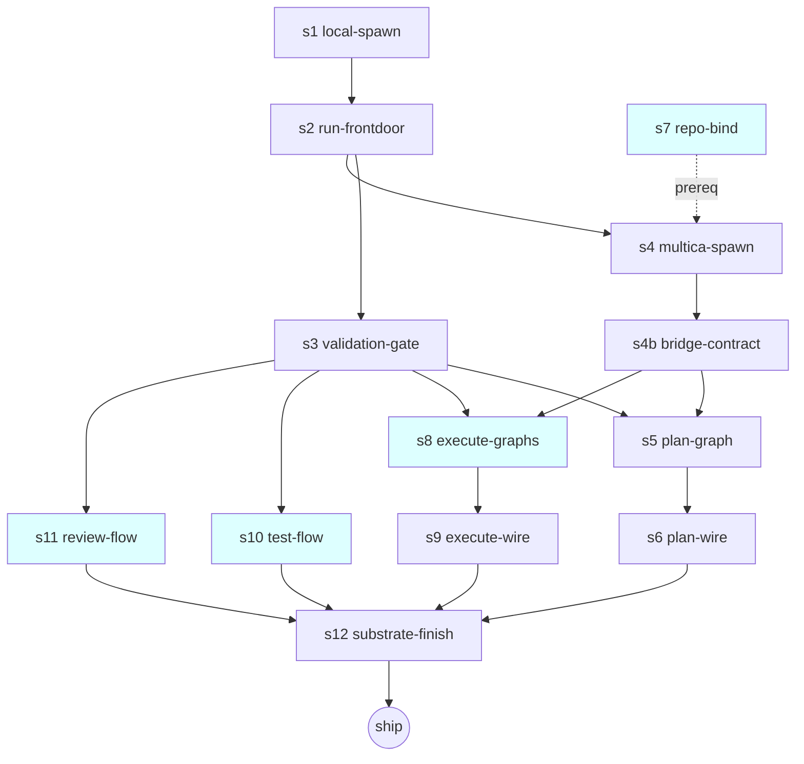

# TPM Sequencing Review — dag-flows-multica

Read-only delivery-sequencing analysis of `vertical-plan.md` against the
design discussion + drafted specs (s1/s2/s3). Verdict: **slice ordering is
sound; one false serialization, two parallelism wins, one missing prereq edge.**

## 1. Slice ordering — APPROVED with edits

Substrate-first is correct. Slice 1 proving the seam with the **stub/local**
binding (no Multica) is the right thinnest PoC: it de-risks the greenfield front
door (R3) and the gate (R2) *before* the 401-prone Multica runtime (R1) is in the
critical path. Each slice ends genuinely demonstrable. Two corrections:

- **s7-repo-bind is mis-sliced.** The chain diagram shows `s7-repo-bind` feeding
  Slice 1, but Slice 1's working state is stub-only (no checkout needed). Repo-bind
  is a **hard prereq for Slice 2** (Multica needs a real checkout to reconcile),
  not Slice 1. Keep s7 *authored* in Slice 1 (it touches the Node bridge, parallel
  to the executor work) but make it gate **Slice 2**, not Slice 1's demo.
- **Slice 1's "working state" should NOT claim repo-bind proves a checkout** — that
  conflates the stub demo with the Multica prereq. Split the claim.

## 2. Dependency graph + parallelism



**Parallel wins:**
- **s1 ‖ s7** — local binding (executor/Python) and repo-bind (Node bridge) touch
  disjoint surfaces. Run concurrently from day 1. (Serial-Codex caveat does not
  apply; this is human/agent authoring, not Codex fan-out.)
- **Slices 4, 5, 6 ‖ each other.** Once Slice 3's gate (s3) + Multica binding (s4b)
  land, the execute-flow (s8/s9), test-flow (s10), and review-flow (s11) graphs are
  **independent graph-authoring units** — each is a self-contained `*.workflow.yaml`
  + step_files + a validation target. No cross-dependency. **Yes — test-flow and
  review-flow can run parallel to each other and to execute.** This is the single
  biggest schedule compression: collapse Slices 4/5/6 into one parallel band.
- **False dep:** Slice 3 (plan) is NOT a prereq for Slices 4–6. The chain diagram's
  linear s5→s8→s10→s11 is wrong; they fan out from the substrate (s3+s4b), not from
  plan. Plan is merely *lowest-risk-first*, an ordering preference, not a hard edge.

## 3. Critical path + risk

Critical path: **s1 → s2 → s3 → s4 → s4b → {first flow E2E} → s12**. The substrate
spine (s1/s2/s3) and the Multica binding (s4/s4b) are the only true serial chain.

De-risk earliest:
- **R1 (401 headless)** is operational, not code. **Validate it in Slice 2 with the
  trivial 2-node graph** before any real flow depends on it — route the agent node
  to a **Codex** agent. If Codex-headless also fails, the whole Multica half stalls;
  catch it on the cheapest possible graph.
- **R5 (harvest/reconcile before gate)** is the subtle one: s4 must reconcile
  (bare→ff-merge) before s3's gate validates, or the gate sees an empty tree. Make
  this an explicit AC in s4 and a test in s4b.

## 4. Gaps + split/merge

- **Slice 7 (s12) is overloaded** — "backend unify + episodes + resume across all
  flows + docs" is 4 concerns. Resume is already proven per-slice (s2 AC). Recommend
  splitting s12 into **s12a backend-unify + episode markers** and **s12b docs**, so
  docs don't block ship on integration debugging.
- **minimal-then-deepen for test/review: ACCEPTED.** (Open-Q #4.) Single producer
  node + validation gate this epic is the right call — it proves the substrate spans
  all 4 flows without over-investing in two under-specified flows. Deepen post-ship.
- **s6/s9 (skill-wire) could merge** if the routing seam is identical across flows;
  keep separate only if planning-routing vs execution mode-resolve diverge.

## 5. Skill → graph shape map (targets for graph-authoring units)

| Skill | Graph nodes (ordered) | Validation gate target |
|---|---|---|
| /plan (s5) | research ‖ design → writer-author → **gate** | committed `.pHive/epics/<id>/{epic.yaml,stories/*.yaml}` conform to schema |
| /execute classic (s8) | research → implement → test → review → **gate** → integrate | changed code+test files exist & parse |
| /execute tdd (s8) | research → test-spec → implement → review → **gate** → integrate | test files + impl committed |
| /execute bdd (s8) | extends `development.bdd.workflow.yaml` (exists) | behavior spec + impl |
| /test (s10) | context → author → execute → triage → **gate** → report | report artifact exists & parses |
| /review (s11) | (resolve-mode) → review → **gate** → report | review artifact exists |

Gate is always the **last deterministic node before integrate/exit** and reads
committed files, never node self-report (North-star 2).

```yaml
ESCALATION_FLAGS:
  - id: ef-1
    severity: high
    flag: "s7-repo-bind dependency edge is wrong in vertical-plan.md — shown as Slice-1 prereq; it is a Slice-2 (Multica) prereq. Decompose with s7 gating Slice 2, not Slice 1's demo."
  - id: ef-2
    severity: high
    flag: "R1 (Multica 401 headless for Claude; only Codex unattended) sits on the critical path at Slice 2. Validate Codex-headless on the trivial 2-node graph BEFORE any real flow depends on it. If Codex-headless also fails, the entire Multica half is blocked pre-run."
  - id: ef-3
    severity: med
    flag: "vertical-plan dependency chain serializes s5→s8→s10→s11 (false). Execute/test/review flows fan out from substrate (s3+s4b) and run PARALLEL. Collapse Slices 4/5/6 into one parallel band to compress schedule."
```
