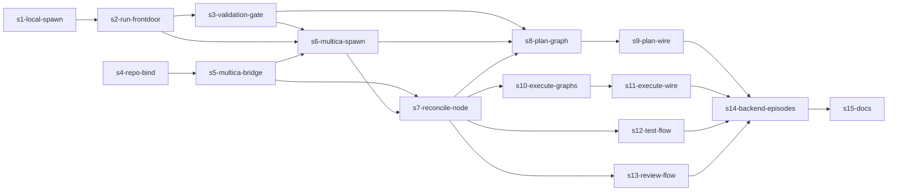

# Vertical Plan — dag-flows-multica (revised post team-review)

Revised after architect + tpm + researcher review. Changes from straw-man:
repo-bind re-sliced (gates Slice 2, not Slice 1); s4 split into bridge-surface +
spawn-binding + reconcile-node; execute/test/review collapsed into one parallel band;
s12 split into backend/episodes vs docs.

Each slice ends in a working, demonstrable state. Ship gated on all slices.

## Horizontal layers

- **L1 Executor core** — model/loader/dispatcher/gate/run_state (EXISTS).
- **L2 Spawn bindings** — local AgentSpawn (Step 7) + MulticaAgentSpawn (BUILD).
- **L3 Run front door** — production assembly + run/resume entrypoint (BUILD).
- **L4 Validation gates** — schema/output validation, reads committed files (BUILD).
- **L5 Reconcile** — fetch-from-bare + ff-merge as a SCRIPT node (BUILD; net-new).
- **L6 Graphs** — `*.workflow.yaml` per flow + verbatim step_files (BUILD/EXTEND).
- **L7 Skill wiring** — plan/execute/test/review route to L3 (BUILD).
- **L8 Bridge** — Multica dispatch + create-issue + repo-bind (EXTEND; net-new create-issue).

## Slice 1 — Substrate, stub-only (no Multica)

Stories: s1-local-spawn, s2-run-frontdoor, s3-validation-gate.
(s4-repo-bind authored in this slice too — disjoint Node-bridge surface, runs in
parallel — but it is NOT a Slice-1 dependency; it gates Slice 2.)

**Working state:** a trivial 2-node graph runs through the production front door with
the **local** binding and exits clean through a validation gate that reads committed
files. `load_workflow → assemble dispatcher → run → resume` works in prod, not just
tests. (Dropped the straw-man's "proves a real checkout" claim — that's Slice 2.)

## Slice 2 — Multica binding + harvest (de-risk R1 here)

Stories: s4-repo-bind (prereq), s5-multica-bridge, s6-multica-spawn, s7-reconcile-node.

**Working state:** binding swap → the SAME 2-node graph runs its agent node on a
**Codex** Multica agent (headless), the reconcile node ff-merges the agent commit,
the gate validates the real files, run passes. Proves Codex-headless E2E on the
cheapest possible graph BEFORE any real flow depends on Multica (R1 de-risk).

## Slice 3 — Plan flow (lowest-risk, read-mostly; ordering preference, not hard edge)

Stories: s8-plan-graph, s9-plan-wire.

**Working state:** `/plan` (DAG backend) runs research+design ‖ → writer author →
reconcile → output-validation gate over committed `.pHive/epics`. User gates stay
local. A real epic plans E2E on the substrate.

## Slices 4/5/6 — Flow band (PARALLEL after the spine s3+s6+s7)

Independent graph-authoring units; can run concurrently with each other and with
Slice 3. Each = a `*.workflow.yaml` (+ step_files) + a reconcile node + a gate target
+ skill wiring.

- **Execute** — s10-execute-graphs (EXTEND `development.*.workflow.yaml` classic/tdd/bdd),
  s11-execute-wire.
- **Test** — s12-test-flow (EXTEND `test-swarm.workflow.yaml` + gate + wire).
- **Review** — s13-review-flow (NEW `review.workflow.yaml` + gate + wire).

**Working state (each):** the command runs a story/change through its graph on
Multica; gate validates the committed artifacts/report. E2E green on a real target.

## Slice 7 — Generalization

- s14-backend-episodes — unify binding selection across all flows + episode markers +
  resume proven across every flow.
- s15-docs — README + operations-guide for the DAG-on-Multica substrate (split out so
  docs don't block ship).

## Dependency graph

Critical path: `s1 → s2 → s3 → s6 → s7 → {first flow} → s14 → s15`. De-risk R1 at s6.
Parallel band: s8/s10/s12/s13 (bounded-slice, disjoint graph+skill files).
