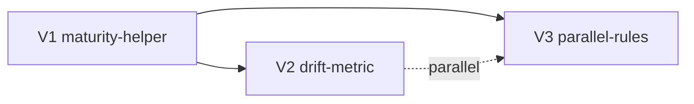

# H/V Plan — exec-discipline-may2026

## Horizontal Layers

| Layer | Surface | Touched by |
|-------|---------|-----------|
| L1 — Profile schema | `.pHive/project-profile.yaml` field set | maturity-helper |
| L2 — Library (`hive/lib/`) | `project_maturity.py`, `drift.py`, `metrics/core.py` | maturity-helper, drift-score |
| L3 — References (`hive/references/`) | `cross-swarm-handoff.md`, `cycle-state-schema.md`, `story-yaml-schema.md` | drift-score, parallel-rules |
| L4 — Skills (`skills/`) | `skills/plan/SKILL.md`, `skills/execute/SKILL.md`, `skills/execute-dispatch/SKILL.md`, `skills/standup/SKILL.md`, `skills/review/SKILL.md` | drift-score (all phases emit), parallel-rules (plan emits flags, execute enforces) |
| L5 — Config | `hive.config.yaml` + `hive/hive.config.yaml` baseline | maturity-helper (optional override) |
| L6 — Surfaces | `/hive:status`, `/standup` trend output | drift-score |

## Vertical Slices

### Slice V1 — Maturity helper (foundation)

**Deliverable:** `hive/lib/project_maturity.py` reads `project-profile.yaml.project_maturity`, returns `greenfield|early|established|mature`, defaults to `early` on placeholder profile. Helper used by future drift + candidate-detect.

**Working state at end of slice:** `from hive.lib.project_maturity import resolve_maturity` works; existing skills unchanged; no behavioral impact yet (helper exists, no consumers).

**Stories:** `ed-1-maturity-helper`

### Slice V2 — Scope-drift metric (depends on V1)

**Deliverable:** drift emit at every phase boundary of /plan + /execute + /review + /standup. Bucketed score, JSONL events, surfaced in /hive:status.

**Working state at end of slice:** every plan/execute run writes drift events; status command shows recent drift trend; no breaking change to existing skills (drift is additive emit).

**Stories:** `ed-2-handoff-schema`, `ed-3-drift-metric-emit`, `ed-4-drift-status-surface`

### Slice V3 — Parallel-rules gate (depends on V1 only)

**Deliverable:** story YAML schema extension; /plan emits flags; /execute refuses fan-out without rationale; existing parallel call sites audited + tagged.

**Working state at end of slice:** new stories require explicit `parallel_rationale` for parallel dispatch; default is serial; existing workflows pass.

**Stories:** `ed-5-story-schema-parallel`, `ed-6-plan-emits-flags`, `ed-7-execute-enforces-gate`

## Slice Sequencing

V2 and V3 are independent after V1 lands (consume the helper but not each other). Stories within V2 and within V3 are sequential (each step builds on previous).

## Deferred / out of scope

- Normalized 0-1 drift scoring (user confirmed bucketed v1).
- Post-implement touch-set verification hook (R1 mitigation — deferred to v2; ed-7 documents the gap).
- `/standup` integration of drift trend — Slice V2 covers `/hive:status`; `/standup` is candidate for follow-on epic.

## Risks revisited (post-H/V)

- **R1 carry-over:** ed-7 ships the gate; verification hook follow-up is a known gap, documented in ed-7 risks block.
- **Audit creep:** ed-7 must enumerate ALL current parallel call sites; if scope explodes, split into ed-7a (gate) + ed-7b (audit).
