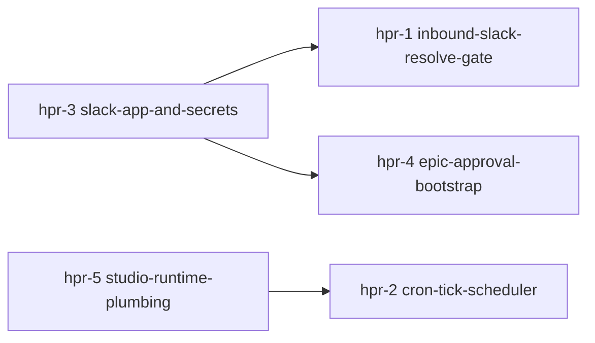

# Design Discussion — hermes-production-readiness

## §0 Prelude

- **git_flow:** base `develop`, per-epic branch `feat/hermes-production-readiness`.
- **Prior art:** `hermes-orchestrator-skills` (v2.13.1, PR #321) — the contract + skills.
- **Helper note:** git_flow resolved from config (develop existed at plan time).

## §1 Goal

Make the lights-on loop *actually run unattended on Studio*. The contract is built;
the loop currently has two open ends — (a) no inbound path from a human's Slack reply
back to `resolveGate`, and (b) no cron firing `reconcile-tick`. Close both, plus the
Slack app, the human-go bootstrap, and durable Studio runtime. North star: human in
the loop only at planning + review; orchestrator + agents own the rest.

## §2 Proposed approach

A 5-story epic. Two foundation stories with no deps (hpr-3 Slack app+secrets, hpr-5
Studio runtime) unblock the rest. The loop-closer (hpr-1) is the highest-value build.

**Dependency rationale:** hpr-1 (inbound receiver) needs the signing secret + bot
token from hpr-3. hpr-4 (bootstrap) writes through the same secret/runtime context
seeded by hpr-3. hpr-2 (cron) needs the Studio daemon + Hermes config from hpr-5.
hpr-3 and hpr-5 are independent foundations and run first/in parallel.

### Story-by-story

- **hpr-3 slack-app-and-secrets (MEDIUM, no deps).** Create the Slack app (interactivity
  + bot scopes), capture signing secret + bot token + webhook, store as Studio secrets
  (keychain/env, never committed). Documented runbook so it's reproducible. Foundation
  for hpr-1 + hpr-4.
- **hpr-5 studio-runtime-plumbing (HIGH, no deps).** multica daemon autostart + health,
  Hermes `~/.hermes/config.yaml` `mcp_servers.multica → node mcp-tools.mjs`, workspace
  bind, survive-restart. Foundation for hpr-2. Mostly host/ops + SSH.
- **hpr-1 inbound-slack-resolve-gate (HIGH, dep hpr-3).** THE LOOP-CLOSER. Repo slice:
  extend `buildVerdictMessage/buildErrorMessage` to emit Block Kit buttons
  (action_id/value encodes `{epic_handle, story_id, action}`); keep text fallback; add
  a thin `resolveGate`-invoker entrypoint. Studio slice: HTTP receiver verifying Slack
  request signature *before any state write*, parsing the payload, calling resolveGate,
  posting a thread confirmation. Receiver candidate: extend hermes-agent `mcp_serve.py`
  (`permissions_*` surface already maps onto notify-and-await).
- **hpr-4 epic-approval-bootstrap (LOW, dep hpr-3).** The gated human "go": a command
  that sets a chosen epic's initial `gate_state: pre_approved` + `epic_of_record` (via
  `cli.mjs write-state` / `multica_write_state`). The ONLY way an epic enters the
  autonomous loop. Must be human-invoked; Hermes must never self-issue it.
- **hpr-2 cron-tick-scheduler (MEDIUM, dep hpr-5).** Durable scheduler firing
  `reconcile-tick` over `epic_of_record`. Idempotent (advisory lock already guards
  state writes); respects gate_state — halts at `review_awaiting_human`, resumes on
  `pre_approved`. Hermes-native cron on Studio.

## §3 Risks

| Severity | Risk | Mitigation |
| --- | --- | --- |
| HIGH | Unauthenticated receiver lets anyone resolve gates (bypass the human gate). | Slack signature verification is an AC, not optional; no state write before signature check. |
| MED | Most work lands on Studio/hermes-agent, not plugin-hive — review/CI can't see it. | Repo slices carry tests + docs; Studio slices land as committed config/scripts in hermes-agent repo + an operations-guide runbook; verify on-host. |
| MED | Cron double-fires a tick → concurrent state writes. | `withCycleStateLock` advisory lock already in state.mjs; cron tick must be idempotent + skip if a tick holds the lock. |
| MED | Secrets leak into the repo or logs. | Secrets in Studio keychain/env only; never committed; receiver redacts signature/token in logs. |
| LOW | Bootstrap mis-targets an epic → wrong epic goes autonomous. | Bootstrap echoes the resolved epic_of_record + requires explicit confirm. |

## §4 Dependencies

- Slack workspace admin (to create the app) — human, one-time (hpr-3).
- Studio host access (`hive@mac.lan`, SSH `studio-multica`) — hpr-5, hpr-1 Studio slice.
- hermes-agent repo (~/Code/hermes-agent) — receiver + cron land here.
- Existing repo contract (state.mjs, slack-notify-await.mjs, cli.mjs, mcp-tools.mjs).

## §5 Open questions

1. **Receiver host:** extend hermes-agent `mcp_serve.py` (reuse `permissions_*`) vs a
   small dedicated Flask/stdlib receiver? Lean: extend mcp_serve.py (one surface, one
   process). Resolve in hpr-1 research.
2. **Cron mechanism:** Hermes-native scheduler vs host `launchd`/`cron` calling a tick
   script? Lean: Hermes-native if it exists; else launchd on Studio. Resolve in hpr-2.
3. **Block Kit vs slash command** for inbound: buttons (best UX) recommended; slash
   `/hive-gate` as fallback. Resolve in hpr-1.

## §6 Scale assessment

**MEDIUM.** 5 stories, multi-surface (repo + Studio + Slack) but over a known contract.
`--fast` (skip H/V) appropriate — slicing is already clear from the dependency graph.
version_bump: **minor** (new runtime capability, additive).
