# Horizontal Plan: Hive Composability + Design-Aware Planning

**Epic:** `hive-composability-design`
**Date:** 2026-04-17
**Sources:** research-brief.md, architect-memo.md, tpm-memo.md, design-discussion.md, user-feedback-design-discussion.md
**Classification:** Meta-infra epic (config + routing + skill-template changes, not runtime feature)

---

## 1. Layer Inventory

This epic touches plugin-hive's own planning and spawn infrastructure — it is a "meta" epic that modifies the skills and configs the framework uses. There are no runtime app layers. Layers below are the framework's internal subsystems.

- **L1 — Plan Orchestration Skill** (`skills/plan/SKILL.md`, `hive/agents/orchestrator.md`) — the entry point for `/hive:plan`. Today parses `$ARGUMENTS` prose for flags, routes to design-discussion, then to H/V + structured outline. Must gain `--lite` routing, a scope-class guardrail, and a confirmation-gate integration.
- **L2 — Design-Discussion Skill** (`skills/hive/skills/design-discussion/SKILL.md`) — today produces the doc AND runs collaborative review in one skill. Must split these two concerns structurally; must also emit the new rich-output format (HTML image slots, markdown canonical).
- **L3 — Output Template Skills** (`skills/hive/skills/horizontal-plan/SKILL.md:89-109`, `skills/hive/skills/vertical-plan/SKILL.md:97-122`, `skills/hive/skills/structured-outline/SKILL.md`) — planning doc authoring templates. Today emit ASCII art diagrams. Must emit Mermaid and HTML image slots per format contract.
- **L4 — Agent-Spawn Skill** (`skills/hive/skills/agent-spawn/SKILL.md:149, 188-206`) — the single spawn entry that reads frontmatter `model:` (C consumer, already live) and takes `respawn_summary_path` (B consumer, needs extension). Must gain `handoff_summary_path` as a second parameter.
- **L5 — Respawn Lifecycle Skill** (`skills/hive/skills/respawn/SKILL.md`) — context-pressure respawn today. Must co-exist with new per-task lifecycle; no schema reuse.
- **L6 — Session Execute Path** (`skills/hive/skills/execute/SKILL.md` + session-based execution from memory-autonomy Phase 2) — the only surface per-task respawn plugs into. Workstream B wires into this. Already session-based (see `967a1d4` story-execution-migration merge).
- **L7 — Config Layer** (`hive/hive.config.yaml:45-68 model_tiers, :134-136 planning.collaborative_review`) — project-level behavior toggles. Gains `model_overrides` population (C), `planning.teammate_lifecycle` + `execution.teammate_lifecycle` (B), optional doc-format keys (D).
- **L8 — Persona Documentation** (`hive/agents/orchestrator.md:170-184 tier table, :191-197 flag table`) — agent-facing docs of routing and tiering behavior. Every behavior change requires a doc update.
- **L9 — New Reference Docs** (`hive/references/planning-format-contract.md` NEW, `hive/references/model-tiering-contract.md` NEW, `hive/references/story-handoff-schema.md` NEW) — new reference documents that formalize contracts introduced by this epic. No such files exist today.
- **L10 — Telemetry / Measurement** (NEW `lib/doc-token-telemetry.*` + `state/telemetry/` write path) — net-new capability. No existing measurement infrastructure in hive.
- **L11 — Carrier Directory** (`state/respawn-summaries/`) — already exists for respawn summaries; gains a second filename convention (`{agent}-handoff-{to-story-id}.md`) for per-task handoff carriers.
- **L12 — HTML Sidecar Generation** (new lib function; precedent only at `state/brand/brand-guide.html`) — a new pure-function step that renders markdown+embedded-HTML into a standalone `.html` sidecar. No analogue today in planning skills (brand-guide is generated by a different path).

---

## 2. Per-Layer Requirements

### L1 — Plan Orchestration Skill

```
FLAG / ROUTING ADDITIONS (prose — natural-language $ARGUMENTS parsing):
  - --lite flag recognition at skills/plan/SKILL.md:14 prose instructions
  - --skip-sign-off, --skip-research flag recognition (same prose pattern)
  - --profile {quality|balanced|budget} flag recognition (C dispatch)

ROUTING TABLE ADDITIONS (skills/plan/SKILL.md:120-134):
  - Lite mode routing row: design-discussion doc-production ON, collaborative-review OFF,
    horizontal-plan SKIPPED, vertical-plan SKIPPED, structured-outline minimal, story
    decomposition simplified
  - Scope-class guardrail: refuse --lite when scope is multi-epic or PRD-territory
    (detected before routing decision from design-discussion SCALE ASSESSMENT signals
    OR explicit user prose)
  - Quick-task escape: /hive:plan --quick for trivial tasks — writes to state but skips
    decomposition; design discussion still applies if UI is touched

CONFIRMATION GATE INTEGRATION:
  - After design-discussion doc-production completes, invoke TUI confirmation prompt
  - Optionally write a gate sign-off artifact to state/epics/{epic-id}/docs/design-discussion-signoff.md
  - Both paths gate further routing — nothing proceeds without confirmation

ORCHESTRATOR PERSONA UPDATES:
  - Flag table at hive/agents/orchestrator.md:191-197 gains --lite, --quick, --profile,
    --skip-sign-off, --skip-research
  - Tier table at :170-184 updates to describe resolution precedence (frontmatter > config)
```

### L2 — Design-Discussion Skill

```
STRUCTURAL SPLIT (breaking contract change — own story):
  - design-discussion/SKILL.md today does: (1) produce design discussion doc,
    (2) run collaborative team review. Split into two sub-invocations:
      (a) produce-doc — always fires (lite AND full)
      (b) review-doc — fires only when planning.collaborative_review is true
  - Callers that today invoke "design-discussion" must migrate to either (a) alone
    or (a) + (b) as a sequence
  - Backwards-compat: top-level skill name continues to route to (a) + (b) when
    collaborative_review: true (today's behavior); lite mode routes to (a) only

OUTPUT FORMAT CHANGES (D consumer):
  - Output template grows HTML `<figure>` image slots where wireframes/references belong
  - Output template grows Mermaid slot for SCALE ASSESSMENT summary diagram (if any)
  - Canonical output remains markdown; sidecar .html generated via L12

SCALE ASSESSMENT OUTPUT:
  - Remains prose today (per §4 Q1 deferral) — emit structured scope-class hint that
    L1 scope-class guardrail can read (minimum: {"scope_class": "single-epic"|"multi-epic"|"prd"})
```

### L3 — Output Template Skills (H/V + structured outline)

```
HORIZONTAL-PLAN TEMPLATE CHANGES:
  - Replace ASCII layer-map template at :89-109 with Mermaid flowchart/graph template
  - Prose instruction: "emit Mermaid diagram using the `horizontal-map` graph convention
    from hive/references/planning-format-contract.md"
  - Existing plans stay as ASCII unless regenerated — no data migration

VERTICAL-PLAN TEMPLATE CHANGES:
  - Replace ASCII overlay diagram at :97-122 with Mermaid template
  - Prose instruction: emit Mermaid slice-overlay diagram; cite format-contract reference

STRUCTURED-OUTLINE TEMPLATE CHANGES:
  - Part 6 dep map (currently text code block) becomes a Mermaid graph
  - Part 3 (per-story detail) gains optional HTML `<figure>` slots for wireframe thumbnails
    where design artifacts exist

NEW PROSE INSTRUCTION ACROSS ALL THREE:
  - Reference hive/references/planning-format-contract.md for allowed embedded content,
    image source policy, Mermaid delimiter convention, and sidecar generation rule
```

### L4 — Agent-Spawn Skill

```
STEP 7b EXTENSION (two-parameter shared-code approach per architect-memo §1c(i)):
  - Accept both respawn_summary_path (unchanged) AND handoff_summary_path (NEW)
  - Read whichever is set; if both, error
  - Different preamble text per mode:
      respawn_summary_path → "You are continuing work from a previous instance"
      handoff_summary_path → "You are starting story {N} with context from story {N-1}"
  - Backwards-compat: existing callers with only respawn_summary_path see no behavior change

MEMORY-BRIDGING READ CONTRACT (B consumer):
  - Prose instruction: when handoff_summary_path is set, the agent's first action
    MUST read: (a) the handoff summary, (b) state/insights/ pointers in the summary,
    (c) state/episodes/ pointers in the summary
  - This is persona-facing; enforced by documentation, not code

MODEL RESOLUTION DOCS (C consumer):
  - Expand step 7.1 docs to show frontmatter > config model_overrides > tier default
    precedence explicitly (already the behavior; document it)
```

### L5 — Respawn Lifecycle Skill

```
NO CHANGES — per-task lifecycle is a NEW skill path, not an extension.
  - Existing context-pressure respawn flow at :8-12 stays as-is
  - Existing summary schema at :74-113 stays as-is (designed for same-agent same-step
    handoff)
  - Documentation update only: cross-reference the new story-handoff path and clarify
    when each fires
```

### L6 — Session Execute Path

```
STORY-BOUNDARY HOOK (B consumer):
  - When planning.teammate_lifecycle: respawn_per_task OR execution.teammate_lifecycle:
    respawn_per_task, execute writes a handoff summary at end of story N and spawns
    fresh agent for story N+1 with handoff_summary_path set
  - When lifecycle: long_running (default for planning), no change — teammates persist
  - Hook fires at step 6 (story execution) boundaries, not mid-story

HANDOFF SUMMARY GENERATOR:
  - Small writer instruction block — at story-N completion, produce
    state/respawn-summaries/{agent}-handoff-{to-story-id}.md conforming to L11 schema
  - Writer reads story-N insights + episode pointers from agent's shutdown output
```

### L7 — Config Layer (`hive/hive.config.yaml`)

```
MODEL ECONOMY ADDITIONS (C):
  - Populate model_overrides map with balanced/quality/budget profile mappings per persona
  - Add top-level `model_profile: balanced` key with quality|balanced|budget values
  - Explorer/research persona Haiku-refusal enforced by agent-spawn guardrail docs

TEAMMATE LIFECYCLE ADDITIONS (B):
  - Add planning.teammate_lifecycle: long_running (default)
  - Add execution.teammate_lifecycle: respawn_per_task (default)
  - Phase-keyed per user-feedback Q5

EXISTING KEYS TOUCHED:
  - planning.collaborative_review (:134-136) — no schema change, behavior now explicitly
    described as controlling review ON/OFF independently of doc-production

OPTIONAL (D, deferred to Slice 4+):
  - planning.doc_format: markdown_embedded_html | html_primary (default: markdown_embedded_html)
```

### L8 — Persona Documentation

```
ORCHESTRATOR PERSONA UPDATES:
  - :170-184 tier resolution table: document frontmatter > config precedence
  - :191-197 flag table: add --lite, --quick, --profile, --skip-sign-off, --skip-research
  - Cross-reference hive/references/model-tiering-contract.md and
    hive/references/planning-format-contract.md where first introduced

AGENT PERSONA UPDATES (scoped):
  - Personas that appear in C model_overrides: no persona file changes (frontmatter
    already live); config-driven override is invisible to persona text
  - Personas running under respawn-per-task: no persona file changes (the lifecycle
    mode is orchestrator-enforced, not persona-enforced)
```

### L9 — New Reference Docs

```
hive/references/planning-format-contract.md (NEW):
  - Allowed embedded content per doc type (design-discussion, structured-outline, H/V, PRD)
  - Image source policy (Frame0 paths, descriptive alt text, no runtime image gen)
  - Mermaid delimiter convention (```mermaid ... ``` fenced blocks)
  - Sidecar-HTML generation rule (markdown canonical; .html generated on write)
  - Terminal-degradation expectations per doc type

hive/references/model-tiering-contract.md (NEW):
  - Quality / balanced / budget profile definitions
  - Per-tier persona assignments (frontmatter overrides win)
  - Explorer / research Haiku-refusal rule with rationale
  - Config-vs-frontmatter precedence diagram

hive/references/story-handoff-schema.md (NEW):
  - Schema for {agent}-handoff-{to-story-id}.md files
  - Fields: from_story_id, to_story_id, insights_pointers, episode_pointers,
    prior_story_observations, open_questions, active_blockers
  - Explicit separation from respawn summary schema
```

### L10 — Telemetry / Measurement

```
NEW CAPABILITY — doc-token-telemetry (D-support, parallel to Slice 1):
  - Token-counting probe invoked when design-discussion, structured-outline, H/V,
    or PRD artifacts are written
  - Uses @anthropic-ai/tokenizer or equivalent
  - Writes to state/telemetry/doc-tokens.jsonl (one line per artifact write)
  - Schema: {ts, epic_id, doc_type, format, token_count, char_count, bytes}
  - No read path in v1 — purely data collection for Slice 4+ format-decision revisit
```

### L11 — Carrier Directory

```
state/respawn-summaries/ gains a SECOND filename convention:
  - Existing: {agent}-{story-id}-{N}.md (context-pressure respawn)
  - New: {agent}-handoff-{to-story-id}.md (per-task story handoff)
  - Same directory; schema differs per L9 story-handoff-schema
  - Writer layer: L6 handoff summary generator
  - Reader layer: L4 step 7b handoff_summary_path
```

### L12 — HTML Sidecar Generation

```
NEW GENERATOR (D-support, invoked when planning artifacts are written):
  - Input: markdown file with embedded HTML blocks + optional Mermaid fences
  - Output: standalone .html sibling at same path with .html extension
  - Reference: state/brand/brand-guide.html pattern (only in-repo HTML precedent)
  - Invocation points: design-discussion skill write, structured-outline skill write,
    H/V skill writes, PRD write (Slice 5)
  - Not invoked for story YAMLs, epic YAMLs, or non-planning markdown
  - v1: pure template substitution — no fancy rendering, no embedded scripts
```

---

## 3. Cross-Layer Dependencies

```
DEPENDENCIES (reader → writer format):

L1 plan routing → L2 design-discussion split  (L1 lite routing requires L2 produce-doc
                                                  entry point to exist as a callable)
L1 scope-class guard → L2 scale-assessment    (L1 needs structured scope-class hint from L2)
L1 confirmation gate → L7 optional config     (L1 reads optional gate-to-state toggle)
L1 --profile flag → L7 model_profile         (L1 dispatches profile to L7 config read)

L2 doc-production → L12 sidecar gen           (L2 write triggers L12 on the produced file)
L2 format output → L9 format-contract doc     (L2 prose instructions reference L9)

L3 H/V + outline → L9 format-contract doc     (L3 prose instructions reference L9)
L3 H/V + outline → L12 sidecar gen           (L3 writes trigger L12)

L4 step 7b extension → L11 carrier dir        (L4 reads handoff summary from L11)
L4 step 7b extension → L9 handoff schema      (L4 preamble depends on schema knowledge)
L4 memory-bridging → L9 handoff schema        (L4 prose references insight/episode fields)
L4 model docs → L9 tiering contract           (L4 docs cite tiering contract)
L4 model docs → L7 model_overrides           (L4 reads config per existing flow)

L6 story-boundary hook → L7 lifecycle config  (L6 reads execution.teammate_lifecycle)
L6 story-boundary hook → L11 carrier dir      (L6 writes handoff summary)
L6 story-boundary hook → L9 handoff schema    (L6 writer conforms to schema)
L6 story-boundary hook → L4 step 7b           (L6 spawns with handoff_summary_path set)

L8 orchestrator persona → L7 flag routing     (L8 flag table describes L1 behavior)
L8 orchestrator persona → L9 tiering + format (L8 tier table references L9 contracts)

L12 sidecar gen has no downstream consumers in the skills — it's a write-side
     side effect. Its output is read by humans, not by the framework.

L10 doc-token-telemetry has no consumers in v1 (data-only).

CROSS-EPIC DEPENDENCIES (external):
  memory-autonomy-foundation S7 (session-prompt-spec)   → L6 story-boundary hook  (MERGED 204a1b6)
  memory-autonomy-foundation S9 (story-execution-migration) → L6                 (MERGED 967a1d4)
  memory-autonomy-foundation kg-write-path + kg-read-path → L4 step 5e KG inject (verify status)
  memory-autonomy-foundation chromadb-wrapper/integration → L4 step 5c-L3 rerank (SOFT — fallback)
  memory-autonomy-foundation session-end-integration      → L6 session close     (SOFT — parallel)
```

### Serialization constraints (shared files)

Stories editing the same file must serialize their merges even if development is parallel. From the manifest above:

- **`skills/plan/SKILL.md`**: L1 lite routing + L1 scope-class guard + L1 confirmation-gate + L1 --profile — one serialized edit chain.
- **`skills/hive/skills/design-discussion/SKILL.md`**: L2 split + L2 format-output change — serialize; split must land first.
- **`skills/hive/skills/agent-spawn/SKILL.md`**: L4 step 7b extension + L4 model-resolution docs — can co-land in one story or serialize.
- **`hive/hive.config.yaml`**: L7 model-economy additions + L7 lifecycle additions + L7 optional doc-format — each story owns its config keys, no merge conflict expected but serialize if same sprint.
- **`hive/agents/orchestrator.md`**: L8 tier-table update + L8 flag-table update — serialize; flag updates follow each L1 story.

---

## 4. Layer Map Diagram

```mermaid
graph TD
  subgraph "L1 Plan Orchestration"
    L1A[--lite routing]
    L1B[scope-class guard]
    L1C[confirmation gate]
    L1D[--profile dispatch]
    L1E[--quick escape]
  end
  subgraph "L2 Design-Discussion"
    L2A[produce-doc / review-doc split]
    L2B[format output: HTML slots + Mermaid]
    L2C[structured scope-class hint]
  end
  subgraph "L3 Output Templates"
    L3A[horizontal-plan → Mermaid]
    L3B[vertical-plan → Mermaid]
    L3C[structured-outline → Mermaid + figures]
  end
  subgraph "L4 Agent-Spawn"
    L4A[step 7b two-param]
    L4B[memory-bridging prose]
    L4C[model-resolution docs]
  end
  subgraph "L6 Session Execute"
    L6A[story-boundary hook]
    L6B[handoff writer]
  end
  subgraph "L7 Config"
    L7A[model_overrides + model_profile]
    L7B[planning.teammate_lifecycle]
    L7C[execution.teammate_lifecycle]
    L7D[optional doc_format]
  end
  subgraph "L9 New Reference Docs"
    L9A[planning-format-contract.md]
    L9B[model-tiering-contract.md]
    L9C[story-handoff-schema.md]
  end
  subgraph "Support"
    L10[L10 doc-token-telemetry]
    L11[L11 carrier dir 2nd convention]
    L12[L12 HTML sidecar gen]
  end

  L1A --> L2A
  L1B --> L2C
  L1C --> L2A
  L1D --> L7A
  L2B --> L9A
  L2B --> L12
  L3A --> L9A
  L3B --> L9A
  L3C --> L9A
  L3A --> L12
  L3B --> L12
  L3C --> L12
  L4A --> L11
  L4A --> L9C
  L4B --> L9C
  L4C --> L9B
  L4C --> L7A
  L6A --> L7C
  L6A --> L11
  L6B --> L9C
  L6A --> L4A
  L2A -.split.-> L2A
  L10 -.parallel.-> L2B
```



Workstream-to-layer mapping:

```
Workstream A → L1 + L2 (structural split) + L7 (lifecycle keys live here but written by B) + L8
Workstream B → L4 (extension) + L5 (co-exist) + L6 + L7 (lifecycle) + L9 (handoff schema) + L11
Workstream C → L4 (doc only) + L7 (model_overrides/profile) + L8 + L9 (tiering contract)
Workstream D → L2 (format output) + L3 + L7 (optional doc_format) + L9 (format contract) + L12 + L10 (telemetry parallel)
```

---

## 5. Scope Summary

```
HORIZONTAL SCOPE:
  Layers affected: 12 (all 12 are in scope; L5 is no-change co-exist)
  Total items:
    L1: 6 routing/flag additions
    L2: 2 structural (split + format)
    L3: 3 template updates (H, V, outline)
    L4: 3 (step 7b, bridging prose, model docs)
    L5: 0 (no-change)
    L6: 2 (boundary hook, writer)
    L7: 3 config additions (model, lifecycle ×2, optional doc-format)
    L8: 2 persona doc updates (flag table, tier table)
    L9: 3 new reference docs
    L10: 1 new capability
    L11: 1 filename convention addition
    L12: 1 new generator
    TOTAL: ~27 discrete items across 12 layers
  New vs modified:
    New files: ~6 (3 ref docs + telemetry module + sidecar gen + handoff carrier examples)
    Modified files: ~9 (plan skill, orchestrator, design-discussion, H/V, outline,
                        agent-spawn, execute, hive.config.yaml, respawn docs)
  Estimated total effort: xlarge (four workstreams, meta-infra, 3 new reference contracts,
    greenfield format territory)

  LARGEST LAYER: L1 Plan Orchestration + L2 Design-Discussion combined — most of Workstream
                 A lives here; L2 split is the biggest single contract change in the epic
  RISKIEST LAYER: L2 design-discussion split (breaking contract, multiple callers) tied with
                  L6 story-boundary hook (new surface on already-migrated session execute path,
                  cross-epic coordination needed at merge)
```

**Epic classification for vertical planning:** meta-infra / config-routing-documentation epic. The value delivered is new routing paths + new data contracts + new reference structures, not new runtime behavior. Per working-state-invariant memory, use **pragmatic stop-ship reading** for vertical slices — each slice ships a coherent, inspectable increment, not necessarily an end-to-end runtime change.
