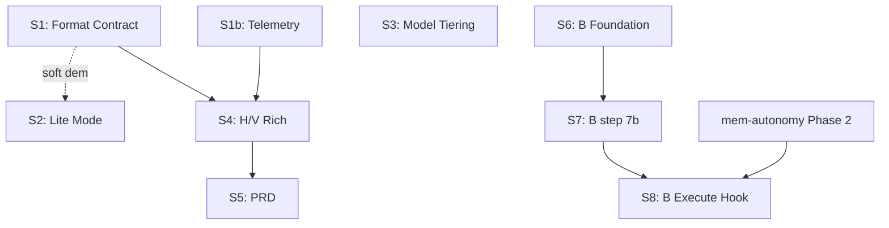

# Structured Outline: Hive Composability + Design-Aware Planning

**Epic:** `hive-composability-design`
**Date:** 2026-04-17
**Sources:** research-brief.md, design-discussion.md, horizontal-plan.md, vertical-plan.md,
             user-feedback-design-discussion.md, user-feedback-hv.md, architect-memo.md, tpm-memo.md

---

## Part 1: Executive Summary

### What We're Building and Why

Plugin-hive's planning ceremonies are thorough but expensive — every invocation runs the full persona sign-off cycle whether the task warrants it or not. At the same time, planning artifacts are pure markdown despite hive's identity as a design-aware SDLC framework. These problems compound: full ceremony costs tokens AND the output doesn't look like a product team produced it.

This epic delivers four workstreams across 9 slices:

- **Workstream A** — Composability: `--lite` mode, scope-class guardrail, TUI confirmation gate, structural separation of design-discussion doc-production from collaborative review (Slices 2).
- **Workstream B** — Teammate lifecycle: respawn-per-task as a new lifecycle mode, `story-handoff` summary schema, two-parameter step 7b injection. Gated on memory-autonomy Phase 2 (Slices 6–8).
- **Workstream C** — Model economy: activate tiering — populate `model_overrides`, define budget/balanced/quality profiles, enforce Explorer/Haiku guardrail (Slice 3).
- **Workstream D** — Rich outputs: planning format contract, markdown-embedded-HTML canonical with `.html` sidecar, Mermaid diagrams replacing ASCII art, HTML `<figure>` image slots (Slices 1, 1b, 4, 5).

### How User Feedback Shaped This Plan

**Five design-discussion open questions resolved:**

1. **Q1 — effort-estimator thresholds:** Deferred. `--lite` ships as a manual flag. Auto-promotion is future work. **New constraint added:** `--lite` MUST refuse multi-epic or PRD-territory scope (scope-class guard from SCALE ASSESSMENT structured hint).
2. **Q2 — confirmation gate shape:** TUI prompt is default; optional state-file sign-off (`docs/design-discussion-signoff.md`) configurable for hook/board integration.
3. **Q3 — doc-token-telemetry timing:** Parallel story in same sprint as Slice 1. Not a prerequisite.
4. **Q4 — format default:** Markdown-embedded-HTML confirmed. `.html` sidecar via `state/brand/brand-guide.html` precedent.
5. **Q5 — lifecycle config shape:** Phase-keyed keys: `planning.teammate_lifecycle` and `execution.teammate_lifecycle`, following `planning.collaborative_review` at `hive/hive.config.yaml:134-136`.

**H/V gate user feedback:** Both late TPM judgment calls accepted — B split into 3 serialized slices (S6/S7/S8) and Mermaid layer map in horizontal-plan.md. No layer revisions, no slice boundary changes.

### Key Decisions Locked

- Design-discussion doc-production is always-on. Collaborative review is separately configurable. Structurally separated in Slice 2 (breaking contract change — own story S2.1).
- Respawn-per-task is a NEW lifecycle mode — not an extension of context-pressure respawn. Two schemas, same `state/respawn-summaries/` directory.
- Step 7b in `agent-spawn/SKILL.md:188-206` gains `handoff_summary_path` as a second parameter. Existing `respawn_summary_path` callers unchanged.
- S7 (`session-prompt-spec`) and S9 (`story-execution-migration`) already merged. B's hard prerequisites are satisfied; YAML statuses need a one-shot refresh before B story YAMLs are authored.
- Sign-off collapse (auto-skip when only one persona weighs in) belongs in execute at runtime, not at plan time.

### Explicitly Deferred (not in any slice)

- **Effort-heuristic auto-promotion** — thresholds undefined; scale-assessment structured schema is itself a breaking change.
- **`/hive:plan --quick` escape hatch** — validate `--lite` first; `--quick` is a one-row routing addition.
- **Runtime sign-off collapse** — execute runtime, not plan time.
- **`planning.doc_format` config key** — only warranted if Slice 1b telemetry shows HTML-primary wins by a meaningful margin.
- **Regenerating existing ASCII art H/V docs** — no migration; existing docs stay as-is.
- **Telemetry read path / dashboard** — data-write only in v1.
- **Auto-lifecycle selection per epic scope** — config-driven first; auto-selection is a follow-on.
- **Planning-phase per-task respawn** — `planning.teammate_lifecycle: long_running` is the default; opt-in only.

### Overall Implementation Strategy

9 deliverables across 8 slices. Slices 1, 1b, and 3 are parallelizable. Slice 2 has a soft demo dependency on Slice 1. Slices 4–5 build on Slice 1's format contract. Slices 6–8 serialize for Workstream B, gated on memory-autonomy Phase 2 closure. **Minimum-viable-ship: Slices 1+1b+2+3** — composability + model economy + design-awareness without B.

---

## Part 2: Detailed Approach

### Slice 1 — Format Contract + Reference Render (Workstream D seed)

**Goal:** Establish the planning format contract as a reference doc, add HTML `<figure>` slots to the design-discussion output template, ship the sidecar HTML generator. This epic's own `design-discussion.html` is the reference render — it proves the format before any story depends on it.

**Depends on:** nothing

**Stories:** S1.1 (planning-format-contract.md), S1.2 (design-discussion template update + sidecar gen, bundled)

#### Changes

1. **`hive/references/planning-format-contract.md` (NEW)**
   - Allowed embedded content per doc type: design-discussion (`<figure>` slots), structured-outline (`<figure>` optional + Mermaid dep map), H/V plans (Mermaid diagrams), PRD (HTML-primary exception).
   - Image source policy: Frame0 PNGs from `state/wireframes/{epic-id}/{story-id}/` when available; otherwise `<figure data-placeholder="description">`. No runtime image generation.
   - Mermaid delimiter convention: standard fenced ` ```mermaid ``` ` blocks. No special wrapper.
   - Sidecar-HTML generation rule: markdown is canonical; `.html` sibling generated on skill write via `lib/html-sidecar-gen`. Sidecar not committed to git by default (generated on-demand).
   - Terminal-degradation expectations: markdown-embedded-HTML degrades to readable markdown + visible `<figure>` tags. Grep works. `.html` sidecar is browser-only.

2. **`skills/hive/skills/design-discussion/SKILL.md` — output template section only**
   - Add `<figure>` slot template to output format instruction (NOT the structural split — Slice 2).
   - Add structured scope-class hint to SCALE ASSESSMENT output: `SCOPE_CLASS: single-epic | multi-epic | prd` (feeds Slice 2 scope-class guard).
   - Add prose instruction to invoke sidecar generator after writing.

3. **`lib/html-sidecar-gen.*` (NEW)**
   - Input: markdown path with embedded HTML + optional Mermaid fences.
   - Output: `.html` sibling — minimal CSS wrapper, Mermaid CDN script reference, `<figure>`/`` support.
   - Follows `state/brand/brand-guide.html` precedent — the only in-repo HTML artifact pattern.
   - Failure is non-blocking: if generator errors, log and continue — markdown is the canonical artifact.

4. **`hive/agents/orchestrator.md`** — cross-reference to planning-format-contract.md added.

#### Interfaces

```
// html-sidecar-gen
generateSidecar(markdownPath: string): Promise<string>  // returns .html path; non-blocking on failure

// SCALE ASSESSMENT structured hint (appended to prose block)
SCOPE_CLASS: single-epic | multi-epic | prd
```

#### Validation

- Inspect `planning-format-contract.md` — all defined fields present and self-consistent.
- Re-run design-discussion skill; confirm `<figure>` slots appear in markdown output.
- `state/epics/hive-composability-design/docs/design-discussion.html` exists and renders in browser.
- `cat design-discussion.md` — markdown readable; `<figure>` tags visible but not obstructing.
- `grep "What Are We Doing" design-discussion.md` — works (no HTML wrapping breaks grep).

---

### Slice 1b — doc-token-telemetry (Parallel to Slice 1)

**Goal:** Token-counting probe on planning artifact writes. Data-only — no read path. Measurement data gates Slices 4–5 Decision #3 re-evaluation.

**Depends on:** nothing (truly parallel)

**Stories:** S1b.1 (probe + invocation hooks)

**Parallel note:** S1b has zero shared files with S1, S2, or S3. It can land before, during, or after any of them. The only coordination needed: if S1b's invocation hook edits `design-discussion/SKILL.md` in the same sprint as S1.2, the two edits must be serialized (one PR rebases on the other). Both are additive one-line additions to the same file — low conflict risk.

#### Changes

1. **`lib/doc-token-telemetry.*` (NEW)**
   - On artifact write: count tokens via `@anthropic-ai/tokenizer` (fallback: character-count heuristic).
   - Append to `state/telemetry/doc-tokens.jsonl`: `{ts, epic_id, doc_type, format, token_count, char_count, bytes}`.
   - Invoked from design-discussion write, structured-outline write, H/V writes, PRD write.
   - Failure non-blocking: skip telemetry for that write, log warning.
   - `state/telemetry/` directory created on first write if absent.

2. **`skills/hive/skills/design-discussion/SKILL.md`** + **`skills/hive/skills/structured-outline/SKILL.md`** — one-line post-write invocation added. Serializes with Slice 1's L2 edit if same sprint.

3. **`lib/doc-token-telemetry.*` format decision note:** if `@anthropic-ai/tokenizer` is unavailable (package conflict, environment constraint), the character-count fallback (`char_count / 4` as token approximation) is sufficient for the format comparison use case. The goal is relative comparison between markdown-embedded-HTML and HTML-primary artifacts — not absolute token accounting. A consistent approximation is adequate.

#### Validation

- Run `/hive:plan`; confirm `state/telemetry/doc-tokens.jsonl` grows.
- Schema check: each line has `{ts, epic_id, doc_type, format, token_count, char_count, bytes}`.

---

### Slice 2 — Lite Mode End-to-End (Workstream A core)

**Goal:** `--lite` as a manual flag. Structurally split design-discussion produce-doc from review-doc. Scope-class guard refusing `--lite` for multi-epic/PRD. TUI confirmation gate with optional state-file sign-off. Full ceremony unchanged.

**Depends on:** Slice 1 (for demo value — format contract makes lite-mode output visually compelling; not a code dependency)

**Stories:** S2.1 (design-discussion split — foundational, lands first), S2.2 (--lite routing), S2.3 (scope-class guard), S2.4 (confirmation gate)

**Serialization: S2.1 → {S2.2, S2.3, S2.4} → each serializes on `skills/plan/SKILL.md`**

#### Changes

1. **`skills/hive/skills/design-discussion/SKILL.md` — structural split (S2.1, breaking contract)**
   - Split into two addressable sub-invocations:
     - `produce-doc` — always fires (lite AND full). Produces the design-discussion document + sidecar.
     - `review-doc` — fires only when `planning.collaborative_review: true`.
   - Top-level skill name in full mode dispatches to `produce-doc` + `review-doc` in sequence (backwards-compat).
   - Lite mode: only `produce-doc` fires.
   - **Breaking contract note:** all callers today assume both happen. Primary caller: `skills/plan/SKILL.md:108-114`. Enumerate all callers before landing S2.1; backwards-compat wrapper must be verified exhaustively.

2. **`skills/plan/SKILL.md` (S2.2, S2.3, S2.4)**
   - At `:14` prose: add `--lite`, `--skip-sign-off`, `--skip-research`.
   - At `:120-134` routing table: add lite mode routing row.
   - Scope-class guard (S2.3): reads `SCOPE_CLASS` from SCALE ASSESSMENT; refuses `--lite` for `multi-epic` or `prd`; fails open (allows `--lite` with warning) if hint absent.
   - TUI confirmation gate (S2.4): after `produce-doc` completes, prompt user. If `planning.confirm_gate_artifact: true`, also write `state/epics/{epic-id}/docs/design-discussion-signoff.md`.

3. **`hive/agents/orchestrator.md`** — flag table at `:191-197` gains `--lite`, `--skip-sign-off`, `--skip-research`.

#### Interfaces

```
// design-discussion-signoff.md (optional gate artifact)
---
epic_id: {epic-id}
date: {ISO8601}
gate: design-discussion-review
status: approved
---
```

#### Validation

- `/hive:plan --lite` (single-epic): produce-doc fires, review-doc does NOT, H/V skipped.
- `/hive:plan` (no flags): full ceremony unchanged (regression test).
- `/hive:plan --lite` (multi-epic): refusal with clear error.
- TUI prompt fires after produce-doc; sign-off artifact written when configured.
- Scope-class guard: absent SCOPE_CLASS hint → allows `--lite` with warning (not refusal).

---

### Slice 3 — Model Tiering (Workstream C — parallelizable with Slice 2)

**Goal:** Activate model tiering. Populate `model_overrides`. Define quality/balanced/budget. Document tiering contract. Enforce Explorer/Haiku guardrail.

**Depends on:** nothing (different subsystem seam — parallelizable with Slice 2)

**Note on shared file:** `hive/agents/orchestrator.md` is touched by both Slice 2 (flag table) and Slice 3 (tier table). One must rebase on the other — coordinate landing order.

**Stories:** S3.1 (model-tiering-contract.md), S3.2 (hive.config.yaml model_profile + overrides), S3.3 (agent-spawn docs + Haiku refusal), S3.4 (--profile flag + orchestrator tier table)

#### Changes

1. **`hive/references/model-tiering-contract.md` (NEW)**
   - quality/balanced/budget profile definitions.
   - Per-tier persona assignments; frontmatter `model:` wins over config wins over tier default.
   - Explorer/research Haiku-refusal rule with rationale (broad context requirement).

2. **`hive/hive.config.yaml`**
   - Add `model_profile: balanced` top-level key.
   - Populate `model_overrides: {}` at `:45-68` with per-profile mappings (budget exceptions: researcher, architect, tpm, explorer all stay at sonnet minimum).

3. **`skills/hive/skills/agent-spawn/SKILL.md` — step 7.1 docs + step 3 check**
   - Document resolution chain: frontmatter `model:` → `model_overrides[profile][persona]` → tier default.
   - Add Explorer/Haiku refusal check: if resolved model is Haiku AND persona is explorer/researcher-type, error and stop.

4. **`skills/plan/SKILL.md`** — `--profile {quality|balanced|budget}` flag prose.

5. **`hive/agents/orchestrator.md`** — tier table at `:170-184` updated; cite model-tiering-contract.md.

#### Validation

- Spawn agent resolving to Haiku under `budget`; confirm tier used.
- Spawn persona with `model: opus` frontmatter under `budget`; confirm frontmatter wins.
- Spawn explorer persona with Haiku tier; confirm refusal with clear error.
- `model-tiering-contract.md` reads as self-contained.

---

### Slice 4 — Rich H/V + Structured Outline (Workstream D expansion)

**Goal:** Mermaid replaces ASCII in H/V templates. Structured outline gets Mermaid dep map and `<figure>` slots. Sidecar gen expanded to cover H/V and outline writes. Telemetry data from Slice 1b informs Decision #3 evaluation.

**Depends on:** Slice 1 (format contract) + Slice 1b (telemetry data available)

**Stories:** S4.1 (H/V Mermaid templates), S4.2 (structured-outline Mermaid + figures), S4.3 (sidecar gen expansion + format-contract update)

#### Changes

1. **`skills/hive/skills/horizontal-plan/SKILL.md:89-109`** — replace ASCII layer-map template with Mermaid `graph TD` template; prose instruction references planning-format-contract.md.

2. **`skills/hive/skills/vertical-plan/SKILL.md:97-122`** — replace ASCII overlay diagram with Mermaid template; same prose instruction.

3. **`skills/hive/skills/structured-outline/SKILL.md`**
   - Part 6 dep map: becomes Mermaid graph.
   - Part 3 per-phase detail: add optional `<figure>` slot instruction for wireframe thumbnails.

4. **`lib/html-sidecar-gen.*`** — extend invocation to cover H/V and structured-outline writes.

5. **`hive/references/planning-format-contract.md`** — update to reflect H/V and outline Mermaid/figure usage.

**Existing ASCII plans stay as-is** (`memory-autonomy-foundation/docs/` etc.). No regeneration.

#### Validation

- Run `/hive:plan`; confirm H/V output has Mermaid fenced blocks, not ASCII.
- Sidecar `.html` files exist for H/V and structured-outline; render in browser.
- `grep "graph TD" horizontal-plan.md` succeeds (Mermaid is fenced markdown — greppable).
- Telemetry review: examine `state/telemetry/doc-tokens.jsonl` from Slice 1b; evaluate format cost. No code flip unless data shows meaningful margin.

---

### Slice 5 — PRD HTML Vehicle (Workstream D completion)

**Goal:** PRD artifacts (PRD-territory epics only) emit full HTML canonical output. Inverse-direction sidecar (HTML → markdown) for grep-compat.

**Depends on:** Slice 4 (Mermaid + figure conventions established)

**Pre-condition:** Verify PRD skill exists at a known path before authoring. If absent, Slice 5 = create + implement in one story.

**Stories:** S5.1 (PRD HTML output template + inverse-direction sidecar)

#### Changes

1. **PRD skill** — HTML-primary output: full `<html>` document with sectioned layout, inline Mermaid, `<figure>` elements. Emit `.md` sidecar (inverse: strip HTML scaffolding for readable markdown fallback).

2. **`lib/html-sidecar-gen.*`** — inverse-direction variant: `generateMarkdownSidecar(htmlPath)`.

3. **`hive/references/planning-format-contract.md`** — PRD exception section: PRD is the only document type where HTML is canonical.

#### Validation

- Produce PRD on a large-scope epic; confirm HTML renders with sections, figures, Mermaid.
- `.md` sidecar readable in terminal and greppable.
- Telemetry: HTML-primary cost measured for PRD; compare against other doc types.

---

### Slice 6 — Workstream B Foundation (schema + config + docs)

**Goal:** Story-handoff schema, phase-keyed lifecycle config keys, respawn docs cross-reference. No behavior changes — pure contracts and docs. Gated on S6.0 bookkeeping.

**Depends on:** S6.0 bookkeeping (YAML refresh) must land as its own PR before any B story YAML authoring.

**Stories:** S6.0 (bookkeeping — refresh memory-autonomy YAML statuses from git), S6.1 (story-handoff-schema.md), S6.2 (hive.config.yaml lifecycle keys), S6.3 (respawn docs cross-reference)

#### Changes

1. **S6.0 (bookkeeping PR):** Run `git log --oneline` against memory-autonomy-foundation. Update `status:` fields in story YAMLs for all merged stories. This must land and be reviewed before any B story YAML cites `depends_on` from memory-autonomy.

2. **`hive/references/story-handoff-schema.md` (NEW)**
   ```yaml
   from_story_id: string
   to_story_id: string
   insights_pointers: [path, ...]      # state/insights/ entries to read
   episode_pointers: [path, ...]       # state/episodes/ entries to read
   prior_story_observations: string    # freeform codebase state after story N
   open_questions: [string, ...]       # unresolved items for story N+1
   active_blockers: [string, ...]      # anything failed or deferred
   ```
   Explicit separation note: distinct from context-pressure schema at `skills/hive/skills/respawn/SKILL.md:74-113`.

3. **`hive/hive.config.yaml`** — add `planning.teammate_lifecycle: long_running` and `execution.teammate_lifecycle: respawn_per_task` following `:134-136` pattern.

4. **`skills/hive/skills/respawn/SKILL.md`** — docs update only: cross-reference story-handoff-schema.md; clarify when each carrier fires.

#### Validation

- `story-handoff-schema.md` has all 7 fields; explicit separation note present.
- `hive.config.yaml` YAML parses; defaults match current behavior (no behavior change yet).
- No existing agent behavior changes.

---

### Slice 7 — Agent-Spawn Step 7b Two-Parameter Extension (Workstream B)

**Goal:** Step 7b accepts both `respawn_summary_path` and `handoff_summary_path`. Different preamble per mode. Memory-bridging read contract as prose. No execute caller sets `handoff_summary_path` yet — Slice 8 wires that.

**Depends on:** Slice 6 (schema exists, config keys exist)

**Stories:** S7.1 (step 7b two-param extension + preamble logic + memory-bridging prose)

#### Changes

1. **`skills/hive/skills/agent-spawn/SKILL.md:188-206`**
   - Accept both optional parameters:
     - `respawn_summary_path` → preamble: "You are continuing work from a previous instance of yourself (respawn iteration {N})."
     - `handoff_summary_path` → preamble: "You are starting story {to_story_id} with context from story {from_story_id}. Read the handoff summary, then all `insights_pointers` and `episode_pointers` before opening any implementation files."
   - Both set simultaneously → error and stop.
   - Memory-bridging read contract enforced by documentation (prose), not code.

#### Validation

- `respawn_summary_path` only: context-pressure preamble unchanged.
- `handoff_summary_path` only (test fixture): story-handoff preamble with memory-bridging instruction.
- Both set: hard error.
- No respawn params: agent behavior identical to today.

---

### Slice 8 — Session Execute Story-Boundary Hook + Handoff Writer (Workstream B)

**Goal:** Wire respawn-per-task lifecycle into session execute. Story-boundary hook writes handoff summary at N completion; spawns story N+1 agent with `handoff_summary_path`.

**Depends on:** Slice 6 + Slice 7 + memory-autonomy Phase 2 remaining stories merged and stabilized (2+ successful complex execution runs)

**Stories:** S8.1 (execute story-boundary hook + handoff writer + agent-spawn caller update)

#### Changes

1. **`skills/hive/skills/execute/SKILL.md`**
   - Story-boundary hook: after story N completes, check `execution.teammate_lifecycle`.
   - If `respawn_per_task`: invoke handoff writer → spawn story N+1 agent with `handoff_summary_path`.
   - If `long_running` (default planning): no change.

2. **Handoff writer block (in execute skill)**
   - Gather agent insights from `state/insights/` and episode pointers from `state/episodes/`.
   - Write `state/respawn-summaries/{agent}-handoff-{to-story-id}.md` per `story-handoff-schema.md`.

#### Validation

- 2+ story epic with `execution.teammate_lifecycle: respawn_per_task`: story N writes handoff; N+1 preamble acknowledges and reads insights before files.
- Same epic with `long_running`: no handoff written; agent persists.
- No-config epics: default = long_running (regression check — default changing is the main upgrade concern).

---

## Part 3: Verification Plan

Hive has no automated test suite. All verification is manual invocation + file inspection + passive telemetry.

**Per-slice verification summary:**

```
Slice 1 verification:
  Manual: planning-format-contract.md inspection; design-discussion.html renders in browser;
          cat design-discussion.md (terminal readability); grep test; sidecar generator error
          does not block markdown write
  Tools: browser, terminal, grep
  Platforms: macOS

Slice 1b verification:
  Manual: /hive:plan run → state/telemetry/doc-tokens.jsonl grows; schema check per line
  Tools: terminal

Slice 2 verification:
  Manual: /hive:plan --lite (single-epic) trims correctly; /hive:plan (no flags) unchanged;
          /hive:plan --lite (multi-epic) refuses; TUI fires; sign-off artifact optional;
          scope-class guard fails open on absent SCOPE_CLASS hint
  Tools: /hive:plan invocation, file inspection

Slice 3 verification:
  Manual: Haiku spawn under budget profile; frontmatter opus override wins under budget;
          explorer/researcher + Haiku → refusal; model-tiering-contract.md self-contained;
          hive.config.yaml YAML parses with populated model_overrides
  Tools: agent-spawn invocation

Slice 4 verification:
  Manual: H/V outputs carry Mermaid blocks; .html sidecars exist and render; grep works;
          telemetry data review (no flip unless meaningful margin)
  Tools: browser, terminal, grep

Slice 5 verification:
  Manual: PRD HTML renders with sections/figures/Mermaid; .md sidecar greppable;
          telemetry cost measured for HTML-primary
  Tools: browser, terminal

Slice 6 verification:
  Manual: story-handoff-schema.md complete; hive.config.yaml parses; no behavior change
  Tools: file inspection, YAML parse

Slice 7 verification:
  Manual: three test fixture calls (respawn_summary_path only, handoff_summary_path only,
          both set → error); no-params case identical to today
  Tools: agent-spawn invocation

Slice 8 verification:
  Manual: 2+ story epic with respawn_per_task; long_running no-change; no-config regression
  Tools: /hive:execute invocation
```

**Verification coverage matrix:**

| Acceptance Criterion | Verification Type | Slice |
|---|---|---|
| Format contract doc present and self-consistent | Inspection | 1 |
| design-discussion.html renders in browser | Manual render | 1 |
| Terminal readability (cat + grep) | Manual terminal | 1 |
| Sidecar generator failure is non-blocking | Error injection | 1 |
| Telemetry appends records with correct schema | Manual log check | 1b |
| `--lite` trims: produce-doc fires, review-doc does not, H/V skipped | Manual invocation | 2 |
| `--lite` refuses multi-epic/PRD with clear error | Negative invocation | 2 |
| Full ceremony unchanged without `--lite` | Regression invocation | 2 |
| TUI gate fires after produce-doc | Manual invocation | 2 |
| Scope-class guard fails open on absent hint | Edge case invocation | 2 |
| Haiku spawn under budget: correct model used | Manual spawn | 3 |
| Frontmatter `model: opus` wins over `budget` profile | Manual spawn | 3 |
| Explorer/researcher + Haiku → hard refusal | Negative spawn | 3 |
| H/V outputs: Mermaid blocks present, no ASCII | Manual invocation | 4 |
| H/V .html sidecars exist and render | Manual render | 4 |
| Grep works against Mermaid-bearing planning docs | Manual grep | 4 |
| PRD HTML renders; .md sidecar greppable | Manual render + grep | 5 |
| story-handoff-schema.md has all 7 fields | Inspection | 6 |
| hive.config.yaml lifecycle keys parse; no behavior change | YAML parse | 6 |
| Step 7b: context-pressure preamble unchanged | Test fixture | 7 |
| Step 7b: story-handoff preamble fires with bridging instruction | Test fixture | 7 |
| Step 7b: both params set → hard error | Negative fixture | 7 |
| Story-boundary hook writes handoff summary | Manual execute run | 8 |
| Story N+1 preamble acknowledges handoff | Manual execute run | 8 |
| long_running: no handoff written | Negative execute run | 8 |
| No-config epics: behavior unchanged (default regression) | Regression execute run | 8 |

**Not verifying and why:**
- Token cost comparisons until Slice 1b data is available. Manual spot-check after Slice 4 is earliest useful.
- Workstream B (Slices 6–8): no verification until memory-autonomy Phase 2 remaining stories confirmed merged and stable.
- Mermaid visual rendering in non-terminal viewers: documented as known limitation in format-contract, out of scope for v1.
- PRD skill existence: verified at Slice 5 authoring time, not earlier.
- Effort-heuristic auto-promotion: not in this epic.

---

## Part 3b: Cross-Cutting Concerns

**Backwards compatibility:** All new flags (`--lite`, `--profile`, `--skip-sign-off`, `--skip-research`) are natural-language prose additions at `skills/plan/SKILL.md:14`. No parser changes. Existing invocations without new flags must produce identical output to today minus Slice 1 format additions.

**Breaking contract — design-discussion skill split (S2.1):** This is the largest backwards-compatibility risk. Every caller of `design-discussion/SKILL.md` assumes doc-production and review happen together. Primary caller: `skills/plan/SKILL.md:108-114`. Potential unknown callers in orchestrator prose, team-lead persona, other skills. Mitigation: top-level skill name in full mode dispatches to both in sequence. Must enumerate all callers before S2.1 lands.

**Serialization chains (shared files):**
- `skills/plan/SKILL.md`: S2.2 → S2.3 → S2.4 → S3.4 must serialize merges.
- `skills/hive/skills/design-discussion/SKILL.md`: S1.2 and S2.1 both edit this file — coordinate; S2.1 (structural split) is the dominant change and should land second if they conflict.
- `hive/agents/orchestrator.md`: S2.2 (flag table at `:191-197`) and S3.4 (tier table at `:170-184`) edit different sections but one must rebase on the other.

**Error handling:** Sidecar generator errors must not block markdown artifact writes. Token telemetry probe errors must not block artifact writes. Both are write-side side effects; failures are non-blocking with warning logging.

**Scope-class guard failure mode:** Guard reads `SCOPE_CLASS:` structured hint from SCALE ASSESSMENT. If hint is absent (e.g., design-discussion skill run without S2.1's scope-hint addition), guard fails open (allows `--lite` with warning). Failing closed would block all `--lite` invocations until S2.1 fully propagates.

**Migration / data:** No data migration. Existing planning docs stay as-is. No YAML schema migrations. New config keys are additive.

**Rollback:** All changes are skill instructions, config keys, and reference docs. Rollback = revert files. No database migration to undo.

**Security:** No new attack surfaces. HTML sidecar generator produces static files — no user-supplied content injection, no XSS. Mermaid CDN reference is the only external resource; acceptable for development-time artifacts.

**Documentation impact:** Three new reference docs in `hive/references/`. Orchestrator persona updated at two locations. Respawn skill docs updated. Format-contract doc is a living document — each D-expansion slice adds a section; initial structure must support extension.

---

## Part 4: File Change Manifest

```
FILES:

CREATE:
  - hive/references/planning-format-contract.md   (S1.1 — format contract, living doc)
  - hive/references/model-tiering-contract.md     (S3.1 — tiering contract)
  - hive/references/story-handoff-schema.md       (S6.1 — handoff schema)
  - lib/html-sidecar-gen.*                        (S1.2 — sidecar generator, extended in S4.3)
  - lib/doc-token-telemetry.*                     (S1b.1 — token probe)
  - state/telemetry/doc-tokens.jsonl              (S1b.1 — data output, created on first run)
  - state/epics/hive-composability-design/docs/design-discussion.html
                                                  (S1.2 — reference render artifact)

MODIFY:
  - skills/hive/skills/design-discussion/SKILL.md (S1.2 format template; S2.1 structural split)
  - skills/plan/SKILL.md                          (S2.2 --lite routing; S2.3 scope-class guard;
                                                   S2.4 confirmation gate; S3.4 --profile flag)
  - skills/hive/skills/horizontal-plan/SKILL.md   (S4.1 Mermaid template)
  - skills/hive/skills/vertical-plan/SKILL.md     (S4.1 Mermaid template)
  - skills/hive/skills/structured-outline/SKILL.md(S4.2 Mermaid dep map + figure slots)
  - skills/hive/skills/agent-spawn/SKILL.md       (S3.3 model docs + Haiku check; S7.1 step 7b)
  - skills/hive/skills/respawn/SKILL.md           (S6.3 docs cross-reference — docs only)
  - skills/hive/skills/execute/SKILL.md           (S8.1 story-boundary hook + handoff writer)
  - hive/hive.config.yaml                         (S3.2 model_profile + model_overrides;
                                                   S6.2 planning/execution.teammate_lifecycle)
  - hive/agents/orchestrator.md                   (S1.1 xref; S2.2 flag table; S3.4 tier table)

UNCHANGED (but affected — must verify):
  - hive/agents/*.md                              — frontmatter model: already live; verify spawn
  - state/epics/*/docs/horizontal-plan.md         — stay as ASCII; verify no forced migration
  - state/respawn-summaries/                      — 2nd filename convention; verify no collision
  - memory-autonomy-foundation story YAMLs        — S6.0 refreshes status fields
```

Total: 7 new files, 11 modified files.

---

## Part 5: Risk Registry

| # | Risk | Severity | Likelihood | Slice | Mitigation | Status |
|---|------|----------|------------|-------|------------|--------|
| R1 | Design-discussion split (S2.1) breaks hidden callers | high | medium | S2 | Enumerate all callers; backwards-compat dispatch wrapper; full regression test | Active |
| R2 | Scope-class guard miscategorizes scope | high | medium | S2 | Guard reads structured `SCOPE_CLASS:` hint (not freeform prose); fails open on absent hint; test with known fixtures | Active |
| R3 | HTML sidecar bloats planning doc token count vs. baseline | medium | low | S1 | doc-token-telemetry (S1b) measures this; markdown-embedded-HTML is confirmed default; flip requires meaningful data | Active |
| R4 | Mermaid degrades in terminal-primary environments | medium | medium | S4 | Mermaid in fenced code blocks is readable plain text in terminal; grep works; degradation documented in format-contract | Accepted |
| R5 | Step 7b two-param extension breaks existing agent-spawn callers | medium | low | S7 | Both-set case is hard error; respawn_summary_path-only callers unchanged; enumerate all callers before landing S7.1 | Active |
| R6 | memory-autonomy Phase 2 remaining stories stall — B gates hit indefinitely | medium | medium | S8 | B slices are last 3; S1+1b+2+3 are min-viable-ship; if B blocks indefinitely, split as follow-on epic | Accepted |
| R7 | Stale memory-autonomy YAML statuses corrupt B dep-graph | medium | high | S6 | S6.0 is mandatory bookkeeping PR before any B story YAML authored; S6.0 reviewed against git log | Active |
| R8 | Slice 8 execute hook destabilizes recently-migrated session path | high | low | S8 | Explicit gate: 2+ successful complex execution runs through session path before S8 starts | Active |
| R9 | PRD skill does not exist — Slice 5 scope expansion | medium | unknown | S5 | Verify at Slice 5 authoring time; if absent, Slice 5 becomes create+implement | Deferred |
| R10 | `<figure>` HTML slots confuse agents reading their own outputs | low | low | S1 | Slots are minimal markup; agents read markdown, not HTML sidecar; `<figure>` is one block per image | Accepted |
| R11 | `execution.teammate_lifecycle: respawn_per_task` as NEW default breaks users relying on long_running implicitly | medium | medium | S8 | Explicit regression test: no-config epics must behave as today; document the default-change in release notes | Active |
| R12 | kg-write-path and kg-read-path not yet merged when Slice 7 begins | medium | unknown | S7 | S7.1 memory-bridging KG injection (step 5e) cannot be fully implemented if these are missing; Slice 7 ships two-param + preamble; KG bridging deferred pending merge | Deferred |

---

## Part 6: Dependency Map



**Parallel lanes:**

```
PARALLEL LANE 1: S1 ∥ S1b ∥ S3
  S1, S1b, and S3 have zero shared files between them.
  S3 shares orchestrator.md with S2 — one must rebase; otherwise independent.

PARALLEL LANE 2 (after S1): S2 ∥ S3
  S2 and S3 are different subsystem seams. S3 does not depend on S2's completion.
  S2 has soft demo dependency on S1 (format contract for visible output).

SERIALIZED CHAINS:
  S2.1 → S2.2 → S2.3 → S2.4 (design-discussion split is the foundation)
  S6.0 → S6.1 → S6.2 → S6.3 (bookkeeping gates all B story YAML authoring)
  S6 → S7 → S8

SHARED-FILE SERIALIZATION:
  skills/plan/SKILL.md: S2.2, S2.3, S2.4, S3.4 → serialize merges
  skills/hive/skills/design-discussion/SKILL.md: S1.2, S2.1 → S2.1 dominant; coordinate
  hive/agents/orchestrator.md: S2.2 (flag table) and S3.4 (tier table) → one rebases

EXTERNAL DEPENDENCIES:
  memory-autonomy S7 (session-prompt-spec): MERGED at 204a1b6 → SATISFIED
  memory-autonomy S9 (story-execution-migration): MERGED at 967a1d4 → SATISFIED
  memory-autonomy kg-write-path + kg-read-path: STATUS UNVERIFIED → verify before S7
  memory-autonomy chromadb-wrapper/integration: SOFT → L0/L1 fallback exists
  memory-autonomy session-end-integration: SOFT → parallel-safe

BLOCKING QUESTION:
  Does the PRD skill exist at a known path? Blocks Slice 5 scope. Verify at S5 authoring.
```

---

## Part 7: Elicitation — Agent Team Stress-Test

The agent team answers these adversarial questions about its own plan. The user reads these to evaluate whether thinking is sound. Weak answers are signals to push back before Phase C story decomposition.

---

**Q1: What will break first when this epic ships?**

The design-discussion structural split (S2.1) will break first if there are callers we haven't enumerated. Today `design-discussion/SKILL.md` does two things in one invocation — the backwards-compat wrapper is sound in theory but depends on exhaustively knowing every call site. If the orchestrator or team-lead persona calls the skill via a prose instruction we haven't found (possible in agent-generated instructions), the split either double-fires review-doc or skips produce-doc. The detection window is the first full-ceremony `/hive:plan` run after S2.1 lands — the sign is either a missing design-discussion doc or an unexpected review-doc firing in lite mode.

**Mitigation in place:** backwards-compat dispatch wrapper + pre-landing caller enumeration in S2.1's own story. But if we miss a caller, the fix is a Slice 2.5 one-story patch, not a full epic revert.

---

**Q2: Which slice has the hidden dependency we haven't named?**

Slice 4 (H/V Mermaid templates) has a hidden consumer dependency we've underweighted. The horizontal-plan and vertical-plan skills don't just output diagrams — the agents reading those docs during later planning runs (e.g., when a developer kicks off `/hive:execute` and reads the vertical plan to understand slice order) are also consumers. If those agents are running in a terminal environment where Mermaid fences are plain text, they're reading a code block like `graph TD\n  S1 --> S2\n  ...` instead of a visual diagram.

This isn't a blocking issue — agents parse Mermaid prose fine — but it means the "Mermaid is visually richer" value is entirely human-facing. The format contract doc should document this explicitly so we don't oversell Mermaid as improving agent comprehension. It improves human review; for agents it's equivalent to ASCII.

---

**Q3: If we had to cut Slice 5 (PRD HTML), what's lost?**

Almost nothing for most users. PRD-territory epics are the rarest scope class — they trigger only when the scope-class guard classifies a requirement as `prd`. For the vast majority of `/hive:plan` invocations (single-epic), Slice 5 never fires. What's lost is completeness: the format-contract doc defines a PRD exception (HTML-primary) but no implementation exists. The gap is cosmetic — PRDs today emit markdown, which is still correct behavior. The PRD HTML vehicle is the most optional D-slice and the natural first cut if scope compresses.

---

**Q4: What's the weakest link in the min-viable-ship (S1+S1b+S2+S3)?**

S2.1 (design-discussion structural split) is the weakest link. It's the story with the highest blast radius (breaking contract change) and the highest implementation complexity (backwards-compat wrapper that must correctly handle every caller). S1, S1b, and S3 are all additive — they create new things without modifying existing behavior. S2.1 modifies existing behavior and must not regress. If S2.1 lands with a subtle bug (e.g., `review-doc` fires when it shouldn't in lite mode), the whole lite-mode value proposition breaks.

The mitigation is S2.1 landing as its own story with a dedicated verification run before S2.2-2.4 are written against it. The proposal to land S2.1 alone first (see Part 8 D3) addresses this directly.

---

**Q5: Where will a consumer of `design-discussion/SKILL.md` get caught out by the structural split?**

The most likely victim is the `orchestrator.md` persona prose. Today the orchestrator may have a line like "invoke the design-discussion skill" that implicitly expects both doc-production and review to happen. After S2.1, invoking the skill name still does both in full mode — so the orchestrator isn't technically broken. But if the orchestrator has a section that says something like "if lite mode: skip design-discussion" — which would be a misunderstanding of the invariant — that prose would conflict with the new structure.

Second risk: if any skill file (e.g., a future `quick-task` skill) was ever written to call `design-discussion` and expect only the doc (not the review), it would have been broken by the old coupled design anyway — but now the split makes the correct call site explicit. The first run of a full `/hive:plan` after S2.1 is the detection gate for any such consumer.

---

**Q6: What does the `story-handoff` schema need that the architect memo didn't anticipate?**

The architect memo's schema (`from_story_id`, `to_story_id`, `insights_pointers`, `episode_pointers`, `prior_story_observations`, `open_questions`, `active_blockers`) is structurally sound. What it's missing is a **`skip_files` list** — files the story N agent explicitly decided NOT to modify (and why). This matters because story N+1's agent should know "we considered changing `hive/hive.config.yaml` but decided not to because X" rather than re-evaluating the same decision independently and potentially making the opposite call.

This isn't a blocker — the `prior_story_observations` freeform field can carry this information. But a structured `intentional_deferrals` field would make the bridging contract cleaner. Recommend: add this as an optional field in the schema, populated by the agent's shutdown output when it explicitly defers a change. The architect memo's schema should be extended before S6.1 lands.

---

**Q7: What does Slice 8's execute hook need to know about the session execute path that we haven't specified?**

The session execute path was migrated in S9 (`story-execution-migration`, merged at `967a1d4`). The Slice 8 hook fires at story boundaries within that session execution model. What we haven't specified: **what constitutes a "story boundary" in the session execute path?** Is it a natural language signal from the agent saying "story N complete"? A YAML status update to the story file? A specific agent-spawn or agent-shutdown event?

If story boundaries are implicit (agent says "I'm done"), the hook needs to parse that signal reliably. If they're explicit (the execute skill itself marks story N complete before spawning for story N+1), the hook is clean. The session-based execute path (`session-prompt-spec`, S7) likely defines this — but we haven't verified it. **S8.1 author must read `hive/references/session-system-prompt-spec.md` first and confirm the story-boundary event is structurally defined before implementing the hook.**

---

**Q8: Is the `--lite` scope-class guard actually detectable at plan time?**

Decision point: the guard reads `SCOPE_CLASS:` from the SCALE ASSESSMENT output, which is produced by the design-discussion skill — but the design-discussion skill runs *after* the user has already invoked `/hive:plan --lite`. This creates a sequencing issue: the user types `--lite`, the plan skill would ideally guard immediately, but the structured hint that powers the guard doesn't exist until after design-discussion produces it.

This means the scope-class guard can only fire **after produce-doc completes**, not before. The TUI confirmation gate is the natural moment to check `SCOPE_CLASS:` — the user sees the design discussion, the gate fires, and at that point the guard either confirms or refuses `--lite` continuation. This is actually correct behavior (the user should read the design discussion before the guard decides), but the current spec doesn't call this out explicitly. **The scope-class guard and the confirmation gate should be the same moment in the flow**, not two separate checks. S2.3 and S2.4 may be the same story, not two.

---

**Q9: What's missing from the format contract that will cause per-story debates in D-expansion?**

The format contract (`planning-format-contract.md`) specifies what embedded content is allowed per doc type, but it doesn't specify **how image placeholders become real images**. The policy says "Frame0 PNGs from `state/wireframes/{epic-id}/{story-id}/` when available; otherwise descriptive alt text." But it doesn't define the workflow: who runs Frame0, when, and how does the planning doc author know whether wireframes exist?

Without this, every D-expansion story (S4.2 structured outline `<figure>` slots, S5.1 PRD) will re-debate whether to look for wireframes, and when they don't exist, whether `<figure data-placeholder="...">` is enough or whether the user should be prompted. The format contract should include a **wireframe discovery protocol** — how the authoring agent checks `state/wireframes/{epic-id}/` before writing `<figure>` slots. This is a one-paragraph addition to `planning-format-contract.md` that S1.1 should include.

---

**Q10: Where are we making the plan more complex than the problem?**

The sidecar HTML generator as a separate `lib/` module may be over-engineered for a v1 probe. The brand-guide precedent (`state/brand/brand-guide.html`) was generated by a purpose-built brand-system process, not a generic markdown-to-HTML utility. Building a generic `lib/html-sidecar-gen.*` that handles arbitrary markdown-with-embedded-HTML, Mermaid CDN references, and inverse-direction PRD conversion is a non-trivial library.

A simpler v1: the design-discussion skill author *manually* produces the `.html` sidecar for this epic's own design discussion (the reference render) by wrapping the markdown in a minimal HTML template. Then we evaluate whether a generic generator is worth building based on whether the reference render is compelling. If it is, S4.3 builds the library. If not, the format contract still stands and the sidecar remains a manually-generated artifact.

This is not the current plan — the current plan builds the generator in S1.2. But if Slice 1 feels like it's overloaded, splitting "establish format contract + manual reference render" from "build sidecar generator" is a valid scope reduction that keeps the format contract intact.

---

## Part 8: Decision Points for Sign-Off

```
DECISIONS REQUIRING SIGN-OFF BEFORE PHASE C STORY DECOMPOSITION:

D1. [CONFIRM] Epic name and methodology
    Epic ID: hive-composability-design
    Methodology: classic (per hive.config.yaml default)
    → Confirm / Change

D2. [APPROACH] Min-viable-ship boundary
    Current plan: Slices 1+1b+2+3 ship value without Workstream B.
    Options: (a) include all 9 slices in this epic (chosen), (b) author Slices 1-5 only
    and split B as a follow-on epic, (c) author all 9 but mark Slices 6-8 as
    conditionally-dropped if memory-autonomy Phase 2 stalls.
    Recommendation: (c) — plan all 9, gate B at merge, allow drop decision at sprint.
    → Affirm (c) / Choose (a) or (b) / Other

D3. [APPROACH] S2.1 (design-discussion split) release strategy
    Options: (a) ship S2.1 as its own story first, verify all callers, then S2.2-2.4
    follow as a batch in the same sprint; (b) ship S2.1 through S2.4 as a single
    atomic slice — all or nothing, no intermediate state.
    Recommendation: (a) — S2.1 first, verified, then rest. The backwards-compat window
    is narrow; isolating S2.1 makes regression detection clean.
    → Affirm (a) / Choose (b)

D4. [SCOPE] Scope-class guard and confirmation gate are the same flow moment
    Elicitation Q8 surfaces that the guard should fire at the TUI gate (after
    produce-doc), not as a separate pre-flight check. This means S2.3 and S2.4
    may be one story, not two.
    Options: (a) merge S2.3 + S2.4 into one story (guard fires at gate moment),
    (b) keep separate (guard is pre-flight, gate is post-produce-doc — two checks).
    Recommendation: (a) — simpler, fewer stories, correct sequencing.
    → Affirm (a) / Keep separate (b)

D5. [SCOPE] story-handoff schema — add `intentional_deferrals` optional field
    Elicitation Q6 surfaces a missing field: structured record of files the story N
    agent explicitly decided NOT to modify. The architect memo schema has 6 fields;
    adding this makes 7.
    Options: (a) add `intentional_deferrals: [{path, rationale}]` as optional field
    in S6.1, (b) cover in freeform `prior_story_observations` prose.
    Recommendation: (a) — structured field prevents story N+1 from re-litigating.
    → Affirm (a) / Use prose (b)

D6. [SCOPE] Sidecar HTML generator — full lib vs. manual reference render in Slice 1
    Elicitation Q10 surfaces that building `lib/html-sidecar-gen.*` in S1.2 may be
    over-engineered for a v1 probe. Alternative: manual reference render for this epic's
    design-discussion.html in Slice 1; generic generator deferred to Slice 4.3.
    Options: (a) build lib in Slice 1 as planned, (b) manual reference render in
    Slice 1, move generic lib to Slice 4.
    Recommendation: user's call — (a) is more complete but heavier; (b) derisks Slice 1.
    → Choose (a) or (b)

D7. [SCOPE] Explicit sign-off on deferred items list
    The following are NOT in any slice and will NOT appear in Phase C story YAMLs:
    - Effort-heuristic auto-promotion
    - /hive:plan --quick escape hatch
    - Runtime sign-off collapse
    - planning.doc_format config key (unless telemetry demands it)
    - Regenerating existing ASCII art planning docs
    - Telemetry read path / dashboard
    - Auto-lifecycle selection per epic scope
    - Planning-phase per-task respawn (opt-in config only, not default)
    → Affirm this list as deferred / Pull any item into scope

D8. [RISK ACCEPTANCE] Slice 8 execute hook stability gate
    Slice 8 gates on memory-autonomy Phase 2 remaining stories merged AND 2+ successful
    complex execution runs through the session execute path. This gate is not a date — it
    is a quality signal. If the session execute path is unstable, Slice 8 does not start
    regardless of sprint schedule.
    → Accept this gating policy / Define an alternative gate condition
```

---

## Part 9: Multi-Epic Coordination

### Cross-Epic Dependency Table

| This Epic | Depends On | Dependency Type | Blocking? | Status |
|---|---|---|---|---|
| Slices 6–8 | memory-autonomy S7 (`session-prompt-spec`) | Skill contract consumed by L4 memory-bridging | Hard | MERGED at `204a1b6` — SATISFIED |
| Slices 6–8 | memory-autonomy S9 (`story-execution-migration`) | Execute path consumed by L6 hook | Hard | MERGED at `967a1d4` — SATISFIED |
| Slices 7–8 | memory-autonomy `kg-write-path` + `kg-read-path` | KG injection in agent-spawn step 5e | Hard for full KG bridging | STATUS UNVERIFIED — confirm before S7 |
| Slice 8 | memory-autonomy `session-end-integration` | Session close 3-op sequence | Soft | Fallback exists; parallel-safe |
| Slice 8 | memory-autonomy `chromadb-wrapper` + `chromadb-integration` | L3 semantic rerank at spawn | Soft | L0/L1 fallback exists |

### Shared State Conventions

- **`state/respawn-summaries/`** — two filename conventions coexist after this epic:
  - `{agent}-{story-id}-{N}.md` (existing, context-pressure respawn)
  - `{agent}-handoff-{to-story-id}.md` (new, per-task story handoff)
  - Writers must use the correct convention per mode. No collision expected but verify no existing files use the new pattern accidentally.
- **`state/telemetry/doc-tokens.jsonl`** — new. Written by this epic's telemetry probe only. No other consumers in v1.
- **`hive/references/session-system-prompt-spec.md`** — owned by memory-autonomy. Read-only from this epic. Governs memory-context injection contract consumed by L4 memory-bridging prose. S8.1 author must read this before implementing the story-boundary hook.

### Handoff Points

- memory-autonomy `session-prompt-spec` (S7) stable → unblocks → L4 memory-bridging prose authoring (S7.1)
- memory-autonomy `story-execution-migration` (S9) stable → unblocks → L6 story-boundary hook authoring (S8.1)
- memory-autonomy `kg-write-path` + `kg-read-path` merged → unblocks → full KG bridging in S7.1
- memory-autonomy Phase 2 fully stable (all stories merged, 2+ execution runs) → unblocks → S8.1 merge gate
- `hive-composability-design` Slice 2 S2.1 (design-discussion structural split) merged → unblocks → any future epic relying on `produce-doc` as an addressable sub-invocation
