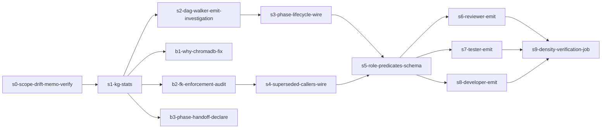

# Design Discussion: kg-repair-activation

**Epic:** `kg-repair-activation`
**Branch:** `feat/kg-repair-activation` (base: `develop`, strategy: per-epic)
**Date:** 2026-05-26
**Inputs:** `research-raw.md`, `research-brief.md`
**No PRIOR DECISIONS section** — `/hive:why` pre-flight returned no results (consumer crash, fail-soft per skill).

## 0. Prelude

Inherits the audit captured 2026-05-26: `~/.claude/hive/kg.sqlite` holds 81 triples, last write 2026-05-24, only `decided`/`phase_blocked` actually populate the DB. `kg_signal: 0.4 # demoted pending KG repair` in `hive.config.yaml:49` is the maintainer's honest admission that the graph isn't earning its weight in `meta-optimize` ranking.

The brief reframes the audit: more emit sites exist than the initial counter suggested (DAG walker, handoff dispatch, escalation-backfill, meta-team supersede, plan story-spec supersede). Some of those paths fire (`phase_blocked`, `phase_failed` from the DAG walker), some are documented-only (plan `superseded` on overwrite), and one is **outright broken** (`handoff/dispatch.mjs:90` emits the undeclared predicate `phase_handoff` — silent insert failure or constraint violation depending on schema enforcement). The audit DB shows 81 rows because the live emits that should populate over 16+ epics aren't reaching disk: either the DAG walker writes to a separate DB, or the predicates fail the foreign-key constraint silently, or both.

Layered on top of write-path gaps: the consumer surface `/hive:why` crashes free-form mode with `RuntimeError: dictionary changed size during iteration` at `hive/lib/kg_why.py:213`. Crash propagates from the ChromaDB provider call; bounded fix is ~3 lines (catch RuntimeError → return `[]`). The skill prelude's pre-flight `/hive:why` step at the top of every `/plan` run silently no-ops because of this. That's the consumer-side blast radius.

## 1. North stars (what success looks like)

1. **All 9 declared predicates have either a live write path or a documented `dropped` status with rationale.** No more zombie predicates.
2. **Non-orchestrator agents emit triples scoped to their role.** Reviewer, tester, developer at minimum. New predicates `validated`, `tested`, `implemented` added to schema (or repurpose existing — design decision below).
3. **Supersession actually fires** on plan/proposal/memory overwrites. Graph self-corrects, not just accumulates.
4. **`/hive:why` returns useful answers across all live predicates**, not just `decided`. ChromaDB free-form crash fixed.
5. **`kg_signal` weight earned back to ≥0.8** in `hive.config.yaml` after density + predicate diversity demonstrably grow over a 30-day window.
6. **Density ≥6 triples/day average over 30 days post-merge** (vs current 1.35/day). Measurable via `SELECT COUNT(*) WHERE valid_from > date('now','-30 days')`.

## 2. Proposed approach

Three plausible shapes from the brief; recommended shape is **#2 with a clean break from #3**:

### Shape 1 — Minimal repair (~3 stories)
- Fix `/hive:why` ChromaDB crash
- Declare `phase_handoff` in schema (or rename dispatch.mjs to use declared predicate)
- Wire the documented-only `superseded` callers in plan + meta-team
- **Verdict:** correct but tiny. Density barely moves. Leaves the bigger zombie-predicate problem untouched. `kg_signal` weight stays demoted.

### Shape 2 — Repair + activate (~8-10 stories) — **RECOMMENDED**
Everything in Shape 1 plus:
- Add `validated`/`tested`/`implemented` predicates (or repurpose `assigned_to` to mean role-completion) — see §3 for the design decision
- Wire reviewer/tester/developer emits at agent shutdown via insights-before-shutdown contract (already exists per `feedback_insights_before_shutdown`)
- Wire `assigned_to` on team-task ownership transfer
- Wire `blocked_by`/`depends_on` from epic.yaml + story.yaml dependency declarations (one-time bootstrap on plan completion)
- Wire `phase_started`/`phase_complete` from DAG walker step-boundary events (NOT per-phase — see §3 tension resolution)
- Audit `phase_handoff` bug; either declare predicate or rename emit
- Density verification job: 30-day post-merge density check + auto-PR to bump `kg_signal` weight when target hit

### Shape 3 — Repair + activate + graphify side-by-side (~11+ stories)
Shape 2 plus optional graphify integration. **Defer to follow-on epic.** Per scope guardrail in user input; per `feedback_test_offtheshelf_before_rewriting` we should validate graphify via a bounded spike before committing slices to it.

### Why Shape 2

- Density math: Shape 1 = ~1.5/day post-merge (negligible). Shape 2 with 3 new source agents + 5 lifecycle predicates fires ~6-9/day naturally per active epic. Hits the 6/day target without contrivance.
- `kg_signal` weight earn-back is a function of *both* density and predicate diversity. Shape 1 fixes neither at scale. Shape 2 fixes both.
- The graphify question is real but deserves its own spike before slicing. Bundle = risk of bloated PR + spike-after-commit anti-pattern.

## 3. Key design decisions (the calls this discussion must make)

### D1. New predicates vs repurpose existing

Two valid framings for non-orchestrator emits:

- **(a) Add `validated`, `tested`, `implemented` as new declared predicates.** Clean. Each role's contribution is queryable as a first-class predicate. Cost: schema migration; meta-optimize consumer might need updating.
- **(b) Reuse `assigned_to` with role as object.** Conservative. No schema change. Cost: predicate semantics get fuzzy ("assigned_to" doing double duty as "completed_by").

**Recommendation: (a).** The semantic clarity matters more than the migration cost; meta-optimize already consumes a narrow predicate set and benefits from richer signal.

### D2. Where do phase lifecycle emits live?

- The `feedback_scope_drift_emit_sites` memory says "3 emit sites only" — but the brief clarifies that was about **scope_drift**, not KG. The tension *may* evaporate, but we should verify before assuming.
- DAG walker already emits `phase_blocked`/`phase_failed` at step boundaries. Adding `phase_started`/`phase_complete` at the same locations is **architecturally consistent**, not a new emit-site explosion.
- **Recommendation:** wire `phase_started`/`phase_complete` in the DAG walker alongside existing `phase_blocked`/`phase_failed`. Same call site, expanded predicate set. NOT new emit sites.

### D3. `/hive:why` repair scope

- **(a) Bounded fix:** catch RuntimeError → return `[]`. Free-form mode degrades to sqlite-only when ChromaDB misbehaves.
- **(b) Bigger fix:** make ChromaDB optional / disabled-by-default until provider is stable.
- **Recommendation: (a) first, (b) as a follow-up story.** Bounded fix unblocks the `/plan` pre-flight today; longer-term ChromaDB question deserves its own decision.

### D4. `phase_handoff` undeclared predicate

- **(a) Add `phase_handoff` to the declared schema.** Treat the bug as a documentation gap.
- **(b) Rename the emit to use a declared predicate.** Keep schema lean.
- **Recommendation: (a).** The handoff concept is real and worth tracking; `phase_handoff` is a meaningful semantic alongside `phase_started`/`phase_complete`/`phase_failed`/`phase_blocked`.

### D5. Density verification — manual or automated?

- Story or post-merge job that queries DB after 30 days and PRs the `kg_signal` weight bump?
- **Recommendation:** scripted check + PR draft, but human merges the weight change. Avoids auto-bumping signal weight while we're still learning what density means.

## 4. Risks

| Risk | Severity | Mitigation |
|---|---|---|
| Adding new predicates breaks meta-optimize step-02c consumer | Medium | Audit `step-02c-kg-signal.md:79` query; update before declaring new predicates |
| `validated`/`tested`/`implemented` from agents floods graph with noise | Medium | Constrain to one emit per role per story (insights-before-shutdown gate); not per-step |
| `phase_started`/`phase_complete` wired in DAG walker pollutes if not gated | Medium | Same gate the existing `phase_blocked`/`phase_failed` use; do not loosen |
| `phase_handoff` schema add breaks unique-triple index | Low | Check `idx_unique_triple` constraint; predicate is a column so adding values shouldn't conflict |
| ChromaDB fix masks deeper provider issue | Low | Add log line on catch so we know how often it fires |
| 30-day density measurement gets gamed by automated emits | Low | Track distinct (source_agent, predicate) tuples, not just COUNT(*) |

## 5. Dependencies

- Bug-fix stories (`/hive:why` crash, `phase_handoff` declaration) are **no-deps** — can ship first as quick wins
- Schema migration (`validated`/`tested`/`implemented`) blocks all role-emit stories
- DAG walker emits (`phase_started`/`phase_complete`) block density-verification story
- Density verification depends on epic merge + 30-day window

## 6. Open questions

1. Is the `~/.claude/hive/kg.sqlite` location the **right** location, or should `paths.state_dir` resolve it? (raw research §8 tension) — propose: defer to State Dir Resolver project (already deferred).
2. Should we **drop** any of the 9 declared predicates entirely vs wire all of them? Current proposal wires all 9 (+ adds 3-4 new). Alternative: drop `assigned_to` if `validated`/`tested`/`implemented` cover the role-completion case.
3. Should there be a `/hive:kg-stats` skill that prints what we manually ran today, so the next maintainer doesn't have to reinvent the query? Cheap, useful, ~1 story.
4. Should `kg_signal` weight bump be 0.4 → 0.8 in one step, or staged (0.4 → 0.6 → 0.8 across 60 days)?

## 7. Scale assessment

**Recommendation: MEDIUM (`--fast` candidate).**

- Multi-file, multiple layers (schema + write paths + consumer + DAG walker + meta-optimize)
- Each story is bounded (typically 1-3 files); no novel architecture
- H/V planning would slice cleanly into 3 horizontal layers (write paths, consumers, observability) × ~2-3 vertical slices
- BUT: the decisions are already mostly made in this discussion (D1-D5). Strong design-discussion + grill + direct-to-stories is probably tighter than full H/V ceremony.

**Default: medium without `--fast`** — run H/V to confirm slicing. Honest H/V here is short (each layer's stories are independent enough that the slicing isn't load-bearing). If H/V comes back trivial, that's a signal we could have used `--fast`; not a failure.

## 8. Notes on metrics

Plugin-hive has `metrics.enabled: true` per maintainer override. This epic should be a clean test case for the meta-meta loop:

- Token + wall-clock per story → measures epic execution cost
- Pre-merge baseline: 81 triples, 2 live predicates, 1 source agent
- Post-merge 30-day measurement: density (≥6/day target), predicate count (≥5 live), source-agent count (≥3)
- Story-level `metric:` blocks should declare which numbers move (per `cross-cutting-concerns.yaml` metrics concern)

## 9. Resolutions of grill findings

The grill pass at `grill-record.md` surfaced 9 findings. Resolutions below feed directly into Phase C story scoping.

### V1 — 3-state predicate taxonomy
**Accept.** Story ACs adopt the taxonomy `declared` / `documented` / `firing` and each story names which transition it executes. Wired into the agent-ready checklist for this epic.

### H1 — Density math grounding
**Accept.** A no-deps investigation story (call it `kg-stats`) prints current `(source_agent, predicate) → COUNT` and active-epic count. Target math then anchors to: `(active_epics × roles_per_epic × stories_per_epic / week × 7) / 7 = expected/day`. If the measured baseline can't plausibly reach 6/day post-Shape-2 wiring, downgrade target to **"diversity over volume"**: ≥5 firing predicates and ≥3 source agents in 30 days, with density as secondary signal.

### H2 — DAG walker emit destination investigation
**Accept — critical.** Before wiring `phase_started`/`phase_complete`, an investigation story confirms where existing `phase_blocked`/`phase_failed` emits land. Three possible outcomes:
- (a) **Same DB, just rare** → wiring is safe additive
- (b) **Different DB** (per-project, per-cycle, separate state-dir) → consolidation story added
- (c) **Silently dropped** (FK violation, knob-off, missing-sqlite swallow) → fix-the-drop story added

This investigation is a HARD BLOCKER for the lifecycle-wiring stories — see §10 dependency revision.

### H3 — `/hive:why` catch site named
**Accept.** Bug-fix story AC explicitly names: catch `RuntimeError` in `_extract_chroma_response` (kg_why.py:292) — NOT at line 213 — so we contain the chromadb-iteration bug without masking all provider errors. Add a single-line log: `kg_why.chromadb_runtime_error count=N reason=<message>`. Story also adds a unit test reproducing the original crash.

### U1 — Investigation blocks phase-lifecycle wiring
**Accept.** §10 revised dependency graph below.

### U2 — Schema FK enforcement audit
**Accept — new story.** Auditing `PRAGMA foreign_keys` state on the kg.sqlite connection. If off, story enables it and writes a regression test. This is a one-time fix; pairs naturally with the H2 investigation story.

### C1 — Verify scope_drift memory before relying on resolution
**Accept.** First story of the epic re-reads `feedback_scope_drift_emit_sites.md` end-to-end. If the memo is indeed scope_drift-only (expected outcome), the same story updates the memo with a one-line cross-reference: `See also kg-repair-activation epic — KG emit sites are NOT in scope of this guidance.` If the memo's intent turns out to include KG, the planner re-opens D2 with that constraint.

### C2 — Clarify emit hook point for new role predicates
**Accept.** Design decision: new role predicates (`validated`/`tested`/`implemented`) emit at agent **shutdown**, in the same call sequence as insights-before-shutdown capture — but as **separate structured emits**, not part of the insights free-text. Rationale: insights are free-text for human review; predicates are structured graph signal. Same trigger point, two outputs. Wiring in `hive/agents/<role>.md` agent contracts.

### P1 — meta-optimize step-02c contract change is AC, not risk
**Accept.** Each story that adds a new predicate carries an explicit AC: *update `step-02c-kg-signal.md:79` consumer query to include the new predicate*. Treated as contract change, not downstream cleanup. Reviewer (Claude per agent_backends) verifies the update is present before the story merges.

### Notes resolution
- D1 ↔ §2 Shape 2 predicate count inconsistency: Shape 2's "3-4 new predicates" = D1's 3 (`validated`/`tested`/`implemented`) + D4's 1 (`phase_handoff`). **Total: 4 new predicates declared.** Fixed inline.

## 10. Revised dependency graph (post-grill)

10 stories total. `s0`/`s1`/`b1`/`b2`/`b3` are concurrent-eligible (read-only or bounded-slice independent fixes); the lifecycle-wiring + role-emit layer is sequenced as shown.
