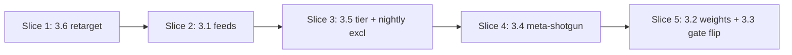

# Vertical Plan — Meta-Improvement Reset

**Epic:** `meta-improvement-reset`
**Source:** `horizontal-plan.md` + `design-discussion.md`
**Date:** 2026-05-25

## 1. Slicing Strategy

```
STRATEGY:
  Total horizontal items: 9 (workflow steps × 3, workflow YAMLs × 2, skills × 1,
                              config × 2, backlog schema × 1, GH Actions × 1,
                              cross-cutting audit, tests, docs)
  Planned slices: 5
  First slice goal: PR flow corrected (develop-targeting); zero behavior change
                    for cycles themselves but every subsequent PR review lands in
                    the right place
  Final slice goal: step-03c metric gate blocks thin-metric proposals; signal
                    weighting active in plugin-hive root config; full
                    feedback loop intentional + metric-anchored

  Slicing rationale:
    - 3.6 first (smallest, safest, unblocks every subsequent PR flow review)
    - 3.1 second (new signal feed runnable before being weighted/blocked-against)
    - 3.5 + nightly exclusion before 3.4 (clean schema + delegation before
      consumer skill ships)
    - 3.4 stands on 3.5's delegation contract
    - 3.2 + 3.3 LAST: weights + gate flip touch hot path (step-03/03c) — ship
      after new signals are producing and shotgun absorbed the little-fix surface
```

## 2. Vertical Slice Plan

### Slice 1: Retarget meta-meta-nightly PRs to develop (§3.6)

**WHAT WORKS AFTER THIS SLICE:**
Next /meta-meta-optimize nightly PR opens against `develop`, not `main`. Review flow consistent with feature-branch convention per `feedback_seek_direct_push_auth`.

**Layers touched:**
- GH Actions (1 file edit)
- (Optional) docs note in `hive/references/meta-optimize-maintainer.md`

**Story breakdown:**
- **mir-1**: Locate + retarget meta-meta-nightly PR base from `main` to `develop`
  - Research: find the gh pr create site (likely `.github/workflows/hive-dispatch.yml:155` OR scheduled nightly workflow)
  - Change: explicit `--base develop` override
  - Verify: open synthetic PR or wait for next nightly; check `gh pr view --json baseRefName`
  - Methodology: classic
  - Metric: `meta_pr.baseRefName_correct (binary up: 0/3 → 3/3 next 3 nightlies)`

**Verification:** Next nightly PR baseRefName=develop. Manual confirmation acceptable.

---

### Slice 2: External research subproviders (§3.1)

**WHAT WORKS AFTER THIS SLICE:**
step-02b runs both subproviders every cycle; `external_research_candidates` list populated when releases / posts exist; routes through existing step-03 §2b merge to eligible-pool.

**Layers touched:**
- Workflow step file (`step-02b-external-research.md`)
- Tests (provider fetch mocks)

**Story breakdown:**
- **mir-2**: Add Claude Code release-notes subprovider to step-02b
  - Update step-02b doc: add `claude_code_release` subsource (GH API endpoint, tag rule, filter)
  - Researcher prompt template: filter rule for "Anthropic shipped X" vs "Hive should adopt X"
  - Unit test: mocked GH releases response → 1+ candidates with correct shape + tag
  - Methodology: classic (could be tdd but small)
  - Metric: `external_research_candidates.count (up: 0/3 → ≥1 in next 3 cycles given a CC release in window)`

- **mir-3**: Add Anthropic blog subprovider to step-02b
  - Verify feed endpoint (https://www.anthropic.com/news or RSS)
  - Tag rule + filter (skip company/business/policy posts; keep model/capability/SDK)
  - Unit test: mocked feed response → candidates with `signal_subtype: anthropic_blog`
  - Methodology: classic
  - Metric: `external_research_candidates_by_subtype.anthropic_blog (count)`

---

### Slice 3: Backlog tier field + nightly exclusion (§3.5 + part of §3.4 prep)

**WHAT WORKS AFTER THIS SLICE:**
`queue-meta-meta-optimize.yaml` supports `tier:` field on candidates. Nightly cycles read candidates and skip `tier: little-fix` entries (delegate to shotgun, even though shotgun doesn't exist yet — the surface is reserved).

**Layers touched:**
- Backlog schema (`.pHive/meta-team/queue-meta-meta-optimize.yaml` header docs)
- Workflow step files (`step-02-analysis.md` OR `step-03b-backlog-fallback.md` — add tier filter)
- Validator (if one exists)
- Tests + docs

**Story breakdown:**
- **mir-4**: Add `tier:` field to queue-meta-meta-optimize.yaml schema
  - Update file header comment with `tier:` enum + definition
  - Default behavior: missing field = `structural`
  - Update `hive/references/meta-optimize-maintainer.md` queue-management section
  - No data migration (existing candidates default to structural)
  - Methodology: classic
  - Metric: `backlog_candidates.with_tier_field (count, will rise from 0 as new candidates added)`

- **mir-5**: Filter `tier: little-fix` from nightly cycle backlog-fallback
  - Modify step-03b-backlog-fallback.md filter logic
  - Workflow YAML: ensure filter step runs before backlog candidates enter step-03
  - Unit test: backlog with mixed tiers → only structural+strategic flow through to nightly proposals
  - Methodology: classic
  - Metric: `nightly.proposals_with_little_fix_tier (down: monitor; target 0)`

---

### Slice 4: /meta-shotgun skill (§3.4)

**WHAT WORKS AFTER THIS SLICE:**
Maintainer can run `/meta-shotgun` → reads tier:little-fix candidates from backlog → applies changes → opens single PR with sections per dir.

**Layers touched:**
- New skill (`skills/hive/skills/meta-shotgun/SKILL.md`)
- New workflow YAML (`hive/workflows/meta-shotgun.workflow.yaml`)
- Tests (integration)
- Docs (runbook)

**Story breakdown:**
- **mir-6**: Build `/meta-shotgun` skill scaffold
  - SKILL.md with maintainer-skill posture (NOT in plugin.json manifest)
  - Frontmatter (name, description, args, trigger phrases)
  - Process section: invokes meta-shotgun.workflow.yaml
  - Preconditions: backlog has ≥1 pending tier:little-fix candidate
  - Methodology: classic
  - Metric: `meta_shotgun.invocations (count; baseline 0; track over next 3 months)`

- **mir-7**: Build meta-shotgun workflow + integration test
  - meta-shotgun.workflow.yaml with steps: filter → exclude-30d-touch → apply → validate → commit → push PR → mark done
  - 30-day touch exclusion via `git log --since` check per candidate file
  - Single PR with sections per dir, no in-skill grouping
  - Integration test: stub backlog (3 little-fix candidates spanning 2 dirs) → single PR opened with 2 sections
  - Methodology: classic
  - Metric: `meta_shotgun.candidates_per_run (count; expect 3-10 after 1 month accumulation)`

---

### Slice 5: Signal weights + metric gate flip (§3.2 + §3.3) — LAST

**WHAT WORKS AFTER THIS SLICE:**
Plugin-hive root `hive.config.yaml` carries weight + gate config; step-03 applies weight multipliers; step-03c blocks thin-metric proposals (with `advisory` escape hatch). Meta cycles produce signal-driven, metric-anchored proposals OR reject and surface gaps.

**Layers touched:**
- Workflow step files (step-03 ranking, step-03c gate)
- Config (`hive/hive.config.yaml` example + `hive.config.yaml` root)
- Cross-cutting concerns audit
- Tests
- Docs

**Story breakdown:**
- **mir-8**: Add `meta_optimize.signal_weights` config knob to step-03 ranking
  - PRECONDITION (grill H2 resolution): research step verifies step-03 has a multiplier surface; if absent, scoring infrastructure added here (expand scope)
  - Add weight read from config; default all 1.0 (preserves current behavior)
  - Apply multiplier per `discovery_source` to existing priority score
  - Shipped baseline: comment-only example
  - Root config: active weights per design §3.2 example
  - Unit test: weight = 1.0 preserves current ordering; weight > 1 elevates source; weight = 0 demotes
  - Methodology: tdd (knob math is mechanical)
  - Metric: `meta_optimize.proposals_by_discovery_source (distribution; expect shift toward external_research in plugin-hive root after enabling)`

- **mir-9**: Flip step-03c metric gate to blocking (with advisory escape hatch)
  - Read `meta_optimize.metric_gate` config (default `blocking`; `advisory` opt-in)
  - Blocking mode: gate failures → `enriched_proposals[*].status: rejected_metric_gate` with failing field named; proposal does NOT enter step-04
  - Advisory mode: current non-blocking behavior preserved (escape hatch)
  - Surface rejections in PR body under "Rejected by metric gate" section
  - Cross-reference `/plan §14a` in step-03c.md to flag drift risk
  - Unit test: blocking + thin metric → rejected; advisory + thin metric → passes; per-proposal scope
  - Cycle-level: continues with passing subset; fails only when zero proposals pass
  - Methodology: tdd
  - Metric: `step_03c.proposals_rejected_per_cycle (count; expect 0-2 per cycle steady state; cycle continues with passing subset)`

- **mir-10**: Audit cross-cutting `metrics` concern alignment + docs sweep
  - Read `.pHive/cross-cutting-concerns.yaml` metrics concern definition
  - Verify `applies_when` + `planning_prompt` are consistent with blocking-gate semantics
  - Update `hive/GUIDE.md` meta-optimize section with new knobs
  - CHANGELOG.md entries for all 6 surface changes
  - New `hive/references/meta-shotgun-runbook.md` (or inline in SKILL.md)
  - Methodology: classic
  - Metric: applies:false — process/docs substrate story; justified via mir-9 verification

---

## 3. Slice Dependency Graph



Linear chain — each slice unlocks the next. Slice 1 is independent (could ship same day). Slice 5 is the heavy one.

## 4. Verification Strategy per Slice

| Slice | Verification |
|---|---|
| 1 | Next nightly PR `baseRefName=develop` (manual obs + 1-line script) |
| 2 | Mocked fetch unit tests; live verify by triggering nightly with WebSearch grant active |
| 3 | Unit test on filter; integration: add tier:little-fix candidate, run nightly cycle, confirm skipped |
| 4 | Integration test with stub backlog; manual: first real /meta-shotgun run after Slice 3 accumulates fixtures |
| 5 | Unit tests for weight math + gate decisions; integration: real /meta-meta-optimize cycle with both knobs active; observe PR body shows rejected proposals |

## 5. Working-State Invariants

After each slice:
- **Slice 1**: nightly PRs review-able in develop; main is clean
- **Slice 2**: every cycle produces external_research candidates (when feeds have entries); no blocking on weight or gate
- **Slice 3**: tier:little-fix candidates start accumulating in backlog; nightly cycles ignore them
- **Slice 4**: maintainer can run /meta-shotgun; cleans up accumulated little-fix backlog
- **Slice 5**: thin-metric proposals get rejected with explicit surfacing; signal-driven cycles win over backlog dribble

If a slice fails mid-implementation, the prior slice's working state is preserved (no in-flight breakage). The gate flip in Slice 5 is the only operation with potential to disrupt in-flight cycles; mitigated by `metric_gate: advisory` escape hatch.
