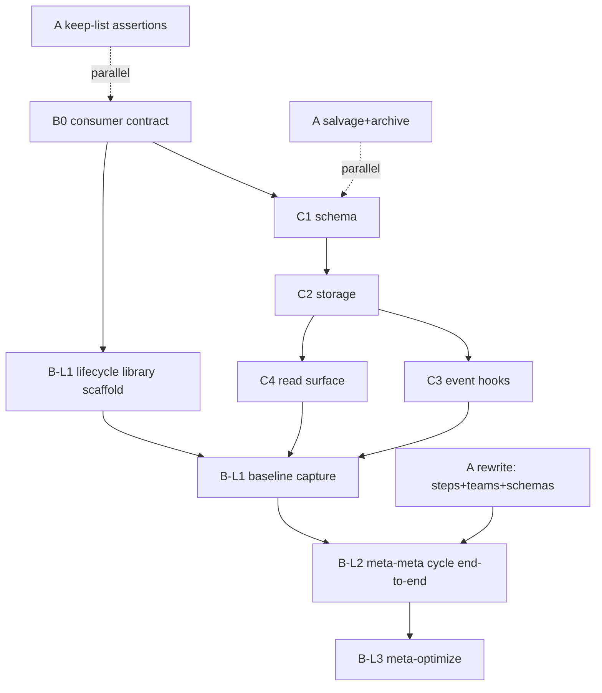

# 1. Revised sequencing recommendation

My initial read (`C ∥ A → B`) survives contact with Phase A but needs one hard adjustment: **B's thin consumer contract must be drafted before C's schema freeze**, per architect recommendation 1 and risk #2. That inverts the naive dependency (C feeds B) into a contract-first loop (B shapes C shapes B).

Revised sequence:

```
  ┌─────────────────────┐
  │ B0 — consumer contract │   ← new upstream sliver (~1-2 days)
  │ (query shape, envelope │
  │  outline, policy seams)│
  └──────────┬──────────────┘
             │
      ┌──────┴──────┐
      ▼             ▼
  [C proper]    [A proper]      ← parallel after B0
  schema+storage  audit+rewrite
      │             │
      └──────┬──────┘
             ▼
         [B proper]              ← swarm implementation
```

B0 is not all of Epic B — it is the minimum Epic B design surface required to keep Epic C from guessing. C and A then run in parallel (they touch disjoint subsystems: C = new `.pHive/metrics/` + hooks; A = existing `.pHive/meta-team/` + workflow steps). B proper lands after both.

This preserves "C is foundational" (the data layer still ships before B runs) while honoring the architect's point that C's shape is driven by B's queries, not the other way around.

# 2. Epic C internal sequencing

Apply the subsystem-seam heuristic. C has four natural sub-layers with different risk and coupling:

1. **Schema contract** (LOW) — define dual carrier: `.pHive/metrics/events/*.jsonl` envelope + `.pHive/metrics/experiments/*.yaml` envelope. Pure schema docs + validation.
2. **Storage primitives** (LOW) — append-only writer module + filesystem layout + rotation policy. No emitters wired yet; writer is inert.
3. **Event emission hooks** (MEDIUM) — passive capture points (Stop hook, PostToolUse, agent-spawn report, step boundaries). First actual telemetry flow. Must land one subsystem at a time to isolate regression surface.
4. **Query/read surface** (LOW, but gated on 1-3) — helper scripts or skill for baseline snapshot and delta comparison. Consumed by B.

Sequencing within C: 1 → 2 → 3 → 4. 1+2 are bundled-safe (contract + inert primitives is a coherent increment). 3 is the risk-class break — split by emission site if the hook surface is wide.

**MVP metric set (epic-scope-defining):** tokens-per-story, wall-clock-per-phase, fix-loop-iterations, human-escalations, first-attempt-pass-rate. These five cover the four brief categories with minimum hook surface. Everything else (cache hit rate, CodeRabbit fixes, memory wiki hit rate, trust trajectory, skill invocation coverage) is deferred to C-follow-on once Epic B has proven the MVP set is useful.

**The token-count risk (researcher constraint #1) materially shapes C3.** If the Claude Code SDK doesn't surface per-Agent token usage via TeamCreate, C3 needs an alternative capture path (PostToolUse on Task tool? transcript parsing? explicit self-report?). This is a C3 design discussion item, not a sequencing item — but it may force token metrics into a C-follow-on if no viable capture exists.

# 3. Epic A scope split

Architect framing: "control-plane rewrite with selective artifact salvage." Not a contradiction-patch pass. Breaking by delivery shape:

**Keep-list (no-op, still valid) — ~0-1 stories:**
- `.pHive/meta-team/queue.yaml` source-attribution fields (preserve as registry with added experiment fields — handled in B proper, not A).
- `skills/status/SKILL.md` §8 morning-summary surface hook point.
- The loop vocabulary itself (analyze → propose → implement → test → evaluate → promote → close).

**Salvage-list (preserve as historical refs, migrate pointers) — ~2-3 stories:**
- `hive/references/meta-team-nightly-cycle.md` → demoted to operator-narrative-only, cross-referenced from new docs.
- Old `cycle-state.yaml` and `ledger.yaml` contents → archived under `.pHive/meta-team/archive/` with a MANIFEST note; live files cleared for new schema.
- `.pHive/design-discussion-meta-team.md` + `.pHive/research-brief-meta-team.md` → marked "historical rationale, non-authoritative" in-file.
- Charter hard constraints (§37-45, §70-82) → extracted into a shared `meta-safety-constraints.md` ref, reused by both new charters.

**Rewrite-list (must rebuild) — ~5-7 stories:**
- New `meta-optimize` charter (user-project swarm).
- New `meta-meta-optimize` charter (plugin-hive swarm).
- `.pHive/teams/meta-team.yaml` → split into two team files with correct per-role `.pHive/**` write grants matching new step obligations.
- All six flagged step files (implementation, testing, evaluation, promotion, close — plus workflow file itself).
- `hive/references/meta-team-sandbox.md` → replaced with a single authoritative isolation contract doc (worktree-centric per risk #1).
- New schemas: experiment-envelope.yaml, metrics-event.jsonl, dual-schema READMEs.

Rough Epic A story-count estimate: **~8-11 stories total**. Weighted toward rewrite-list. Keep-list is effectively zero net work (assertions, not deliverables).

# 4. Epic B scope split

**One epic, two swarms, three distinct seams.** Not two epics — the shared experiment lifecycle and carrier conventions (architect §4 "shared seam") are the point. Splitting into two epics risks divergent implementations of the same abstraction.

Internal shape: three-layer architecture.

- **Layer 1 — shared lifecycle library** (~3-4 stories). Experiment envelope runtime, baseline-capture primitive, delta-compare primitive, promotion adapter interface, rollback watch-window primitive. No swarm-specific code.
- **Layer 2 — `meta-meta-optimize` skill** (~3-4 stories). Plugin-hive-targeted. Worktree isolation default, harness-metric policy registry, direct-mutation promotion adapter, internal commit-based rollback. **This is the lower-risk swarm to ship first** — risk profile is contained to plugin-hive repo, and it exercises the shared library first.
- **Layer 3 — `meta-optimize` skill** (~3-4 stories). User-project-targeted. PR-artifact promotion adapter, consumer-supplied metric registry, stricter permission model, target-repo isolation. Ships after L1+L2 prove the abstraction.

**Critical path "C schema locked" → "first meta-meta-optimize cycle runs end-to-end":**

```
C1 schema → C2 storage → C4 read surface ─┐
                              ├──→ B-L1.1 envelope → B-L1.2 baseline → B-L1.3 compare → B-L2.1 skill scaffold → B-L2.2 worktree-isolated cycle runs
A-rewrite (workflow steps) ───┘
```

Six to eight steps on the critical path. A-rewrite must merge before B-L2.2 because the new step files ARE the cycle B-L2 orchestrates.

# 5. Cross-epic dependencies



**Serializations that are real and must be honored:**
- A-rewrite → B-L2 cycle execution (can't orchestrate against step files that don't exist).
- C1 schema → C3 hooks (can't emit against undefined envelope).
- B0 → C1 (per architect risk #2).

**Serializations that look real but aren't (parallelization opportunities):**
- C and A proper: zero shared files once B0 lands. Run concurrent.
- A-salvage and A-rewrite: different file sets, can run parallel if two workstreams.
- B-L1 library and C3 hooks: no shared files; library consumes C's contract, not C's implementation.

**Invisible-parallelism flag:** A-keep-list (~0-1 stories) is zero-dependency — could run immediately alongside B0 to clear noise. No reason to wait.

# 6. Calendar-time vs work-time estimate

| Epic | Size | Agent-days | Notes |
|---|---|---|---|
| B0 (consumer contract sliver) | small | 1-2 | Design sketch, not impl. Just enough for C to build against. |
| Epic C | medium-large | 5-8 | Schema (1d) + storage (1-2d) + hooks (2-3d, risk-class split likely) + read surface (1-2d). Token-capture unknown could push this up. |
| Epic A | medium | 4-6 | Rewrite-heavy but file-scoped. 8-11 stories at ~0.5d each. |
| Epic B | large | 7-10 | Three layers at 3-4 stories each. L2 proves the lib; L3 repeats with different adapter. |
| **Total critical path** | **1.5-3 weeks** | **11-15 agent-days** | Assumes 1 active teammate; A ∥ C cuts calendar time. |

"Agent-days" = one focused teammate-day. Calendar-time depends on parallelism. With C ∥ A running concurrently and A-keep + B0 front-loaded, the epic is **1.5 weeks optimistic, 3 weeks realistic, 4+ weeks if token-capture forces a detour**.

# 7. Risks YOU see that architect/researcher didn't flag

1. **Epic B's abstraction test is Layer 2, but Layer 2 is also the higher-anxiety swarm.** The architect is right that `meta-meta-optimize` is lower blast-radius and should ship first — but it's also the swarm that modifies the optimizer itself. If the shared L1 library has a bug, L2 is where it bites, and it bites the thing fixing itself. **Sequencing mitigation:** B-L2's first cycle must run against a no-op target (an intentionally trivial experiment like "rename a comment") so the infra is validated before real experiments. Add this as a B-L2 acceptance gate, not a story of its own.

2. **Story-ordering inside B will thrash if C's schema isn't frozen by the time B-L1 drafts start.** This is a soft version of architect risk #2 cast as a sequencing risk: even with B0 defining the consumer contract, there's a window where C1-C2 are in flight and B-L1 could begin drafting. If C's schema shifts during that window, B-L1 rewrites. **Sequencing mitigation:** hard gate B-L1 start on C1+C2 merge, not on B0. B0 lets C proceed; C1+C2 merge lets B proceed. The gate is one-way.
