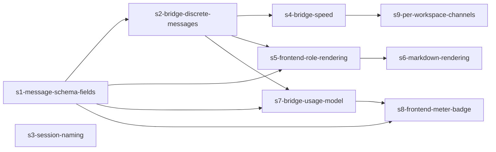

# Design Discussion — multica-hermes-chat-refine

**Epic:** multica-agent-tui (refine the Multica fork's Hermes tab chat)
**Date:** 2026-06-25
**Target repo:** `/Users/hive/Code/spikes/multica/` (the Multica fork on Studio) — NOT plugin-hive

---

## §0 Prelude

No prior KG decisions on this topic. Clean slate.
git_flow: base_branch=develop, branch_strategy=per-epic (planning artifacts only; impl lands in the fork repo).

**Path A (iframe stock `hermes dashboard`) rejected** after investigation — the native tab is better-architected than stock (workspace-integrated, persisted, multi-thread). Refine, don't replace.

---

## §1 Goal

Make the Hermes tab chat read like the Hermes web UI session view:
1. Discrete turn/tool messages instead of one growing bubble
2. Context meter (tokens used / window)
3. Model badge
4. Sessions surfaced in the Hermes web UI, named to their Multica thread
5. Faster bridge
6. Per-workspace channels

**The enabling insight:** the hermes api server (`:8642`) SSE stream already emits `usage`, `model`, session `title`/`source`, and `tool.started/completed/reasoning` events. The bridge throws them away. Most of this epic is **teaching the bridge to consume what's already there**, plus thin schema + UI plumbing.

---

## §2 Proposed approach (by gap)

### Gap 1 — Discrete messages
Bridge currently posts one placeholder and PATCHes it for the whole turn. Change `handle_message` so each SSE boundary creates a **new** multica message:
- `reasoning.available` → a collapsed "thinking" message (optional, role=reasoning)
- `tool.started` → a "🔧 <tool>(<args preview>)" message (role=tool)
- `assistant.delta`…`assistant.completed` → the assistant text message (role=assistant), still streamed via PATCH into ITS OWN bubble
Requires a `Role`/`Kind` field on the multica message schema (server + store + WS payload + frontend rendering branch).

### Gap 2 — Context meter
Bridge reads `usage` from the completion event + `model_context_length` (api_server exposes it). Writes `tokens_used` + `context_window` onto the message (and a running total on the thread). Frontend renders a meter in the thread header.

### Gap 3 — Model badge
Bridge captures session `model` (from session create response or completion event), stores on thread. Frontend renders a small badge next to the bridge-health dot.

### Gap 4 — Session naming + surfacing
On session create, set `title` = the Multica thread Title (not `hive:<uuid>`), and `source: "multica"`. Keep title synced if thread renamed. Confirm api_server session DB == dashboard `:9119` list (verified same store). Result: Multica conversations appear in `hermes dashboard` / `hermes sessions` with human names.

### Gap 5 — Speed
Profile first. Candidate fixes: (a) drop the redundant non-stream `hermes_respond` path; (b) coalesce/raise PATCH efficiency (batch deltas, or use a single keep-alive HTTP session — `requests.Session()`); (c) move per-message handling off the WS thread (worker queue) so concurrent threads don't serialize; (d) reuse connections.

### Gap 6 — Per-workspace channels
Today one bridge = one `HERMES_WORKSPACE_ID`. Make the bridge multiplex: subscribe to N workspaces (config list), namespace `session-store.json` + bridge-status by workspace, one logical "channel" per workspace. Per-process-per-workspace under a supervisor is the fallback if multiplex proves racy.

---

## §3 Technical layers / files

| Layer | Files | Gaps |
|-------|-------|------|
| Bridge (Python) | `docs/hive-plugin/hermes_bridge.py` | 1,2,3,4,5,6 (ingest) |
| Go server | `server/internal/hive/{router,store,bridge_status}.go` + a migration | 1 (Role field), 2 (usage fields), 3 (model field) |
| Web | `packages/hive/HermesChat.tsx` | 1 (role rendering), 2 (meter), 3 (badge) |

---

## §4 Risks

1. **Schema migration on a live fork** — adding message fields needs a SQL migration in `server/internal/hive/migrations/`. Backward-compat: default Role=assistant, null usage.
2. **api_server `usage` payload sub-keys unconfirmed** — confirm `total_tokens`/`prompt_tokens` names against a live stream before wiring the meter (MEDIUM). Fallback: read from `assistant.completed` payload.
3. **Gap-6 multiplex races** — shared session-store across workspaces. Mitigate with per-workspace keying + a lock; fall back to per-process.
4. **Bridge restart = downtime** — schedule changes when idle; bridge already has reconnect backoff.
5. **Fork is not plugin-hive** — these commits land in the Multica fork repo. Plugin-hive only holds the planning docs. Don't cross the streams.

---

## §5 Open questions (answer at the gate)

1. **Gap-1 granularity:** discrete messages per *tool call* too (🔧 messages), or only per assistant turn? Tool messages = best fidelity to hermes UI, but more schema + noise.
2. **Gap-6 shape:** one multiplexing bridge process, or one-per-workspace under a supervisor?
3. **Scope cut:** do all 6 this epic, or land 1+4+5 first (the "follow the conversation" core) and defer 2+3+6 (meter/model/multi-ws) to a second slice?
4. **Markdown rendering** (adjacent freebie — frontend renders raw plaintext today): fold in, or leave out of scope?

---

## §6 Scale assessment

**MEDIUM–LARGE.** 6 concerns × 3 layers, one SQL migration, cross-language (Python bridge + Go server + React). But layers map cleanly and most work is bridge-side consumption of an existing stream. No deep unknowns. Recommend **MEDIUM** with ~7-9 stories sliced so the conversation-legibility core (gaps 1,4,5) ships first and is independently useful.

---

## §7 Proposed slicing (vertical)

- **Slice 1 (legibility core):** gap 1 (discrete msgs) + gap 4 (session naming) + gap 5 (speed). Ships a chat that's readable + sessions surfaced + snappier.
- **Slice 2 (telemetry):** gap 2 (context meter) + gap 3 (model badge). Builds on slice-1 schema work.
- **Slice 3 (scale-out):** gap 6 (per-workspace channels).
- **Adjacent:** markdown rendering (optional, slot into slice 1).

```
slice1: bridge-discrete-msgs ─┬─ session-naming ── bridge-speed
                              │
slice2:                       └─ msg-schema-usage ── context-meter ── model-badge
slice3:                           per-workspace-channels
```

---

## §8 Concept illustration

<figure data-placeholder="concept illustration — image generation unavailable (OPENAI_API_KEY unset / openai-image MCP not loaded)">
</figure>

> Visual planning is ON; concept raster skipped (best-effort, non-blocking per planning-format-contract §8). Mermaid dependency graph below is the canonical visual.


