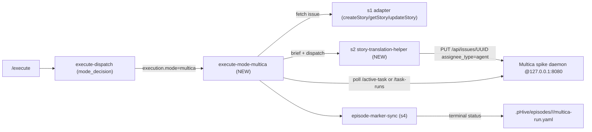

# Design Discussion — multica-execute-routing

**Date:** 2026-05-21
**Status:** Draft for user confirmation
**Scale:** Small-medium (5 stories, additive, well-scoped)

## Goal

Wire `/execute` to dispatch through Multica agents as an additive opt-in dispatch mode alongside `sandcastle`, `team`, `team-cmux`, `sessions`, and `sequential`. Default remains `sequential` (local orchestrator-narrated).

v2.6.0 (multica-substrate-adoption) shipped the adapter (s1), `/plan` Phase D wiring (s2), bootstrap skill (s3), persona seed (s4), and docs (s5). What's missing: the actual dispatch — `/execute` does not yet route work through Multica agents. This work closes that loop.

## Trigger surface

Mirrors the existing sandcastle override at `skills/hive/skills/execute-dispatch/SKILL.md:64-69`:

- `HIVE_EXECUTION_MODE=multica` env (exact match, case-sensitive)
- Root `hive.config.yaml execution.mode: multica`

Either triggers `mode_decision=multica`, `mode_reason=execution-mode-override-{env|config}`. Skips the standard sessions/team/sequential resolution.

## Architecture

## Proposed approach (5 stories)

### s1 — dispatch wiring (low)
Add `multica` to `execute-dispatch.SKILL.md` mode_decision enum + precedence. Mirror the existing sandcastle override branch. Returns `mode_decision=multica`. New test under `tests/hive-lib/`.

### s2 — story-translation-helper (medium)
New `hive/lib/multica-story-dispatch/index.mjs`. Pure functions:
- `serializeStoryBrief(story) → markdown` — story spec → Multica issue body text (sections: description, AC, files_to_modify, code_examples)
- `resolveAgentUuidByName(serverUrl, token, workspaceId, name) → uuid | throws` — fail-loud lookup
- `ensureIssueBriefMatches(serverUrl, token, workspaceId, issueUuid, brief) → was_updated`
- `dispatchStoryToAgent(serverUrl, token, workspaceId, issueUuid, agentUuid) → response` — PUT with `{assignee_type, assignee_id}`

### s3 — execute-mode-multica skill (medium)
New `skills/hive/skills/execute-mode-multica/SKILL.md` mirroring `execute-mode-sandcastle/SKILL.md`. Per-story lifecycle: precondition check → fetch issue → write brief → resolve agent UUID → dispatch → poll → cleanup. Inputs: `workflow_path`, `unblocked_stories[]`, `appends_map`, `epic_handle`, `hive_config`.

### s4 — episode marker sync (medium)
New `hive/lib/multica-story-dispatch/episode-sync.mjs`. `pollTaskUntilTerminal()` helper drives state transitions via `/active-task` + `/task-runs`. Writes one Hive episode marker per story (v1 contract: whole-story episode, not per-Hive-phase) at `.pHive/episodes/<epic>/<story>/multica-run.yaml`. Captures last N messages from `/api/tasks/{id}/messages` into an artifact for audit.

### s5 — smoke + docs (low)
End-to-end smoke at `tests/smoke/multica-execute-mode.test.mjs` (gated on live spike availability). README "How execution works" subsection + GUIDE update. CHANGELOG 2.7.0 entry. Version bump 2.6.0 → 2.7.0 across plugin.json + marketplace.json (both fields) + README badge.

## Key design decisions

### D1: Whole-story-to-one-Multica-agent (v1 contract)
Multica owns the full story execution. The assigned agent runs research+implement+test+review+integrate inside its own work_dir. Hive writes ONE `multica-run` episode marker per story (`started → in_progress → passed|failed|cancelled`), NOT per-Hive-phase markers.

**Rationale:** Multica agents already run a multi-step internal loop via their session. Carving up into per-phase Hive episodes would require synthetic phase boundaries that don't exist in Multica's model. Whole-story is the natural unit.

**Trade-off:** Loss of per-phase Hive observability. Mitigated by capturing the Multica `/api/tasks/{id}/messages` stream into the episode artifact for audit. Per-phase routing within Multica can be a v2 extension if needed.

### D2: Per-story issues (no reuse)
Each `/execute` run creates a fresh Multica issue per story (using s1 adapter `createStory`). The issue exists for the lifetime of that run. Re-running `/execute` on the same story creates a NEW issue.

**Rationale:** Multica `UpdateIssue` cancels existing active tasks on assignee change (per research line 108). Reusing issues for re-runs would silently cancel any in-flight work. Per-story issues = isolation.

**Trade-off:** Multica issue list grows with each `/execute` invocation. Acceptable — Multica supports archival; cleanup is a separate concern.

### D3: Fail-loud on missing bootstrap
If `GET /api/agents?workspace_id=<UUID>` returns empty OR the named persona (developer/tester/reviewer) is missing, abort with a clear `/hive:multica-init` pointer. Do NOT silently fall back to local sequential.

**Rationale:** `execution.mode: multica` is explicit user intent. Silent fallback hides config drift. Failing loud points to the fix (s3 bootstrap).

### D4: Polling, not SSE/WebSocket (v1)
Poll `/active-task` and `/task-runs` every 5s (configurable via `execution.multica.poll_interval_seconds`). Research line 325 flags WebSocket/SSE stability uncertainty for v0.3.4. Start with polling; revisit when stability proven.

### D5: Brief lives in `description`, NOT comments
Multica has no per-run instructions field. The story brief MUST be in the issue body before assignment. Use `description` (single canonical location) rather than comments (could be missed by agent reading just title+description).

**Rationale:** Comments are a fragmented signal. Description is the canonical body the Multica agent already reads on dispatch.

### D6: Persona → agent name mapping
The Hive story workflow's `agent:` field (`developer`, `tester`, `reviewer`) maps directly to the Multica agent `name` field via the seed at `.pHive/multica/agents.yaml`. The dispatch helper resolves `developer → spike-claude UUID` (or whatever name the seed declares for that workspace).

For the v1 whole-story contract (D1), the assigned agent is the `developer` persona (it runs the full classic workflow internally). `tester` and `reviewer` are bootstrapped for future per-phase routing (v2).

## Risks (with mitigations)

| # | Severity | Risk | Mitigation |
|---|----------|------|------------|
| R1 | High | No per-run instructions field → brief must serialize into issue description | D5; helper enforces brief-in-description; ensureIssueBriefMatches re-writes if drift |
| R2 | Medium | Reassignment cancels existing tasks → re-runs blow away in-flight work | D2 per-story issues; no reassignment |
| R3 | Medium | Bootstrap precondition failures masked as silent fallback | D3 fail-loud with `/hive:multica-init` pointer |
| R4 | Medium | Multica spike API drift in 0.3.x (still pre-1.0) | friction-notes pattern; adapter version tracks deltas; spike pinning |
| R5 | Low | Poll cadence: too tight loads spike, too loose stale episodes | Default 5s, configurable; revisit with telemetry |
| R6 | Low | `AgentTaskResponse.workspace_id` is `""` in responses (research line 307) | Don't rely on it; consumers already have workspace context |
| R7 | Low | Task messages are stream-style (seq-based), need `since` handling | Episode sync captures last-N via simple seq tracking; not full streaming |

## Dependencies (all already on develop)

- `hive/adapters/multica/index.ts` (s1 of multica-substrate-adoption) — issue CRUD
- `hive/lib/multica-bootstrap/index.mjs` (s3 of prior) — `reconcileAgents`, `getRuntimes`
- `hive/lib/multica-agents-config/index.mjs` (s4 of prior) — `parseAgentsConfig`, `resolveAgentInstructions`
- `.pHive/multica/agents.yaml` (s4 of prior) — persona seed
- `skills/multica-init/SKILL.md` (s3 of prior) — bootstrap entry point referenced in fail-loud errors

## Open questions (resolved inline)

**Q1: Should `/execute` create new Multica issues per story, or reuse tracker_id from Phase D?**
A: Reuse `tracker_id` when populated (from Phase D's `task_tracking.adapter: multica` run). If not populated (user ran `/plan` with different adapter), `execute-mode-multica` creates one. The helper accepts both paths.

**Q2: Persona mapping when live Multica contains extras or missing desired agents?**
A: Fail-loud on missing `developer`. Ignore extras. Bootstrap (s3 of prior epic) is the canonical source of truth.

**Q3: Episode markers from task status alone, or magic completion string?**
A: Task status alone (`completed | failed | cancelled` are unambiguous per research line 181). No magic strings.

**Q4: Sidecar reviewer modeling?**
A: OUT OF SCOPE for v1. v1 contract is whole-story-to-one-agent (D1). Sidecar reviewers per the `appends_map` input are documented but no-op'd in v1 with a `[info] sidecar injection deferred to v2 multi-agent contract` log line.

**Q5: WebSocket/SSE for task events?**
A: D4 — polling only in v1.

**Q6: Auto-bootstrap on empty agent list?**
A: D3 — no auto-bootstrap. Fail loud, point at `/hive:multica-init`.

## Scale assessment

**SMALL-MEDIUM.** 5 stories, additive, well-scoped, mirrors existing pattern. Skipping H/V planning and structured outline. Proceeding directly to story decomposition per `/plan` small-scope routing.

## Out of scope (explicit)

- **Sandcastle teardown** → separate epic `sandcastle-adoption-followon`
- **Making multica the default** → leave `execution.mode` unset = sequential
- **Per-phase Hive episode markers when Multica owns the story** → v2 (multi-agent contract)
- **Sidecar reviewer dispatch via Multica** → v2 (multi-agent contract)
- **SSE/WebSocket event consumption** → v2 (deferred per D4)
- **Multica issue archival/cleanup after `/execute` runs** → separate concern

## Methodology

`classic` (per `hive.config.yaml default_methodology`). All 5 stories use the classic workflow (research → implement → test → review → integrate).

## Branch + git flow

- Branch: `feat/multica-execute-routing` (created)
- Base: `develop` (per `git_flow.base_branch`)
- Strategy: `per-epic` (one PR for the epic)

## Confirmation gate

User reviews this document, confirms scope + key design decisions (D1-D6), then story YAMLs land on disk and Phase D decision (publish to Multica vs local-only) is made.
