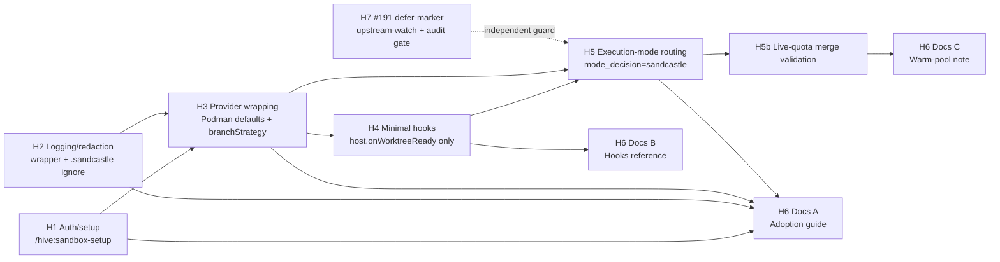

# Horizontal Plan: Sandcastle Adoption Follow-on

## Goal

This plan maps the breadth of Phase B2 work for adopting Sandcastle as an opt-in Hive execution mode, not as a backend-dispatch or Messages-API substrate change. It enables later story authoring to preserve the TPM's slice cuts while keeping security gates, provider lifecycle ownership, routing integration, documentation, and upstream-watch work visible across the full architecture.

The primary source is the TPM sequencing memo, which identifies seven horizontal layers and seven vertical slices with 11 total stories (`.pHive/epics/sandcastle-adoption-followon/docs/tpm-sequencing-memo-b2.md:11`). Supporting inputs confirm the post-2.0 placement, Codex-path-only scope, sidecar-neutral V1 posture, and #191 defer-marker requirement (`.pHive/epics/sandcastle-adoption-followon/docs/user-decisions-b1.md:29`, `.pHive/epics/sandcastle-adoption-followon/docs/user-decisions-b1.md:41`, `.pHive/epics/sandcastle-adoption-followon/docs/user-decisions-b1.md:51`).

## Architectural Layers

### H1. Auth/setup Layer

The auth/setup layer owns the one-time project setup path for Sandcastle Codex runs. It creates the dedicated `/hive:sandbox-setup` surface and treats `auth.json` provisioning, container image expectations, and rootless Podman prerequisites as setup preconditions rather than hot-path dispatch logic (`.pHive/epics/sandcastle-adoption-followon/docs/tpm-sequencing-memo-b2.md:15`).

**Touched / new files**

| Status | File | Purpose |
|---|---|---|
| New | `skills/hive/skills/sandbox-setup/SKILL.md` | User-facing setup skill for Codex auth mount readiness. |
| New | setup-checklist reference doc under canonical Hive references | Minimal checklist for auth material, container image, Podman/Docker prerequisites. |
| Touched | None in existing dispatch paths | Setup is intentionally outside the `/execute` hot path (`.pHive/epics/sandcastle-adoption-followon/docs/tpm-sequencing-memo-b2.md:18`). |

**Cross-layer dependencies**

| Direction | Dependency |
|---|---|
| Provides to H3 | Provider wrapping expects `auth.json` already provisioned before mount creation (`.pHive/epics/sandcastle-adoption-followon/docs/tpm-sequencing-memo-b2.md:32`). |
| Provides to H5 | Execution mode skill fails fast or warns with a clear setup instruction when setup preconditions are missing (`.pHive/epics/sandcastle-adoption-followon/docs/tpm-sequencing-memo-b2.md:19`). |
| No upstream dependency | H1 can land before provider and routing code. |

**Risk + mitigation**

| Risk | Mitigation |
|---|---|
| Missing Codex `auth.json` produces 401s because Sandcastle does not auto-write it and Codex CLI ignores plain `OPENAI_API_KEY` for this path. | Make setup a Tier-1 hard prerequisite and mount the resulting config directory into every run (`.pHive/epics/sandcastle-adoption-followon/docs/research-brief.md:108`, `.pHive/epics/sandcastle-adoption-followon/docs/design-discussion.md:35`). |
| Setup surface gets conflated with execution-mode authoring. | Keep `/hive:sandbox-setup` distinct from `execute-mode-sandcastle/SKILL.md`; user decisions lock both auth setup and logger redaction as Tier-1 hard prereqs (`.pHive/epics/sandcastle-adoption-followon/docs/user-decisions-b1.md:12`). |

### H2. Logging/redaction Layer

The logging/redaction layer blocks key leakage before any Sandcastle provider path can ship. It wraps Sandcastle file logger stdout/stderr handling in Hive and adds `.sandcastle/` to the default `.gitignore` template (`.pHive/epics/sandcastle-adoption-followon/docs/tpm-sequencing-memo-b2.md:21`).

**Touched / new files**

| Status | File | Purpose |
|---|---|---|
| New | wrapper module under `hive/lib/` | Redacts `OPENAI_API_KEY`, `ANTHROPIC_API_KEY`, `*_TOKEN`, and `*_KEY` patterns before logs are exposed (`.pHive/epics/sandcastle-adoption-followon/docs/tpm-sequencing-memo-b2.md:23`). |
| Touched | default project `.gitignore` template | Adds `.sandcastle/` so provider logs are not committed (`.pHive/epics/sandcastle-adoption-followon/docs/tpm-sequencing-memo-b2.md:24`). |
| Touched | relevant reference docs | Documents the local redaction boundary and `.sandcastle/` ignore rule. |

**Cross-layer dependencies**

| Direction | Dependency |
|---|---|
| Provides to H3 | Logger wrapping must happen before `SandboxProvider` instantiation (`.pHive/epics/sandcastle-adoption-followon/docs/tpm-sequencing-memo-b2.md:25`). |
| Provides to H5 | Execution mode cannot route through Sandcastle without this ship gate. |
| Provides to H6 | Adoption guide explains the redaction rationale and `.sandcastle/` ignore rule (`.pHive/epics/sandcastle-adoption-followon/docs/tpm-sequencing-memo-b2.md:53`). |

**Risk + mitigation**

| Risk | Mitigation |
|---|---|
| Sandcastle file logs can contain full `podman run` argv with API keys. | Treat redaction as a ship gate, not cleanup; S1 cannot ship without fake-key verification and `.gitignore` coverage (`.pHive/epics/sandcastle-adoption-followon/docs/research-findings.md:231`, `.pHive/epics/sandcastle-adoption-followon/docs/tpm-sequencing-memo-b2.md:221`). |
| Sidecar teams later assume this wrapper emits sidecar-compatible redaction spans. | Document that the wrapper is local to Sandcastle mode and does not produce or consume sidecar bundles in V1 (`.pHive/epics/sandcastle-adoption-followon/docs/tpm-sequencing-memo-b2.md:195`). |

### H3. Sandcastle Provider Wrapping Layer

The provider wrapping layer centralizes Hive defaults around Sandcastle factories. It wraps `createBindMountSandboxProvider`, `createIsolatedSandboxProvider`, and the built-in `podman()` factory with Podman default, Docker opt-in, `userns: false`, and `branchStrategy: { type: "branch", branch: <story-id> }` (`.pHive/epics/sandcastle-adoption-followon/docs/tpm-sequencing-memo-b2.md:27`).

**Touched / new files**

| Status | File | Purpose |
|---|---|---|
| New | provider wrapper module | Creates configured Sandcastle providers through Hive defaults. |
| New | provider wrapper tests | Verifies defaults, branch strategy, logger wrapping, and lifecycle cleanup. |
| Touched | no existing dispatch surface directly in this layer | H5 consumes the wrapper rather than duplicating provider construction. |

**Cross-layer dependencies**

| Direction | Dependency |
|---|---|
| Consumes H1 | Auth mount assumes `/hive:sandbox-setup` has produced usable `auth.json` material (`.pHive/epics/sandcastle-adoption-followon/docs/tpm-sequencing-memo-b2.md:32`). |
| Consumes H2 | Logger redaction wrapper must be applied before provider instantiation (`.pHive/epics/sandcastle-adoption-followon/docs/tpm-sequencing-memo-b2.md:31`). |
| Contains H4 | The only V1 hook, `host.onWorktreeReady`, is declared in the provider wrapper (`.pHive/epics/sandcastle-adoption-followon/docs/tpm-sequencing-memo-b2.md:38`). |
| Provides to H5 | Execution mode instantiates Sandcastle through this wrapper (`.pHive/epics/sandcastle-adoption-followon/docs/tpm-sequencing-memo-b2.md:33`). |

**Risk + mitigation**

| Risk | Mitigation |
|---|---|
| Rootless Podman parallel runs race under default `userns: keep-id`. | Ship `userns: false` as the Hive default for Podman; keep Docker opt-in (`.pHive/epics/sandcastle-adoption-followon/docs/research-findings.md:220`, `.pHive/epics/sandcastle-adoption-followon/docs/design-discussion.md:27`). |
| Worktree cleanup has double ownership between Sandcastle and legacy `.claude/worktrees/{story-id}`. | Declare that Sandcastle owns `wt.close()` only for worktrees it creates; legacy `.claude/worktrees/{story-id}` retains its existing owner (`.pHive/epics/sandcastle-adoption-followon/docs/tpm-sequencing-memo-b2.md:34`). Architect must re-validate this against post-PR-#62 paths before story spec authoring (`.pHive/epics/sandcastle-adoption-followon/docs/user-decisions-b1.md:71`). |
| Merge behavior remains unproven beyond spike partial-pass. | H5b/S4 performs live-quota validation after routing lands (`.pHive/epics/sandcastle-adoption-followon/docs/tpm-sequencing-memo-b2.md:47`). |

### H4. Hooks Layer

The hooks layer is intentionally minimal for V1. It wires exactly one Sandcastle lifecycle hook, `host.onWorktreeReady`, to invoke `copyToWorktree` for persona files, memory directory paths, and an in-worktree config snapshot (`.pHive/epics/sandcastle-adoption-followon/docs/tpm-sequencing-memo-b2.md:36`).

**Touched / new files**

| Status | File | Purpose |
|---|---|---|
| Touched | provider wrapper module from H3 | Declares the single `host.onWorktreeReady` hook. |
| Touched | `skills/hive/skills/execute-mode-sandcastle/SKILL.md` | Explains the lifecycle hook boundary to execution-mode users. |
| New/Touched | hooks reference doc in H6 | Documents the one wired hook and deferral of the other hook points. |
| Not created | standalone hook YAML template | V1 does not ship speculative hook configuration (`.pHive/epics/sandcastle-adoption-followon/docs/user-decisions-b1.md:25`). |

**Cross-layer dependencies**

| Direction | Dependency |
|---|---|
| Lives inside H3 | No standalone hooks story; hooks ship inside the provider wrapping slice (`.pHive/epics/sandcastle-adoption-followon/docs/tpm-sequencing-memo-b2.md:39`). |
| Surfaced by H5 | Execution mode prose must state that Sandcastle hooks are lifecycle-only. |
| Documented by H6 | Hooks reference leads with "Sandcastle hooks are container-lifecycle, NOT Hive tool-hook replacement" (`.pHive/epics/sandcastle-adoption-followon/docs/tpm-sequencing-memo-b2.md:220`). |

**Risk + mitigation**

| Risk | Mitigation |
|---|---|
| Readers mistake Sandcastle hooks for Hive PreToolUse/PostToolUse hooks. | Keep the scope to `host.onWorktreeReady` and document the lifecycle-only framing in both the hooks reference and adoption guide (`.pHive/epics/sandcastle-adoption-followon/docs/research-findings.md:153`, `.pHive/epics/sandcastle-adoption-followon/docs/tpm-sequencing-memo-b2.md:224`). |
| Speculative hook surface creates unused maintenance burden. | Defer `host.onSandboxReady` and `sandbox.onSandboxReady` until a concrete consumer story exists (`.pHive/epics/sandcastle-adoption-followon/docs/user-decisions-b1.md:25`). |

### H5. Execution-mode Routing Layer

The execution-mode routing layer adds Sandcastle as a new opt-in `/execute` mode. It introduces `execute-mode-sandcastle/SKILL.md`, extends `mode_decision` with the fifth value `sandcastle`, adds `execution_mode` to `field_sources`, and updates the caller switch in `skills/execute/SKILL.md:143` (`.pHive/epics/sandcastle-adoption-followon/docs/tpm-sequencing-memo-b2.md:41`).

**Touched / new files**

| Status | File | Purpose |
|---|---|---|
| New | `skills/hive/skills/execute-mode-sandcastle/SKILL.md` | Sandcastle execution mode body and lifecycle contract. |
| Touched | `skills/hive/skills/execute-dispatch/SKILL.md:16` | Adds `sandcastle` to `mode_decision`, currently `sessions / team / team-cmux / sequential`. |
| Touched | `skills/hive/skills/execute-dispatch/SKILL.md:44` | Extends `field_sources` with `execution_mode` attribution. |
| Touched | `skills/execute/SKILL.md:143` | Adds the hidden caller switch case for `sandcastle`. |

**Cross-layer dependencies**

| Direction | Dependency |
|---|---|
| Consumes H3 | Instantiates Sandcastle only through the provider wrapper (`.pHive/epics/sandcastle-adoption-followon/docs/tpm-sequencing-memo-b2.md:47`). |
| Consumes H4 | Explains and uses the one lifecycle hook already contained in provider wrapping. |
| Provides to H6 | Docs can describe real env/config/default mode selection after routing lands. |
| Contains H5b | Live-quota merge validation is logically part of execution-mode confidence but remains a distinct story (`.pHive/epics/sandcastle-adoption-followon/docs/tpm-sequencing-memo-b2.md:48`). |

**Risk + mitigation**

| Risk | Mitigation |
|---|---|
| Enum count or spelling drifts from user decision. | Lock `sandcastle` as the fifth `mode_decision` value; current four values are visible at `skills/hive/skills/execute-dispatch/SKILL.md:16` and confirmed in user decisions (`.pHive/epics/sandcastle-adoption-followon/docs/user-decisions-b1.md:16`). |
| Hidden caller switch is missed because new SKILL prose looks sufficient. | Make `skills/execute/SKILL.md:143` an explicit acceptance signal for the routing story (`.pHive/epics/sandcastle-adoption-followon/docs/tpm-sequencing-memo-b2.md:217`). |
| Sidecar work becomes accidentally coupled to Sandcastle. | Use `field_sources.execution_mode` as the forward-compat seam. V1 has no sidecar layer; a future `sidecar_bundle_path` tracked field can follow the same pattern without re-touching `execute-mode-sandcastle/SKILL.md` (`.pHive/epics/sandcastle-adoption-followon/docs/tpm-sequencing-memo-b2.md:194`). |
| Existing session/team users see behavior changes. | Keep the mode opt-in through `HIVE_EXECUTION_MODE=sandcastle` or `execution.mode: sandcastle`; existing mode paths remain unchanged (`.pHive/epics/sandcastle-adoption-followon/docs/design-discussion.md:52`). |

### H6. Documentation Layer

The documentation layer trails the execution-touching layers so docs match shipped behavior, not architectural intent. It covers sandbox setup, auth mounts, Podman/Docker defaults, branch strategy, hooks scope, logging redaction, and warm-pool context (`.pHive/epics/sandcastle-adoption-followon/docs/tpm-sequencing-memo-b2.md:50`).

**Touched / new files**

| Status | File | Purpose |
|---|---|---|
| New | adoption guide under canonical Hive references | Auth setup, Podman/Docker defaults, branch strategy, logger-redaction rationale, `.sandcastle/` ignore note. |
| New | minimal hooks reference under canonical Hive references | One wired `host.onWorktreeReady` point, lifecycle-only framing, deferral rationale. |
| New | warm-pool architecture note | Short doc-only placeholder for future `createSandbox()` optimization, tied to S2/S4 perf baseline. |

**Cross-layer dependencies**

| Direction | Dependency |
|---|---|
| Consumes H1-H5 | Documentation ships after the code and validation path are available (`.pHive/epics/sandcastle-adoption-followon/docs/tpm-sequencing-memo-b2.md:55`). |
| Documents H2 | Adoption guide includes logging redaction and sidecar non-flow note. |
| Documents H4 | Hooks reference covers only `host.onWorktreeReady`; no speculative hook YAML or deferred hook points. |
| Documents H5b | Warm-pool placeholder references cold-start and merge-validation signals from S2/S4. |

**Risk + mitigation**

| Risk | Mitigation |
|---|---|
| One large doc over-stuffs setup, provider, branch, redaction, and hooks content. | Preserve the TPM default of two documentation stories: adoption guide plus minimal hooks reference (`.pHive/epics/sandcastle-adoption-followon/docs/tpm-sequencing-memo-b2.md:51`). |
| Docs accidentally imply sidecar bundle support. | State once that Sandcastle V1 does not consume or produce sidecar bundles, and redaction is local to the mode (`.pHive/epics/sandcastle-adoption-followon/docs/user-decisions-b1.md:43`). |
| Docs document unshipped hook surfaces. | Hooks reference covers only the wired hook and deferral rationale (`.pHive/epics/sandcastle-adoption-followon/docs/tpm-sequencing-memo-b2.md:148`). |

### H7. Defer-marker / Upstream-watch Layer

The defer-marker layer makes the `claudeCode()` lane block enforceable while issue #191 remains open. It is orthogonal to runtime routing and does not unblock the Codex-path Sandcastle mode (`.pHive/epics/sandcastle-adoption-followon/docs/tpm-sequencing-memo-b2.md:57`).

**Touched / new files**

| Status | File | Purpose |
|---|---|---|
| New | `.pHive/upstream-watch/sandcastle-191.md` | Link, current behavior, unblock condition, and owner for upstream issue #191. |
| New/Touched | `hive/scripts/gate-mode-audit.mjs` or new lightweight audit script | Fails if Hive wires the `claudeCode()` lane through Sandcastle while #191 is open. |
| New/Touched | project memory entry | Points future planners to the watch file. |

**Cross-layer dependencies**

| Direction | Dependency |
|---|---|
| Independent | No runtime dependency on H1-H6; sequenced last only because TPM marks it Tier-3 and standalone (`.pHive/epics/sandcastle-adoption-followon/docs/tpm-sequencing-memo-b2.md:156`). |
| Guards H5 | Prevents accidental `claudeCode()` Sandcastle wiring while the upstream blocker remains open. |

**Risk + mitigation**

| Risk | Mitigation |
|---|---|
| Memory-only watch decays and a future Claude-code story rediscovers the blocker late. | Add an explicit defer-marker story, watch file, audit gate, and project memory pointer (`.pHive/epics/sandcastle-adoption-followon/docs/user-decisions-b1.md:34`). |
| Cleanup gets folded into this epic. | Mark cleanup after upstream resolution as a separate future story, outside this epic (`.pHive/epics/sandcastle-adoption-followon/docs/tpm-sequencing-memo-b2.md:159`). |

## Cross-layer Wiring Map

## Cross-cutting Concerns

### Security

Security is a front-loaded ship gate, not an after-the-fact cleanup stream. The pre-exec `security:plan-audit` already exists for this epic because the work changes auth material handling and touches an active key-leak surface (`.pHive/epics/sandcastle-adoption-followon/docs/design-discussion.md:128`). S1 must include setup, redaction, and `.sandcastle/` ignore coverage before provider wrapping or routing can ship.

The `claudeCode()` lane remains blocked by upstream issue #191. V1 is Codex-path-only, and H7 adds an audit gate to prevent accidental Anthropic subscription-lane wiring while the upstream blocker is open (`.pHive/epics/sandcastle-adoption-followon/docs/research-findings.md:239`).

### Observability

Mode routing must extend `field_sources` with `execution_mode` and emit attribution for env/config/default resolution. This is both operational observability and the forward-compat seam for later sidecar fields (`.pHive/epics/sandcastle-adoption-followon/docs/tpm-sequencing-memo-b2.md:218`).

Performance observability starts in S2 with cold-start baseline capture and becomes concrete in S4 during live-quota validation (`.pHive/epics/sandcastle-adoption-followon/docs/tpm-sequencing-memo-b2.md:108`, `.pHive/epics/sandcastle-adoption-followon/docs/tpm-sequencing-memo-b2.md:134`). The warm-pool note must not propose code; it preserves the measured trigger context for future work.

### Documentation

Docs trail execution-touching layers so they can cite real behavior. The two-doc split is retained: adoption guide for setup/provider/branch/redaction and minimal hooks reference for lifecycle-hook framing (`.pHive/epics/sandcastle-adoption-followon/docs/tpm-sequencing-memo-b2.md:137`).

The adoption guide must state that sidecar bundles are neutral in V1: Sandcastle execution mode neither consumes nor produces them, and the redaction wrapper is local to the mode (`.pHive/epics/sandcastle-adoption-followon/docs/user-decisions-b1.md:43`).

## Open Items

| Item | Owner / timing | Why it remains open |
|---|---|---|
| Architect re-validates `wt.close()` ownership against post-PR-#62 worktree paths. | Architect before story-spec authoring. | TPM and user decisions both flag the need to avoid double ownership with legacy `.claude/worktrees/{story-id}` (`.pHive/epics/sandcastle-adoption-followon/docs/tpm-sequencing-memo-b2.md:219`, `.pHive/epics/sandcastle-adoption-followon/docs/user-decisions-b1.md:71`). |
| Final wrapper module location under `hive/lib/`. | Architect/developer during story spec. | TPM leaves the redaction wrapper module location TBD while locking behavior and regex coverage (`.pHive/epics/sandcastle-adoption-followon/docs/tpm-sequencing-memo-b2.md:23`). |
| Final canonical doc paths for adoption guide, hooks reference, and warm-pool note. | Writer/developer during docs story specs. | TPM allows `hive/references/` or equivalent canonical location for docs (`.pHive/epics/sandcastle-adoption-followon/docs/tpm-sequencing-memo-b2.md:140`). |
| S4 same-slice fix-forward boundary. | TPM/story author during S4 story spec. | If live-quota validation finds a small defect, S4 should permit same-slice fix-forward; a distinct fix story only appears if the defect exceeds that boundary (`.pHive/epics/sandcastle-adoption-followon/docs/tpm-sequencing-memo-b2.md:135`). |
| Optional Sandcastle 0.6.x changelog check at implementation time. | Implementer if the package changes before execution. | Research says no blocking web gaps, with optional confirmation only if a newer Sandcastle release appears mid-implementation (`.pHive/epics/sandcastle-adoption-followon/docs/research-findings.md:289`). |
