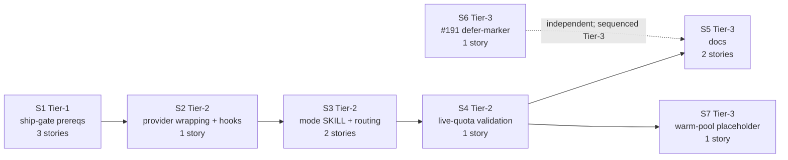

# Vertical Plan: Sandcastle Adoption Follow-on

## Slice Principle

Each slice ships a working state that can be inspected or validated before the next slice depends on it. The plan preserves the TPM's seven-slice cut and 11-story count: Tier-1 removes security/auth blockers, Tier-2 wires and validates the execution mode, and Tier-3 documents the shipped behavior plus deferred upstream and warm-pool follow-ons (`.pHive/epics/sandcastle-adoption-followon/docs/tpm-sequencing-memo-b2.md:79`, `.pHive/epics/sandcastle-adoption-followon/docs/tpm-sequencing-memo-b2.md:184`).

The mode is opt-in, Codex-path-only, and post-2.0. Existing `sessions`, `team`, `team-cmux`, and `sequential` users must see no behavior change while `sandcastle` becomes the fifth `mode_decision` value (`skills/hive/skills/execute-dispatch/SKILL.md:16`, `.pHive/epics/sandcastle-adoption-followon/docs/user-decisions-b1.md:16`).

## Slices

### Slice S1: Ship-gate Prerequisites - Auth, Redaction, Gitignore

**Tier:** 1

**Goal:** Land the security/log-leak prerequisites and `auth.json` setup plumbing before any Sandcastle provider path is wired.

**Working state after slice ships:** A maintainer can run `/hive:sandbox-setup` end-to-end; `auth.json` is mounted into a test container; logger redaction masks an injected fake `OPENAI_API_KEY`; the default `.gitignore` template carries `.sandcastle/` (`.pHive/epics/sandcastle-adoption-followon/docs/tpm-sequencing-memo-b2.md:83`).

**Stories included**

| Story | Topic area |
|---|---|
| `codex-auth-setup-skill` | Dedicated `/hive:sandbox-setup` skill, `auth.json` mount semantics, and minimal setup-checklist doc. |
| `logger-redaction-wrapper` | In-Hive stdout/stderr redaction wrapper for Sandcastle logger output. |
| `gitignore-template-update` | Add `.sandcastle/` to the default template and applicable project `.gitignore` paths. |

**Layers touched**

| Layer | Touch |
|---|---|
| H1 Auth/setup | New setup skill and checklist. |
| H2 Logging/redaction | Wrapper and `.gitignore` template update. |
| H6 Documentation | Minimal setup-checklist content only; full adoption docs wait for S5. |

**depends_on:** none

**Risks per slice**

| Risk | Mitigation |
|---|---|
| Security audit finds the auth setup or redaction contract insufficient. | `security:plan-audit` runs before implementation; `security:impl-audit` attaches to auth setup and redaction stories (`.pHive/epics/sandcastle-adoption-followon/docs/tpm-sequencing-memo-b2.md:94`). |
| Redaction is treated as cleanup rather than a gate. | Slice acceptance requires fake-key verification and `.sandcastle/` ignore coverage; this is locked as a hard prereq (`.pHive/epics/sandcastle-adoption-followon/docs/tpm-sequencing-memo-b2.md:221`). |
| Worktree ownership needs clarification before provider work starts. | Architect re-validates `wt.close()` ownership before story specs proceed (`.pHive/epics/sandcastle-adoption-followon/docs/tpm-sequencing-memo-b2.md:96`). |

**Acceptance signal**

S1 is done when `/hive:sandbox-setup` can prepare mounted Codex auth material in a test container, redaction tests show fake key values are masked, `.sandcastle/` is ignored by the default template, and no execution-mode path routes through Sandcastle yet.

### Slice S2: Sandcastle Provider Wrapping + Minimal Hooks

**Tier:** 2

**Goal:** Land the provider wrapper with Hive defaults and the single V1 `host.onWorktreeReady` hook, without user-facing execution routing.

**Working state after slice ships:** A direct test harness call instantiates the wrapped provider, creates a worktree, runs a no-op command inside the sandbox, exercises redacted logging, fires `host.onWorktreeReady`, copies a marker into the worktree, and tears down cleanly (`.pHive/epics/sandcastle-adoption-followon/docs/tpm-sequencing-memo-b2.md:98`).

**Stories included**

| Story | Topic area |
|---|---|
| `sandcastle-provider-wrapping` | Wrapper module, Podman default, Docker opt-in, `userns: false`, `branchStrategy: branch`, `wt.close()` ownership declaration, and inline `host.onWorktreeReady` hook. |

**Layers touched**

| Layer | Touch |
|---|---|
| H2 Logging/redaction | Wrapper is exercised through provider setup. |
| H3 Provider wrapping | Core provider wrapper module and tests. |
| H4 Hooks | Single `host.onWorktreeReady` lifecycle hook. |

**depends_on:** S1

**Risks per slice**

| Risk | Mitigation |
|---|---|
| Provider construction duplicates auth or logger behavior instead of consuming S1. | Tests instantiate provider only after setup and redaction preconditions are available. |
| Hooks scope expands beyond Q4. | Story scope is limited to `host.onWorktreeReady`; no `host.onSandboxReady`, `sandbox.onSandboxReady`, or hook YAML templates (`.pHive/epics/sandcastle-adoption-followon/docs/user-decisions-b1.md:21`). |
| Cold-start overhead is unknown. | `performance:audit` begins here to capture a baseline for the future warm-pool decision (`.pHive/epics/sandcastle-adoption-followon/docs/tpm-sequencing-memo-b2.md:108`). |

**Acceptance signal**

S2 is done when the wrapper test proves Podman defaults, branch naming, redaction wrapping, `host.onWorktreeReady` marker copy, and clean teardown. There is still no `/execute` mode selection for Sandcastle.

### Slice S3: Execution-mode SKILL + Dispatch Routing

**Tier:** 2

**Goal:** Plug the wrapped provider into `/execute` through a new Sandcastle execution-mode SKILL, dispatch enum extension, field-source attribution, and caller switch case.

**Working state after slice ships:** A user can set `HIVE_EXECUTION_MODE=sandcastle` or `execution.mode: sandcastle`; `/execute` routes through the Sandcastle mode; telemetry shows `execution_mode` attribution; misconfig warnings fire; existing `team-cmux`, `team`, `sessions`, and `sequential` paths continue unchanged (`.pHive/epics/sandcastle-adoption-followon/docs/tpm-sequencing-memo-b2.md:111`).

**Stories included**

| Story | Topic area |
|---|---|
| `execution-mode-skill` | New `skills/hive/skills/execute-mode-sandcastle/SKILL.md` body and lifecycle contract. |
| `mode-routing-integration` | `execute-dispatch` enum and `field_sources` extension plus `skills/execute/SKILL.md:143` caller switch case. |

**Layers touched**

| Layer | Touch |
|---|---|
| H3 Provider wrapping | Execution mode instantiates the wrapped provider. |
| H4 Hooks | Mode prose explains the one lifecycle hook and deferrals. |
| H5 Execution-mode routing | New mode SKILL, enum value, field attribution, and caller switch. |

**depends_on:** S2

**Risks per slice**

| Risk | Mitigation |
|---|---|
| `mode_decision` spelling or count drifts. | Lock `sandcastle` as the fifth value; current contract line is `skills/hive/skills/execute-dispatch/SKILL.md:16`. |
| Hidden caller switch is missed. | Acceptance criteria must mention `skills/execute/SKILL.md:143` explicitly (`.pHive/epics/sandcastle-adoption-followon/docs/tpm-sequencing-memo-b2.md:122`). |
| Sidecar bundle dependency sneaks into mode routing. | Keep sidecar neutral in V1; only `field_sources.execution_mode` lands as the forward-compat seam (`.pHive/epics/sandcastle-adoption-followon/docs/user-decisions-b1.md:43`). |
| Existing users regress. | Test no-behavior-change for non-Sandcastle mode decisions. |

**Acceptance signal**

S3 is done when Sandcastle mode is selectable by env/config, mode attribution is visible in telemetry, warnings identify defaulted or misconfigured inputs, `skills/execute/SKILL.md:143` dispatches to the new mode, and existing mode paths pass regression checks.

### Slice S4: Merge-behavior Live-quota Validation

**Tier:** 2

**Goal:** Run the end-to-end validation the spike could not complete: two parallel named-branch Sandcastle runs reach merge behavior under live quota without races or double worktree cleanup.

**Working state after slice ships:** A documented live validation run and result table prove Sandcastle mode operationally reaches the merge step, not just provider instantiation or agent invocation (`.pHive/epics/sandcastle-adoption-followon/docs/tpm-sequencing-memo-b2.md:125`).

**Stories included**

| Story | Topic area |
|---|---|
| `merge-behavior-validation` | Live-quota run, result table, recorded findings, and small same-slice fix-forward if needed. |

**Layers touched**

| Layer | Touch |
|---|---|
| H3 Provider wrapping | Validates branch strategy and worktree ownership under parallel runs. |
| H5 Execution-mode routing | Exercises the complete routed Sandcastle mode. |
| H5b Merge validation | Distinct validation surface for live quota behavior. |
| H6 Documentation | Produces evidence later consumed by docs and warm-pool note. |

**depends_on:** S3

**Risks per slice**

| Risk | Mitigation |
|---|---|
| Live run uncovers a small defect. | Story spec permits same-slice fix-forward instead of forcing a separate Tier follow-on (`.pHive/epics/sandcastle-adoption-followon/docs/tpm-sequencing-memo-b2.md:135`). |
| Defect is larger than validation scope. | Queue a follow-on only if it exceeds same-slice fix-forward; surface it before docs ship. |
| Performance result is noisy. | Capture baseline data as audit evidence; use it only as future warm-pool trigger context, not as code commitment. |

**Acceptance signal**

S4 is done when the validation artifact shows two parallel named branches reaching merge behavior, no worktree ownership conflict, no redaction leakage, and a clear performance baseline or explanation of measurement limits.

### Slice S5: Documentation - Adoption Guide + Hooks Reference

**Tier:** 3

**Goal:** Bring reference documentation up to the behavior shipped and validated in S1-S4.

**Working state after slice ships:** Two docs land in `hive/references/` or another canonical location. Users can read how to adopt Sandcastle mode, configure Podman/Docker, understand `auth.json`, branch strategy, logger redaction, `.sandcastle/` ignore coverage, and the minimal lifecycle hook contract (`.pHive/epics/sandcastle-adoption-followon/docs/tpm-sequencing-memo-b2.md:137`).

**Stories included**

| Story | Topic area |
|---|---|
| `docs-adoption-guide` | Auth setup walkthrough, provider defaults, branch strategy, redaction rationale, `.sandcastle/` gitignore note, and sidecar-neutral V1 note. |
| `docs-hooks-reference-minimal` | One wired `host.onWorktreeReady` point, deferral rationale, and "Sandcastle hooks are not Hive tool hooks" framing. |

**Layers touched**

| Layer | Touch |
|---|---|
| H1 Auth/setup | Documents setup skill and mount semantics. |
| H2 Logging/redaction | Documents redaction and `.sandcastle/` ignore behavior. |
| H3 Provider wrapping | Documents provider defaults and branch strategy. |
| H4 Hooks | Documents only `host.onWorktreeReady`. |
| H5 Execution-mode routing | Documents opt-in mode selection and no-change behavior for existing modes. |
| H6 Documentation | Two documentation stories. |

**depends_on:** S4

**Risks per slice**

| Risk | Mitigation |
|---|---|
| Docs drift from real implementation. | Depend on S4 so docs can verify against operational reality, not design intent (`.pHive/epics/sandcastle-adoption-followon/docs/tpm-sequencing-memo-b2.md:144`). |
| Hooks docs over-document deferred hook points. | Hooks reference covers only the wired hook plus deferral rationale (`.pHive/epics/sandcastle-adoption-followon/docs/tpm-sequencing-memo-b2.md:148`). |
| Sidecar neutral posture is missed. | Adoption guide includes one explicit note that Sandcastle V1 neither consumes nor produces sidecar bundles (`.pHive/epics/sandcastle-adoption-followon/docs/user-decisions-b1.md:43`). |

**Acceptance signal**

S5 is done when the adoption guide and hooks reference are reviewed against S1-S4 behavior, include concrete command/config examples where implementation provides them, avoid unshipped hook surfaces, and preserve the V1 sidecar-neutral statement.

### Slice S6: #191 Defer-marker

**Tier:** 3

**Goal:** Make the blocked `claudeCode()` Sandcastle lane enforceable rather than relying on memory or reviewer recall.

**Working state after slice ships:** `.pHive/upstream-watch/sandcastle-191.md` exists; a CI/local audit check fails if Hive wires `claudeCode()` through Sandcastle while issue #191 is open; a project memory entry points at the watch file (`.pHive/epics/sandcastle-adoption-followon/docs/tpm-sequencing-memo-b2.md:150`).

**Stories included**

| Story | Topic area |
|---|---|
| `sandcastle-191-defer-marker` | Upstream-watch file, audit-script gate, and project memory pointer. |

**Layers touched**

| Layer | Touch |
|---|---|
| H7 Defer-marker / upstream-watch | Full slice scope. |
| H5 Execution-mode routing | Guarded indirectly by the audit check. |

**depends_on:** none at the runtime level. Sequenced after S5 as Tier-3 follow-on per TPM priority; can ship any time after S1 clears security audit (`.pHive/epics/sandcastle-adoption-followon/docs/tpm-sequencing-memo-b2.md:156`).

**Risks per slice**

| Risk | Mitigation |
|---|---|
| Future planner treats #191 cleanup as part of this epic. | Story spec states cleanup after upstream resolution is a separate future story (`.pHive/epics/sandcastle-adoption-followon/docs/tpm-sequencing-memo-b2.md:159`). |
| Audit check is too broad and blocks Codex-path work. | Check only for Hive code paths wiring `claudeCode()` through Sandcastle while #191 remains open. |
| Watch file becomes stale. | Include owner, current behavior, unblock condition, and link in the watch file (`.pHive/epics/sandcastle-adoption-followon/docs/user-decisions-b1.md:35`). |

**Acceptance signal**

S6 is done when the watch file, audit gate, and project memory entry exist, and the gate catches a deliberate test fixture that attempts to wire `claudeCode()` through Sandcastle while allowing Codex-path Sandcastle mode.

### Slice S7: Warm-pool Placeholder

**Tier:** 3

**Goal:** Preserve the `createSandbox()` long-lived warm-pool option as a parked optimization, using S2/S4 performance data as the future trigger context.

**Working state after slice ships:** A short architecture note lives near provider docs and explains when a future story would adopt the warm-pool primitive. It makes no code change (`.pHive/epics/sandcastle-adoption-followon/docs/tpm-sequencing-memo-b2.md:161`).

**Stories included**

| Story | Topic area |
|---|---|
| `warm-pool-placeholder` | Doc-only architecture note referencing cold-start baseline and future trigger threshold. |

**Layers touched**

| Layer | Touch |
|---|---|
| H5b Merge validation | Consumes S4 performance/validation signal. |
| H6 Documentation | Adds a short architecture note, separate from adoption guide for review granularity. |

**depends_on:** S4

**Risks per slice**

| Risk | Mitigation |
|---|---|
| Placeholder becomes a code story. | Acceptance requires no runtime code change and no provider wrapper warm-pool behavior. |
| Placeholder duplicates the adoption guide. | Keep it short and focused on future trigger conditions. The TPM allowed folding, but this plan preserves the seven-slice/11-story cut requested here (`.pHive/epics/sandcastle-adoption-followon/docs/tpm-sequencing-memo-b2.md:170`). |
| Future threshold is invented without data. | Reference S2/S4 baseline only; avoid committing to an unmeasured threshold. |

**Acceptance signal**

S7 is done when the architecture note states what `createSandbox()` would solve, what S2/S4 baseline evidence currently shows, what future trigger would justify implementation, and that no V1 code changes are included.

## Slice Dependency Graph

## Tier Roll-up

| Tier | Slice count | Slices | Story count | Purpose |
|---|---:|---|---:|---|
| Tier-1 | 1 | S1 | 3 | Security/auth ship-gate prerequisites. |
| Tier-2 | 3 | S2, S3, S4 | 4 | Core Sandcastle mode wiring and operational validation. |
| Tier-3 | 3 | S5, S6, S7 | 4 | Docs, upstream guardrail, and parked performance optimization note. |
| Total | 7 | S1-S7 | 11 | Cross-checked against TPM total (`.pHive/epics/sandcastle-adoption-followon/docs/tpm-sequencing-memo-b2.md:184`). |

## Story Count Cross-check

| Slice | Stories | Count |
|---|---|---:|
| S1 | `codex-auth-setup-skill`, `logger-redaction-wrapper`, `gitignore-template-update` | 3 |
| S2 | `sandcastle-provider-wrapping` | 1 |
| S3 | `execution-mode-skill`, `mode-routing-integration` | 2 |
| S4 | `merge-behavior-validation` | 1 |
| S5 | `docs-adoption-guide`, `docs-hooks-reference-minimal` | 2 |
| S6 | `sandcastle-191-defer-marker` | 1 |
| S7 | `warm-pool-placeholder` | 1 |
| **Total** |  | **11** |

## Architect Re-validation Flags

| Flag | Applies to | Reason |
|---|---|---|
| `wt.close()` ownership rule | S1/S2/S3 story specs | Architect must re-check Sandcastle-owned worktrees against legacy `.claude/worktrees/{story-id}` before story authoring (`.pHive/epics/sandcastle-adoption-followon/docs/user-decisions-b1.md:71`). |
| Redaction wrapper module location | S1 story specs | Behavior is locked, but module location under `hive/lib/` remains TBD (`.pHive/epics/sandcastle-adoption-followon/docs/tpm-sequencing-memo-b2.md:23`). |
| S4 fix-forward boundary | S4 story spec | Same-slice small fixes are allowed; distinct story only if the live run exposes larger scope (`.pHive/epics/sandcastle-adoption-followon/docs/tpm-sequencing-memo-b2.md:249`). |
| Optional Sandcastle version check | S2/S4 implementation time | Research has no blocking web gap, but newer Sandcastle releases may warrant implementation-time changelog verification (`.pHive/epics/sandcastle-adoption-followon/docs/research-findings.md:289`). |
