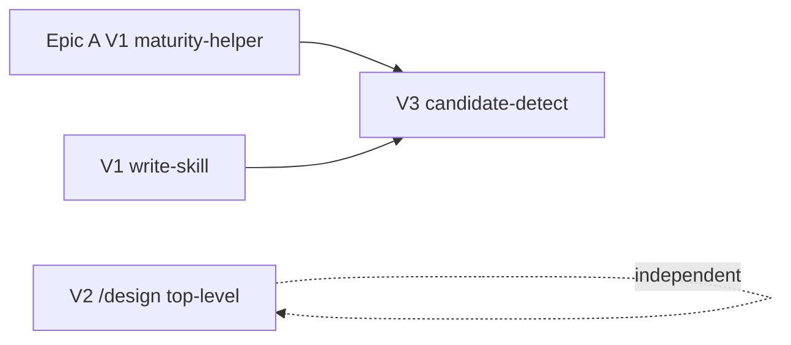

# H/V Plan — skill-ergo-may2026

## Horizontal Layers

| Layer | Surface | Touched by |
|-------|---------|-----------|
| L1 — Skill catalog | `skills/write-skill/`, `skills/skill-candidate-detect/`, `skills/design/` (all new) | write-skill, candidate-detect, /design |
| L2 — Library | `hive/lib/skill_template.py` (new), reuse `hive/lib/project_maturity.py` (from Epic A) | write-skill, candidate-detect |
| L3 — References | new `hive/references/skill-template.md`; possible update to `hive/references/skill-catalog.md` if present | write-skill |
| L4 — Skill descriptions | `design-review`, `design-system` descriptions disambiguated from new `/design` | /design |
| L5 — Signal mining | reads `.pHive/metrics/events/*.jsonl`, `.pHive/kg.sqlite`, `git log` | candidate-detect |
| L6 — Outputs | `.pHive/meta/skill-candidates.yaml` (new path) | candidate-detect |

## Vertical Slices

### Slice V1 — write-skill (foundation for #133)

**Deliverable:** new `skills/write-skill/SKILL.md` callable as `/write-skill`. Takes a brief (problem + trigger + scope) → emits `skills/<name>/SKILL.md` skeleton + asks targeted questions to fill in body.

**Working state at end of slice:** user can `/write-skill <brief>` standalone and get a working SKILL.md file scaffolded. Hand-off target for candidate-detect.

**Stories:** `se-1-write-skill`

### Slice V2 — /design top-level (independent of V1/V3)

**Deliverable:** new `skills/design/SKILL.md` for UI/wireframe design ceremony (NOT design-discussion authoring — per user clarification, scope is UI design work). Composes wireframe-protocol + brand-system context + design-review handoff. Callable outside `/plan`.

**Working state at end of slice:** `/design` invokable at any session state; produces wireframe artifacts; `design-review` and `design-system` descriptions disambiguated.

**Stories:** `se-2-design-top-level`, `se-3-skill-disambiguation`

### Slice V3 — skill-candidate-detect (depends on V1 + Epic A maturity helper)

**Deliverable:** new `skills/skill-candidate-detect/SKILL.md`. Mines signal sources, ranks candidates, writes `.pHive/meta/skill-candidates.yaml`, hands off to `/write-skill`.

**Working state at end of slice:** `/find-skills` (or composed into `/meta-optimize`) emits ranked candidate list; gates on `project_maturity != greenfield|early` per Epic A helper.

**Stories:** `se-4-signal-mining`, `se-5-candidate-ranking-handoff`

## Slice Sequencing

V1 + V2 fully independent. V3 depends on both V1 (handoff target) and Epic A's maturity helper (gate signal).

## Deferred / out of scope

- `/meta-optimize` integration of candidate-detect — V3 ships standalone; integration is a follow-on cycle.
- Wireframe generation tooling (Frame0 etc.) — V2 reuses existing wireframe-protocol; doesn't expand it.
- Candidate detection in non-hive consumer codebases — scoped to plugin-hive substrate first.

## Risks revisited (post-H/V)

- **write-skill scope drift:** se-1 must explicitly cap at scaffold-only. No "and also indexes existing skills" expansion.
- **/design trigger collision:** se-3 (disambiguation) is the gating quality story. If user `/design` invocation routes to `design-review` after V2 ships, V2 is incomplete.
- **Signal-mining false positives:** se-4 must include ranking quality threshold; output below threshold = empty list, not noise.
