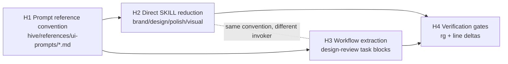

# Horizontal Plan: UI Cluster Extract Config Deeper

## Goal

This plan maps the breadth of Epic F Phase B2 for extracting reusable ui-designer task prompts out of the UI ceremony cluster and into `hive/references/ui-prompts/`, without changing the ui-designer persona or command behavior. The TPM sequencing memo is the controlling source: four horizontal layers, four slices, and a locked story cap of four (`.pHive/epics/ui-cluster-extract-config-deeper/docs/tpm-sequencing-memo-b2.md:8`, `.pHive/epics/ui-cluster-extract-config-deeper/docs/tpm-sequencing-memo-b2.md:14`).

The locked B1 decisions keep the shape narrow: one flat prompt file per skill, direct SKILL load, full design-review workflow inclusion, polish-audit still always invokes ui-designer, and current task text is preserved first (`.pHive/epics/ui-cluster-extract-config-deeper/docs/user-decisions-b1.md:15`, `.pHive/epics/ui-cluster-extract-config-deeper/docs/user-decisions-b1.md:33`, `.pHive/epics/ui-cluster-extract-config-deeper/docs/user-decisions-b1.md:56`, `.pHive/epics/ui-cluster-extract-config-deeper/docs/user-decisions-b1.md:62`, `.pHive/epics/ui-cluster-extract-config-deeper/docs/user-decisions-b1.md:66`).

## Architectural Layers

### H1. Prompt Reference Directory Convention

This layer establishes `hive/references/ui-prompts/` as the canonical home for extracted ui-designer task prompts loaded by procedural SKILLs and workflow steps. It follows the W6 flat-reference precedent and adds a `Required placeholders` header to every prompt file so variables are visible after extraction (`.pHive/epics/ui-cluster-extract-config-deeper/docs/tpm-sequencing-memo-b2.md:18`, `.pHive/epics/ui-cluster-extract-config-deeper/docs/user-decisions-b1.md:21`).

**Touched / new files**

| Status | File | Purpose |
|---|---|---|
| New | `hive/references/ui-prompts/brand-system.md:1` | Extracted task prompt for brand-system ui-designer spawn. |
| New | `hive/references/ui-prompts/design-system.md:1` | Extracted task prompt for design-system ui-designer spawn. |
| New | `hive/references/ui-prompts/polish-audit.md:1` | Extracted task prompt for polish-audit synthesis. |
| New | `hive/references/ui-prompts/visual-qa.md:1` | Extracted task prompt for visual QA comparison. |
| New | `hive/references/ui-prompts/design-review-design-critique.md:1` | Extracted design-review workflow design-critique task. |
| New | `hive/references/ui-prompts/design-review-synthesis.md:1` | Extracted design-review workflow synthesis task. |

**Cross-layer dependencies**

| Direction | Dependency |
|---|---|
| Provides to H2 | Direct SKILL body reduction cites these prompt files instead of embedding task text (`.pHive/epics/ui-cluster-extract-config-deeper/docs/tpm-sequencing-memo-b2.md:28`). |
| Provides to H3 | Workflow extraction uses the same destination convention for the two design-review workflow tasks (`.pHive/epics/ui-cluster-extract-config-deeper/docs/user-decisions-b1.md:35`). |
| Provides to H4 | Verification gates count citations under `hive/references/ui-prompts/` and require prompt files to exist. |

**Risk + mitigation**

| Risk | Mitigation |
|---|---|
| Extracted files hide required runtime variables. | Standardize `## Required placeholders` at the top of all six prompt files, then list placeholders such as `{animation_opportunities}`, `{prior_verdict}`, `{brief_path}`, and `{story_id}` as applicable (`.pHive/epics/ui-cluster-extract-config-deeper/docs/tpm-sequencing-memo-b2.md:198`). |
| Flat directory becomes hard to navigate if future artifacts multiply. | Keep flat files now because Q2 locked the convention; revisit only if a future story adds non-prompt artifacts per skill (`.pHive/epics/ui-cluster-extract-config-deeper/docs/user-decisions-b1.md:23`, `.pHive/epics/ui-cluster-extract-config-deeper/docs/user-decisions-b1.md:25`). |
| Readers confuse prompt files with the ui-designer persona. | Add a short heading in each prompt file stating it is task prompt content loaded by a SKILL or workflow, not agent persona content; leave `hive/agents/ui-designer.md:45` unchanged per Q3 (`.pHive/epics/ui-cluster-extract-config-deeper/docs/user-decisions-b1.md:29`). |

### H2. SKILL Body Reduction

This layer reduces the four direct SKILLs from inline ui-designer task blocks to thin invocations that load the prompt reference, cite it, inject placeholders, spawn ui-designer, and capture outputs. It is behavior-preserving: Q8 requires byte-equivalent prompt movement before any normalization (`.pHive/epics/ui-cluster-extract-config-deeper/docs/tpm-sequencing-memo-b2.md:32`, `.pHive/epics/ui-cluster-extract-config-deeper/docs/user-decisions-b1.md:66`).

**Touched / new files**

| Status | File | Purpose |
|---|---|---|
| Touched | `skills/hive/skills/brand-system/SKILL.md:32` | Replace the inline `Task for ui-designer` block at `:32-67` with prompt-reference loading and citation. |
| Touched | `skills/hive/skills/design-system/SKILL.md:42` | Replace the inline token-generation prompt block at `:42-58` with prompt-reference loading and citation. |
| Touched | `skills/hive/skills/polish-audit/SKILL.md:85` | Replace the polish synthesis prompt block at `:85-115`; preserve the always-invoke behavior locked by Q7. |
| Touched | `skills/hive/skills/visual-qa/SKILL.md:49` | Replace the visual fidelity prompt block at `:49-97`, the largest direct extraction payoff. |

**Cross-layer dependencies**

| Direction | Dependency |
|---|---|
| Consumes H1 | The four prompt files must exist before SKILL citations can resolve. |
| Independent of H3 | Workflow YAML uses the same prompt convention but a different invoker class (`.pHive/epics/ui-cluster-extract-config-deeper/docs/tpm-sequencing-memo-b2.md:40`). |
| Provides to H4 | Verification checks that no direct SKILL still contains the old inline spawn/task markers. |

**Risk + mitigation**

| Risk | Mitigation |
|---|---|
| Direct SKILL loading duplicates prompt-loading boilerplate across four SKILLs. | Architect re-validates the Mattpocock-style atomicity check before story specs; if duplication is real, S1 should factor the load step before S2 inherits it (`.pHive/epics/ui-cluster-extract-config-deeper/docs/user-decisions-b1.md:77`, `.pHive/epics/ui-cluster-extract-config-deeper/docs/tpm-sequencing-memo-b2.md:202`). |
| Behavior changes during prompt extraction. | Preserve current prompt text first, keep persona loading and spawn flow in place, and assert existing artifacts still result from the SKILLs (`.pHive/epics/ui-cluster-extract-config-deeper/docs/tpm-sequencing-memo-b2.md:65`). |
| polish-audit becomes conditional by accident. | Q7 locks polish-audit as always invoking ui-designer; acceptance criteria must assert no optional ui-designer mode appears (`.pHive/epics/ui-cluster-extract-config-deeper/docs/user-decisions-b1.md:60`). |
| Path prefix mismatch causes story specs to target the wrong files. | TPM paths use `skills/hive/skills/...`; research says current on-disk paths are top-level `skills/...`. Architect must verify the prefix before implementation (`.pHive/epics/ui-cluster-extract-config-deeper/docs/research-findings.md:3`, `.pHive/epics/ui-cluster-extract-config-deeper/docs/tpm-sequencing-memo-b2.md:164`). |

### H3. Workflow File Extraction

This layer closes D2 fully by extracting the two ui-designer `task:` blocks from `hive/workflows/design-review.workflow.yaml:54` and `hive/workflows/design-review.workflow.yaml:86` into prompt files. It is the Q4 scope expansion: without it, the workflow-mediated ui-audit replacement would still carry inline ui-designer prompt content (`.pHive/epics/ui-cluster-extract-config-deeper/docs/user-decisions-b1.md:31`, `.pHive/epics/ui-cluster-extract-config-deeper/docs/tpm-sequencing-memo-b2.md:120`).

**Touched / new files**

| Status | File | Purpose |
|---|---|---|
| Touched | `hive/workflows/design-review.workflow.yaml:54` | Replace design-critique `task:` block at `:54-84` with the architect-approved prompt reference shape. |
| Touched | `hive/workflows/design-review.workflow.yaml:86` | Replace synthesis `task:` block at `:86-117` with the architect-approved prompt reference shape. |
| New | `hive/references/ui-prompts/design-review-design-critique.md:1` | Holds byte-equivalent design-critique task text plus placeholder header. |
| New | `hive/references/ui-prompts/design-review-synthesis.md:1` | Holds byte-equivalent synthesis task text plus placeholder header. |

**Cross-layer dependencies**

| Direction | Dependency |
|---|---|
| Consumes H1 | The two design-review prompt files must exist before YAML can cite or load them. |
| Independent of H2 | The workflow path uses `skills/hive/skills/design-review/SKILL.md:95` as its invoker rather than the four direct SKILLs (`.pHive/epics/ui-cluster-extract-config-deeper/docs/tpm-sequencing-memo-b2.md:125`). |
| Provides to H4 | Verification checks that workflow citations exist and that both workflow-mediated tasks remain represented. |

**Risk + mitigation**

| Risk | Mitigation |
|---|---|
| Workflow runtime may not support the same citation-only pattern used in SKILL markdown. | Architect must decide whether YAML keeps a `task:` scalar containing citation-only content or introduces/resolves a `task_file:` field; this remains an H/V review item, not a silent writer decision (`.pHive/epics/ui-cluster-extract-config-deeper/docs/tpm-sequencing-memo-b2.md:126`). |
| `design-review` regresses for either artifact target. | S3 acceptance must require end-to-end design-review execution for both `--artifact-target design` and `--artifact-target implementation`, preserving the W6 a-11 collapse mode (`.pHive/epics/ui-cluster-extract-config-deeper/docs/tpm-sequencing-memo-b2.md:138`). |
| Workflow inclusion exceeds the audit story cap. | Keep the workflow extraction as exactly one slice/story; Q4 already accepted the scope expansion and still projects four stories (`.pHive/epics/ui-cluster-extract-config-deeper/docs/user-decisions-b1.md:41`). |

### H4. Verification + Grep Gates

This layer turns the refactor into an inspectable working-state proof: inline markers are gone, prompt citations are present, workflow citations exist, and line-count deltas are documented. It codifies the design-discussion verification plan and TPM's S4 verification slice rather than adding new runtime behavior (`.pHive/epics/ui-cluster-extract-config-deeper/docs/tpm-sequencing-memo-b2.md:53`, `.pHive/epics/ui-cluster-extract-config-deeper/docs/tpm-sequencing-memo-b2.md:145`).

**Touched / new files**

| Status | File | Purpose |
|---|---|---|
| Touched | Story acceptance criteria at plan step 11 | Documents required grep gates and line-count assertions. |
| Optional | `scripts/verify-ui-prompts-extraction.sh:1` | Only if architect decides a script pays off; the TPM memo defaults to simple `rg` checks (`.pHive/epics/ui-cluster-extract-config-deeper/docs/tpm-sequencing-memo-b2.md:57`). |

**Cross-layer dependencies**

| Direction | Dependency |
|---|---|
| Consumes H1 | Requires six prompt files and consistent `Required placeholders` headers. |
| Consumes H2 | Direct SKILL inline-task markers must be removed and citations must be present. |
| Consumes H3 | Workflow prompt references must exist for both design-review task blocks. |
| Final gate | Must run after S2 and S3; it is not meaningful before all extraction slices land (`.pHive/epics/ui-cluster-extract-config-deeper/docs/tpm-sequencing-memo-b2.md:157`). |

**Risk + mitigation**

| Risk | Mitigation |
|---|---|
| Verification is treated as optional documentation and future SKILL edits re-inline prompts. | Keep S4 as a dedicated verification story with explicit grep commands and line-count assertions (`.pHive/epics/ui-cluster-extract-config-deeper/docs/tpm-sequencing-memo-b2.md:159`). |
| The required grep path prefix is wrong for the repo layout. | Preserve the TPM-specified commands in S4, but flag path-prefix validation for architect because research found current top-level `skills/...` files (`.pHive/epics/ui-cluster-extract-config-deeper/docs/research-findings.md:3`, `.pHive/epics/ui-cluster-extract-config-deeper/docs/tpm-sequencing-memo-b2.md:164`). |
| Line-delta targets overfit rough research estimates. | Story specs should refine line-count assertions during plan step 11 using the actual blocks, while retaining the TPM targets for S1 and S2 (`.pHive/epics/ui-cluster-extract-config-deeper/docs/tpm-sequencing-memo-b2.md:200`). |

## Cross-layer Wiring Map

**Dependency notes**

| Dependency | Reason |
|---|---|
| H1 before H2 | Direct SKILLs cannot cite loadable prompt files until `hive/references/ui-prompts/brand-system.md:1`, `hive/references/ui-prompts/design-system.md:1`, `hive/references/ui-prompts/polish-audit.md:1`, and `hive/references/ui-prompts/visual-qa.md:1` exist. |
| H1 before H3 | The workflow extraction depends on `hive/references/ui-prompts/design-review-design-critique.md:1` and `hive/references/ui-prompts/design-review-synthesis.md:1` existing before `hive/workflows/design-review.workflow.yaml:54` and `hive/workflows/design-review.workflow.yaml:86` point at them. |
| H2 and H3 before H4 | S4 is the aggregate proof, so it must wait until both direct SKILL extraction and workflow extraction have shipped (`.pHive/epics/ui-cluster-extract-config-deeper/docs/tpm-sequencing-memo-b2.md:157`). |
| H2 parallel with H3 after H1 | The two layers share the prompt convention but not edited lines; the TPM still sequences them serially for review clarity (`.pHive/epics/ui-cluster-extract-config-deeper/docs/tpm-sequencing-memo-b2.md:201`). |

## Cross-cutting Concerns

The only true cross-cutting concern is documentation: this is a markdown/YAML refactor whose durable outputs are prompt references, SKILL citations, workflow citations, and verification commands. There are no auth, secrets, external dependency, performance, or library version gates in this epic (`.pHive/epics/ui-cluster-extract-config-deeper/docs/tpm-sequencing-memo-b2.md:187`).

| Concern | Applies to | Plan |
|---|---|---|
| documentation | H1-H4 | Document the new prompt-file convention through file headers, SKILL citations, workflow citations, and S4 grep commands. |
| backward compatibility | H2-H3 | ui-designer must still be spawned and existing outputs/workflow targets must remain behavior-equivalent after byte-equivalent prompt moves (`.pHive/epics/ui-cluster-extract-config-deeper/docs/tpm-sequencing-memo-b2.md:189`). |
| observability | H4 only | Use grep commands and line-count assertions as the regression signal; no runtime telemetry is introduced. |

## Open Items for Architect

1. **S3 workflow `task:` vs `task_file:` runtime nuance.** Validate whether `hive/workflows/design-review.workflow.yaml:54` and `hive/workflows/design-review.workflow.yaml:86` can preserve behavior with citation-only `task:` scalars, or whether the runtime needs a resolved `task_file:` field before `skills/hive/skills/design-review/SKILL.md:95` spawns agents.

2. **SKILL path prefix.** TPM uses `skills/hive/skills/{brand-system,design-system,polish-audit,visual-qa}/SKILL.md:1`, while research found current files at `skills/{brand-system,design-system,polish-audit,visual-qa}/SKILL.md:1`. Confirm the implementation path before story specs and reconcile S4 grep commands if needed.

3. **Direct-SKILL-load atomicity.** Re-validate that S1's prompt-loading shape does not duplicate enough boilerplate across four SKILLs to warrant a tiny shared helper before S2 extends the pattern (`.pHive/epics/ui-cluster-extract-config-deeper/docs/tpm-sequencing-memo-b2.md:202`).

4. **Required placeholders header format.** Confirm the exact prompt header format before implementation; recommended baseline is `## Required placeholders` followed by one placeholder per bullet, including `None` when a prompt has no runtime placeholders (`.pHive/epics/ui-cluster-extract-config-deeper/docs/tpm-sequencing-memo-b2.md:198`).

5. **Line-delta assertions.** Refine the rough S1 and S2 line-delta targets during story authoring with `wc -l` against the actual prompt blocks, while preserving the W6 precedent of negative line-count proof (`.pHive/epics/ui-cluster-extract-config-deeper/docs/tpm-sequencing-memo-b2.md:200`).
