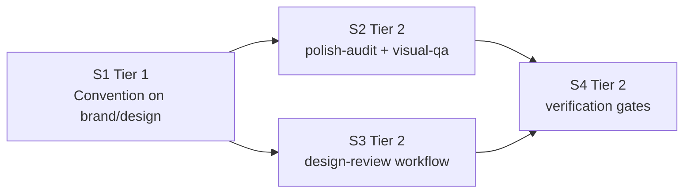

# Vertical Plan: UI Cluster Extract Config Deeper

## Slice Principle

Each slice ships a working refactor state that can be verified by concrete grep or line-count proof before the next slice depends on it. The TPM cut is authoritative: S1 establishes the convention on the W6-precedent pair, S2 completes direct SKILL coverage, S3 closes the workflow-mediated path, and S4 documents the regression gates (`.pHive/epics/ui-cluster-extract-config-deeper/docs/tpm-sequencing-memo-b2.md:65`, `.pHive/epics/ui-cluster-extract-config-deeper/docs/tpm-sequencing-memo-b2.md:67`, `.pHive/epics/ui-cluster-extract-config-deeper/docs/tpm-sequencing-memo-b2.md:92`, `.pHive/epics/ui-cluster-extract-config-deeper/docs/tpm-sequencing-memo-b2.md:118`, `.pHive/epics/ui-cluster-extract-config-deeper/docs/tpm-sequencing-memo-b2.md:143`).

Because this is a markdown/YAML refactor, the working-state proof is not new user-facing behavior. The proof is that ui-designer prompt text moved byte-equivalently, SKILLs and workflow steps still cite loadable prompt files, existing spawn/workflow behavior remains intact, and the required verification commands produce the expected outputs (`.pHive/epics/ui-cluster-extract-config-deeper/docs/user-decisions-b1.md:66`, `.pHive/epics/ui-cluster-extract-config-deeper/docs/tpm-sequencing-memo-b2.md:65`).

## Slices

### Slice S1: Convention Establishment on W6-precedent Pair

**Tier:** 1

**Goal:** Prove `hive/references/ui-prompts/` end-to-end on brand-system and design-system, the two direct SKILLs that already have W6 config/spec extraction precedent.

**Working state after slice ships:** `hive/references/ui-prompts/brand-system.md:1` and `hive/references/ui-prompts/design-system.md:1` exist with `Required placeholders` headers; `skills/hive/skills/brand-system/SKILL.md:32` and `skills/hive/skills/design-system/SKILL.md:42` cite those prompt files via load -> cite -> inject -> spawn. Verification command: `rg "hive/references/ui-prompts/(brand-system|design-system)\\.md" skills/hive/skills/{brand-system,design-system}/SKILL.md`; expected output is two matches, one per SKILL.

**Stories included**

| Story | Topic area |
|---|---|
| `f-01-prompt-convention-brand-design` | Extract brand-system and design-system ui-designer task prompts into one flat prompt file per SKILL; keep existing artifact behavior. |

**Layers touched**

| Layer | Touch |
|---|---|
| H1 Prompt Reference Directory Convention | Creates the first two files under `hive/references/ui-prompts/`. |
| H2 SKILL Body Reduction | Reduces `skills/hive/skills/brand-system/SKILL.md:32` and `skills/hive/skills/design-system/SKILL.md:42` to prompt-reference invocation. |

**depends_on:** none

**Risks per slice**

| Risk | Mitigation |
|---|---|
| The new convention is too repetitive across direct SKILLs. | Architect re-validates direct-SKILL-load atomicity before S2 inherits the pattern (`.pHive/epics/ui-cluster-extract-config-deeper/docs/user-decisions-b1.md:77`). |
| Prompt extraction changes brand or token output behavior. | Preserve task text first and assert both SKILLs still spawn ui-designer and produce `.pHive/brand/brand-system.yaml:1` and `.pHive/brand/tokens.json:1` outputs as before (`.pHive/epics/ui-cluster-extract-config-deeper/docs/tpm-sequencing-memo-b2.md:74`). |
| Required placeholders are not documented uniformly. | S1 establishes the `## Required placeholders` header so S2 and S3 copy the same format (`.pHive/epics/ui-cluster-extract-config-deeper/docs/tpm-sequencing-memo-b2.md:87`). |
| Path prefix mismatch creates false verification failures. | Use TPM commands in plan, but architect must confirm `skills/hive/skills/...` versus current top-level `skills/...` before implementation (`.pHive/epics/ui-cluster-extract-config-deeper/docs/research-findings.md:3`). |

**Acceptance signal**

```bash
test -f hive/references/ui-prompts/brand-system.md
test -f hive/references/ui-prompts/design-system.md
rg "Required placeholders" hive/references/ui-prompts/{brand-system,design-system}.md
rg "hive/references/ui-prompts/(brand-system|design-system)\\.md" skills/hive/skills/{brand-system,design-system}/SKILL.md
```

Expected output: both `test` commands exit zero; `Required placeholders` returns two matches; the citation grep returns exactly two matches. Story acceptance also records a negative net line delta, with the TPM target of roughly -30 to -45 lines per SKILL refined during story authoring (`.pHive/epics/ui-cluster-extract-config-deeper/docs/tpm-sequencing-memo-b2.md:75`, `.pHive/epics/ui-cluster-extract-config-deeper/docs/tpm-sequencing-memo-b2.md:200`).

### Slice S2: Full SKILL Cluster Coverage

**Tier:** 2

**Goal:** Apply the proven convention to polish-audit and visual-qa so all four direct UI cluster SKILLs are thin prompt invocations.

**Working state after slice ships:** `hive/references/ui-prompts/polish-audit.md:1` and `hive/references/ui-prompts/visual-qa.md:1` exist; all four direct SKILLs cite `hive/references/ui-prompts/*.md`; polish-audit still always invokes ui-designer; placeholder injection remains intact for values such as `{animation_opportunities}`, `{prior_verdict}`, `{brief_path}`, and `{story_id}` (`.pHive/epics/ui-cluster-extract-config-deeper/docs/tpm-sequencing-memo-b2.md:97`, `.pHive/epics/ui-cluster-extract-config-deeper/docs/tpm-sequencing-memo-b2.md:100`).

Verification command: `rg "hive/references/ui-prompts/" skills/hive/skills/{brand-system,design-system,polish-audit,visual-qa}/SKILL.md`; expected output is four matches, one per direct SKILL.

**Stories included**

| Story | Topic area |
|---|---|
| `f-02-prompt-convention-polish-visual-qa` | Extract polish-audit and visual-qa prompt blocks and preserve existing ui-designer invocation behavior. |

**Layers touched**

| Layer | Touch |
|---|---|
| H1 Prompt Reference Directory Convention | Adds the second pair of direct-SKILL prompt files. |
| H2 SKILL Body Reduction | Reduces `skills/hive/skills/polish-audit/SKILL.md:85` and `skills/hive/skills/visual-qa/SKILL.md:49`. |

**depends_on:** S1

**Risks per slice**

| Risk | Mitigation |
|---|---|
| polish-audit's procedural flow changes while extracting only the prompt. | Preserve the SKILL flow around `skills/hive/skills/polish-audit/SKILL.md:85` and only move prompt text; Q7 locks ui-designer as always required (`.pHive/epics/ui-cluster-extract-config-deeper/docs/user-decisions-b1.md:62`). |
| visual-qa's larger prompt block loses report-format detail. | Use byte-equivalent first extraction for the block at `skills/hive/skills/visual-qa/SKILL.md:49-97`, then defer format normalization to a later epic (`.pHive/epics/ui-cluster-extract-config-deeper/docs/user-decisions-b1.md:66`). |
| Placeholder variables are not injected after extraction. | Prompt files must list required placeholders, and the SKILL bodies must keep the injection step visible before spawning ui-designer. |
| S2 appears parallel with S3 but inherits convention details from S1. | Keep S2 dependent only on S1; S2 and S3 may be implementation-parallel after S1, but the plan sequences them serially for review clarity (`.pHive/epics/ui-cluster-extract-config-deeper/docs/tpm-sequencing-memo-b2.md:201`). |

**Acceptance signal**

```bash
test -f hive/references/ui-prompts/polish-audit.md
test -f hive/references/ui-prompts/visual-qa.md
rg "Required placeholders" hive/references/ui-prompts/{polish-audit,visual-qa}.md
rg "hive/references/ui-prompts/" skills/hive/skills/{brand-system,design-system,polish-audit,visual-qa}/SKILL.md
rg "Task for ui-designer|Spawn a subagent with the full ui-designer persona" skills/hive/skills/{brand-system,design-system,polish-audit,visual-qa}/SKILL.md
```

Expected output: the first two `test` commands exit zero; the placeholder grep returns two matches for the newly added files; the citation grep returns four matches; the inline-block grep may still be treated as a soft pre-S4 signal here, but should trend to zero for direct SKILLs. Story acceptance records larger S2 line reductions, roughly -30 lines for polish-audit and -49 lines for visual-qa, refined during story authoring (`.pHive/epics/ui-cluster-extract-config-deeper/docs/tpm-sequencing-memo-b2.md:101`, `.pHive/epics/ui-cluster-extract-config-deeper/docs/tpm-sequencing-memo-b2.md:112`).

### Slice S3: Workflow Extraction for Design-review

**Tier:** 2

**Goal:** Extract the two ui-designer task blocks from `hive/workflows/design-review.workflow.yaml:54` and `hive/workflows/design-review.workflow.yaml:86` to prompt files, closing the Q4 full-D2 surface.

**Working state after slice ships:** `hive/references/ui-prompts/design-review-design-critique.md:1` and `hive/references/ui-prompts/design-review-synthesis.md:1` exist; `hive/workflows/design-review.workflow.yaml:54` and `hive/workflows/design-review.workflow.yaml:86` point at the extracted prompt content in the architect-approved shape; `skills/hive/skills/design-review/SKILL.md:95` still passes workflow task content to spawned agents.

Verification command: `rg "hive/references/ui-prompts/design-review-" hive/workflows/design-review.workflow.yaml`; expected output is two matches, one for each extracted workflow task.

**Stories included**

| Story | Topic area |
|---|---|
| `f-03-workflow-prompt-extraction-design-review` | Extract design-review design-critique and synthesis task text while preserving both artifact-target modes. |

**Layers touched**

| Layer | Touch |
|---|---|
| H1 Prompt Reference Directory Convention | Adds the two workflow-mediated prompt files. |
| H3 Workflow File Extraction | Replaces the two inline `task:` blocks in `hive/workflows/design-review.workflow.yaml:54` and `hive/workflows/design-review.workflow.yaml:86`. |

**depends_on:** S1

**Risks per slice**

| Risk | Mitigation |
|---|---|
| `task:` versus `task_file:` support is unclear in the workflow runtime. | Architect must validate whether citation-only `task:` preserves byte-equivalent behavior or whether a `task_file:` field must be resolved before agent spawn; do not decide this silently in story writing (`.pHive/epics/ui-cluster-extract-config-deeper/docs/tpm-sequencing-memo-b2.md:126`). |
| The workflow still runs but prompt content is no longer passed to ui-designer. | Acceptance must exercise or dry-run both design-review targets because `skills/hive/skills/design-review/SKILL.md:95` is the substrate that passes workflow `task` content to spawned agents (`.pHive/epics/ui-cluster-extract-config-deeper/docs/tpm-sequencing-memo-b2.md:137`). |
| Q4 workflow inclusion drifts into extra design-review redesign. | Limit the slice to moving the two task blocks and preserving current workflow behavior; no new workflow routing layer lands in this epic (`.pHive/epics/ui-cluster-extract-config-deeper/docs/user-decisions-b1.md:56`). |

**Acceptance signal**

```bash
test -f hive/references/ui-prompts/design-review-design-critique.md
test -f hive/references/ui-prompts/design-review-synthesis.md
rg "Required placeholders" hive/references/ui-prompts/{design-review-design-critique,design-review-synthesis}.md
rg "hive/references/ui-prompts/design-review-" hive/workflows/design-review.workflow.yaml
rg "artifact-target" skills/hive/skills/design-review/SKILL.md
```

Expected output: both `test` commands exit zero; placeholder grep returns two matches; workflow citation grep returns exactly two matches; `artifact-target` remains present in `skills/hive/skills/design-review/SKILL.md:1` so both W6 a-11 modes remain in scope. Final story acceptance must state the architect-approved runtime form: either retained `task:` citation scalar or resolved `task_file:` field.

### Slice S4: Verification + Grep Gates

**Tier:** 2

**Goal:** Codify the verification plan as enforceable acceptance criteria proving no direct SKILL inline prompt blocks remain, prompt citations are present, workflow citations exist, and line-count deltas are recorded.

**Working state after slice ships:** S1, S2, and S3 are all inspectably complete; future contributors can run the documented grep gates to catch re-inlined ui-designer prompts. This is the refactor's final working-state proof rather than a new behavior slice (`.pHive/epics/ui-cluster-extract-config-deeper/docs/tpm-sequencing-memo-b2.md:145`, `.pHive/epics/ui-cluster-extract-config-deeper/docs/tpm-sequencing-memo-b2.md:159`).

**Stories included**

| Story | Topic area |
|---|---|
| `f-04-prompt-extraction-verification-gates` | Document and enforce grep gates, workflow citation checks, and aggregate line-count proof. |

**Layers touched**

| Layer | Touch |
|---|---|
| H4 Verification + Grep Gates | Full slice scope. |
| H1 Prompt Reference Directory Convention | Confirms all six prompt files exist and carry headers. |
| H2 SKILL Body Reduction | Confirms all four direct SKILLs cite prompt files and no longer contain old inline markers. |
| H3 Workflow File Extraction | Confirms design-review workflow has two prompt references. |

**depends_on:** S2, S3

**Risks per slice**

| Risk | Mitigation |
|---|---|
| Verification commands miss the actual repo paths. | Use TPM-specified commands here, and keep the path-prefix mismatch as an architect re-validation item before implementation (`.pHive/epics/ui-cluster-extract-config-deeper/docs/tpm-sequencing-memo-b2.md:164`). |
| S4 gets folded away as "just acceptance criteria." | Keep it as its own story because it is the durable regression signal and the story-count still matches the audit cap (`.pHive/epics/ui-cluster-extract-config-deeper/docs/tpm-sequencing-memo-b2.md:170`). |
| Line-count assertion is under-specified. | S4 records aggregate SKILL line delta from S1+S2 and exact per-story deltas refined during story authoring. |

**Acceptance signal**

```bash
rg 'Task for ui-designer|Spawn a subagent with the full ui-designer persona' skills/hive/skills/{brand-system,design-system,polish-audit,visual-qa}/SKILL.md
rg 'hive/references/ui-prompts/' skills/hive/skills/{brand-system,design-system,polish-audit,visual-qa}/SKILL.md
rg "hive/references/ui-prompts/design-review-" hive/workflows/design-review.workflow.yaml
find hive/references/ui-prompts -maxdepth 1 -type f | wc -l
```

Expected output: the first grep returns zero matches; the second grep returns one match per SKILL, four total; the workflow grep returns two matches; the prompt-file count returns six after trimming whitespace. The first two commands are intentionally the exact S4 commands required for the direct SKILL gate, including the TPM-specified `skills/hive/skills/{brand-system,design-system,polish-audit,visual-qa}/SKILL.md` path form (`.pHive/epics/ui-cluster-extract-config-deeper/docs/tpm-sequencing-memo-b2.md:148`, `.pHive/epics/ui-cluster-extract-config-deeper/docs/tpm-sequencing-memo-b2.md:149`).

## Slice Dependency Graph



## Tier Roll-up

| Tier | Slice count | Slices | Story count |
|---|---:|---|---:|
| Tier 1 | 1 | S1 | 1 |
| Tier 2 | 3 | S2, S3, S4 | 3 |
| Total | 4 | S1-S4 | 4 |

## Story Count Cross-check

The TPM memo locks the story count at four, matching the audit cap of `<=4` exactly (`.pHive/epics/ui-cluster-extract-config-deeper/docs/tpm-sequencing-memo-b2.md:208`). This plan preserves that cut without splitting S2 by SKILL or folding S4 into the extraction stories: `f-01-prompt-convention-brand-design`, `f-02-prompt-convention-polish-visual-qa`, `f-03-workflow-prompt-extraction-design-review`, and `f-04-prompt-extraction-verification-gates`.

The dependency overlay is S1 -> {S2, S3} -> S4. S2 and S3 are independently implementable after S1, but the plan keeps the TPM's serial story order for review clarity and developer-attention budget (`.pHive/epics/ui-cluster-extract-config-deeper/docs/tpm-sequencing-memo-b2.md:201`).
