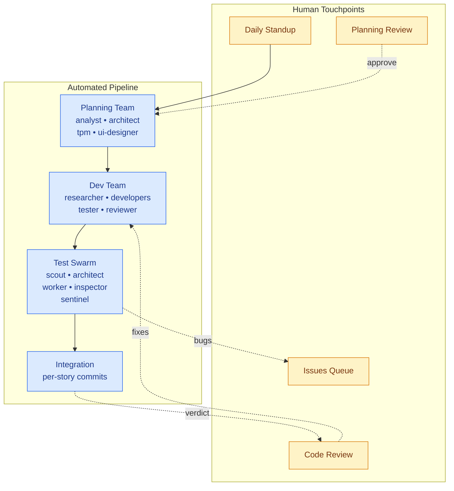

# Hive

**Multi-agent workflow orchestration for Claude Code** — plan, build, test, and review software with coordinated AI teams.

[](LICENSE)
[](.claude-plugin/marketplace.json)
[](https://claude.ai/code)

---

## North Star

Hive is heading toward a **lights-on software factory** — a pipeline where most of the work flows automatically and humans stay in the loop only where judgment actually matters. We're not there yet, and we want to be honest about that: today you'll hit plenty of touchpoints, hand-offs, and moments where the orchestrator needs you to steer. Even with `--dangerously-skip-permissions`, the interaction count is higher than we'd like.

The trajectory is what we're betting on. We chose the plugin format because Claude Code is built by an exceptional team at Anthropic and gets better every week. Every capability they ship — managed agents, tighter hooks, richer sub-agent tooling — is something Hive can fold in without writing it from scratch. Our job is to compose those primitives into a cohesive workflow, not to compete with the platform.

Where we're heading, a developer's day eventually collapses to two touchpoints:

- **A daily standup** — see what shipped overnight, what's blocked, what needs a decision
- **An issues queue** — triage bugs the test swarm filed and direction questions the planning team raised

Everything else — research, implementation, test authoring, fix loops, code review — runs through coordinated agent teams. Today that process has more seams than we want. Tomorrow it has fewer. That's the work.

---

## Features

- **Multi-agent teams** — 20 specialized personas (analyst, architect, developer, tester, reviewer, and more) coordinate through structured workflows
- **Cross-model execution** — route implementation and planning agents to OpenAI Codex while Claude handles orchestration, review, and gating — reduces cost and model bias
- **Structured planning** — decompose requirements into dependency-tracked stories with horizontal/vertical planning for medium and large features
- **Test swarm** — 5-agent pipeline runs tests across platforms, files bugs, and routes fixes automatically
- **Layered memory system** — agents accumulate cross-project knowledge in a compiled wiki with TTL-aware staleness tracking
- **Daily ceremony** — standup → planning → execution → review cycle with quality gates and human touchpoints
- **Extensible by design** — add agents, skills, workflows, and teams without touching core code

---

## Prerequisites

- **Claude Code CLI** v2.1 or later — [install guide](https://claude.ai/code)
- **Anthropic API key** — set as `ANTHROPIC_API_KEY` in your environment

---

## Installation

**1. Add the marketplace** — inside any Claude Code session, run:
```
/plugin marketplace add firefly-events/plugin-hive
```

**2. Install the plugin:**
```
/plugin install plugin-hive@firefly-events/plugin-hive
```

Alternatively, run `/plugin` and use the **Discover** tab to browse and install interactively.

---

## Quick Start

**1. Initialize Hive for your project**
```
/hive:kickoff
```
Hive discovers your codebase (brownfield) or sets up a new project (greenfield) and generates team configs.

**2. Start the day**
```
/hive:standup
```
Reviews yesterday's work, active blockers, and human items. Surfaces continuations.

**3. Plan a feature**
```
/hive:plan
```
Runs multi-phase planning: design discussion → horizontal scan → vertical slice plan → agent-ready stories. You review and steer at each gate.

**4. Execute the plan**
```
/hive:execute
```
Orchestrator loads your team, runs stories through the development workflow (research → implement → test → review → integrate), and commits per story.

**5. Review changes**
```
/hive:review
```
Structured code review covering correctness, security, conventions, and domain compliance. Optional Codex adversarial pass for a second-model perspective.

---

## UI Team Skills

Six dedicated skills for design work — brand identity, design tokens, UI audits, and design review ceremonies:

| Skill | Command | Purpose | Requires |
|-------|---------|---------|---------|
| **Brand System** | `/hive:brand-system` | Establish brand identity: colors (HEX/RGB/CMYK/PMS), typography, spacing. Produces `.pHive/brand/brand-system.yaml` + visual guide PNG via Frame0. | — |
| **Design System** | `/hive:design-system` | Convert brand system into W3C Design Token JSON for frontend tooling (Tailwind, Figma, Style Dictionary). | `/hive:brand-system` first |
| **UI Audit** | `/hive:ui-audit` | Collaborative audit — accessibility specialist + animations specialist surface domain findings; ui-designer synthesizes unified report. | `/hive:kickoff` first |
| **Polish Audit** | `/hive:polish-audit` | Animation and motion opportunity pass — identifies micro-interactions, loading states, and delight improvements. | `/hive:ui-audit` first |
| **Visual QA** | `/hive:visual-qa` | Post-implementation fidelity check — compares design briefs and wireframe PNGs against the actual implementation. | `/hive:ui-design` on a story first |
| **Design Review** | `/hive:design-review` | Design review ceremony — domain critiques from accessibility and animations specialists, synthesized by ui-designer. Supports `--skip accessibility` and `--skip animations`. | `/hive:ui-design` or `/hive:brand-system` |

**Gate chain order:**
```
/hive:brand-system → /hive:design-system
/hive:kickoff → /hive:ui-audit → /hive:polish-audit
/hive:ui-design → /hive:visual-qa
/hive:ui-design or /hive:brand-system → /hive:design-review
```

---

## Meta Optimization

### `/meta-optimize`

Consumer-facing skill for proposing and running improvement experiments on
your project. It targets the resolved project repo, gathers the available
signal, executes one candidate experiment, and leaves retained work as a
PR-style artifact instead of mutating `main` directly.

**Prerequisites**

- Metrics opt-in happens at `/hive:kickoff` and defaults OFF.
- The target project resolves from `paths.target_project` in the root
  `hive.config.yaml`, or falls back to the invoking cwd when unset.
- The resolved target project must be a git repository with a clean working
  tree before the cycle starts.

**Operating model**

- Public `/meta-optimize` is PR-only.
- Retained changes land on a feature branch with a candidate commit.
- The target repo's `main` branch is not mutated directly by the skill.
- The cycle closes with PR-shaped evidence rather than commit-promotion
  semantics.

**Expected outputs**

- A PR-style artifact in the target project: feature branch plus candidate
  commit.
- A close record containing `pr_ref`, `pr_state`, and rollback references.
- Baseline and candidate metrics snapshots captured for comparison at close.

**Backlog fallback**

When the metrics signal is insufficient to rank a candidate, the skill falls
back to the consumer-managed backlog at:

`{target}/.pHive/meta-team/queue-meta-optimize.yaml`

That file is human-edit-only. The skill reads it as a fallback proposal source;
it does not auto-populate backlog items for you.

`/meta-meta-optimize` is maintainer-local and is not part of the shipped
consumer command surface.

For the detailed operating contract, see
[`skills/hive/skills/meta-optimize/SKILL.md`](skills/hive/skills/meta-optimize/SKILL.md).

---

## Architecture Overview

Hive runs as a set of Claude Code skills. The orchestrator (your main session) coordinates teams but never joins them directly. Solid arrows are the automated pipeline; dashed arrows are human touchpoints.



**Pipeline:** Planning → Development → Testing → Review → Integration

Each story produces a working, committed state. Quality gates run between phases. The orchestrator routes bugs from the test swarm back to the dev team and tracks circuit-breaker limits to prevent runaway loops.

For full operational detail, see [docs/operations-guide.md](docs/operations-guide.md).

---

## Optional Integrations

| Integration | Purpose | Setup |
|-------------|---------|-------|
| **Frame0** | UI wireframe generation by the ui-designer agent | `frame0` CLI in PATH |
| **Codex** | Optional second-model review or full per-agent implementation backend via `agent_backends` | `npm install -g @openai/codex && codex login` |
| **cmux** | Visible multi-agent split panes for Codex-backed execution paths | `brew install --cask cmux` |
| **Linear** | Task tracking adapter — stories sync to Linear issues | Set `task_tracker: linear` in `hive/hive.config.yaml` |
| **GitHub Issues** | Task tracking adapter | Set `task_tracker: github` in `hive/hive.config.yaml` |
| **Jira** | Task tracking adapter | Set `task_tracker: jira` in `hive/hive.config.yaml` |

Enable integrations in `hive/hive.config.yaml`. All integrations are optional — Hive works without any of them.

---

## Extensibility

Hive is built to grow. Each component is a discrete file you can add or replace:

**Add an agent** — create a `.md` file in `.claude-plugin/agents/` with YAML frontmatter (`name`, `description`, `model`, `tools`). See `references/agent-config-schema.md`.

**Add a skill** — create a `.md` file in `.claude-plugin/skills/`. Skills are prompt templates invoked via `/hive:<skill-name>`.

**Add a workflow** — create a YAML file in `hive/workflows/` following the workflow schema. Assign it to stories via `methodology` in `hive.config.yaml`. See `references/workflow-schema.md`.

**Compose a team** — create or edit a file in `.pHive/teams/`. Team configs define members, roles, domain restrictions, and methodology. The orchestrator loads them at execution time.

**Hive-to-hive communication** *(forward-looking)* — a cross-system collaboration protocol is in design that will allow Hive instances to share stories, hand off work, and coordinate across repositories and organizations.

---

## Contributing

Contributions are welcome. Hive uses an **issue-first model**: open an issue before submitting a pull request so the approach can be discussed and scoped.

See [CONTRIBUTING.md](CONTRIBUTING.md) for the full workflow — branch naming, commit format, story-based development, and the review process.

---

## License

Apache 2.0 — see [LICENSE](LICENSE) for the full text.

---

## Links

| Resource | Path |
|----------|------|
| Operations Guide | [docs/operations-guide.md](docs/operations-guide.md) |
| Contributing | [CONTRIBUTING.md](CONTRIBUTING.md) |
| Code of Conduct | [CODE_OF_CONDUCT.md](CODE_OF_CONDUCT.md) |
| Changelog | [CHANGELOG.md](CHANGELOG.md) |
