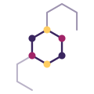
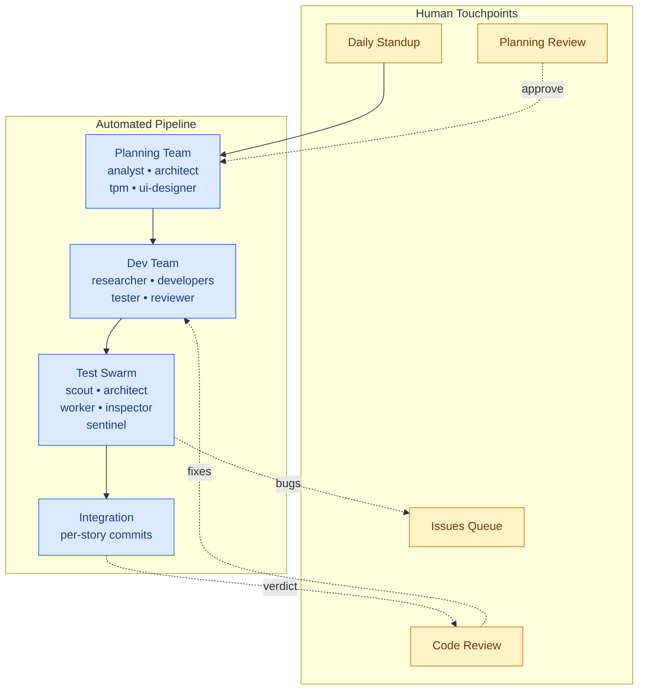

<!-- markdownlint-disable MD033 -->
<p align="center">
  
</p>
<!-- markdownlint-enable MD033 -->

# Hive

> **A director's chair for the agentic SDLC — disciplined swarms, kickoff to ship.**

A Claude Code plugin that turns your project into a coordinated swarm of AI specialists with the discipline of a real software team — planning, design, execution, code review, test. Built at [Firefly Events](https://ff.events) while shipping our own products. Open source.

[](LICENSE)
[](.claude-plugin/marketplace.json)
[](https://claude.ai/code)

---

## Contents

- [Inspirations](#inspirations)
- [Features](#features)
- [Prerequisites](#prerequisites)
- [Installation](#installation)
- [Quick Start](#quick-start)
- [UI Team Skills](#ui-team-skills)
- [Meta Optimization](#meta-optimization)
- [Memory architecture](#memory-architecture)
- [Architecture Overview](#architecture-overview)
- [Optional Integrations](#optional-integrations)
- [Extensibility](#extensibility)
- [North Star](#north-star)
- [Contributing](#contributing)
- [License](#license)
- [Links](#links)

---

## Inspirations

Hive stands on the shoulders of the agentic-engineering community. We borrow patterns and posture from camps that came before us:

- **[IndyDevDan](https://www.youtube.com/@indydevdan)** — agentic engineering as a *practice*; videos, principles, taste
- **[QRSPI](https://github.com/matanshavit/qrspi)** — 8-phase Claude Code workflow (Question · Research · Structure · Plan · Implement); builder workflows and real-world patterns
- **[BMAD-METHOD](https://github.com/bmad-code-org/BMAD-METHOD)** — structured multi-agent methodology and role taxonomy
- **[archon](https://github.com/coleam00/archon)** — orchestration runtime and agent-execution patterns
- **[Matt Pocock](https://www.mattpocock.com)** — atomic-skill design: composable, single-purpose, well-named units of capability
- **[Andrej Karpathy](https://karpathy.ai)** — the intellectual current of software 2.0/3.0

We don't compete with them; we synthesize, in a specific shape, on a specific surface (Claude Code), and put it in the open. Where their patterns show up in Hive, the credit travels with the claim.

---

## Features

- **Multi-agent teams** — 25 specialized personas (analyst, architect, developer, tester, reviewer, and more) coordinate through structured workflows
- **Cross-model execution** — route implementation and planning agents to OpenAI Codex while Claude handles orchestration, review, and gating — reduces cost and model bias
- **Structured planning** — decompose requirements into dependency-tracked stories with horizontal/vertical planning for medium and large features
- **Test swarm** — 5-agent pipeline runs tests across platforms, files bugs, and routes fixes automatically
- **Layered memory (L0–L3)** — sessions persist decisions to a cross-project knowledge graph; agents read prior decisions on spawn, with optional ChromaDB semantic recall
- **Daily ceremony** — standup → planning → execution → review cycle with quality gates and human touchpoints
- **Extensible by design** — add agents, skills, workflows, and teams without touching core code

---

## Prerequisites

- **Claude Code CLI** v2.1 or later — [install guide](https://claude.ai/code)
- **Anthropic API key** — set as `ANTHROPIC_API_KEY` in your environment

---

## Installation

**1. Add the marketplace** — inside any Claude Code session, run:
```
/plugin marketplace add firefly-events/plugin-hive
```

**2. Install the plugin:**
```
/plugin install plugin-hive@firefly-events/plugin-hive
```

Alternatively, run `/plugin` and use the **Discover** tab to browse and install interactively.

> **Migrating from a pre-1.1.2 install?** The default state directory was renamed `state/` → `.pHive/` in 1.1.2. See [CHANGELOG](CHANGELOG.md) for the auto- and manual-migration paths.

---

## Quick Start

**1. Initialize Hive for your project**
```
/hive:kickoff
```
Hive discovers your codebase (brownfield) or sets up a new project (greenfield) and generates team configs.

**2. Start the day**
```
/hive:standup
```
Reviews yesterday's work, active blockers, and human items. Surfaces continuations.

**3. Plan a feature**
```
/hive:plan
```
Runs multi-phase planning: design discussion → horizontal scan → vertical slice plan → agent-ready stories. You review and steer at each gate.

**4. Execute the plan**
```
/hive:execute
```
Orchestrator loads your team, runs stories through the development workflow (research → implement → test → review → integrate), and commits per story.

**5. Review changes**
```
/hive:review
```
Structured code review covering correctness, security, conventions, and domain compliance. Optional Codex adversarial pass for a second-model perspective.

---

## UI Team Skills

Five dedicated skills for design work — brand identity, design tokens, implementation audits, and design review ceremonies:

| Skill | Command | Purpose | Requires |
|-------|---------|---------|---------|
| **Brand System** | `/hive:brand-system` | Establish brand identity: colors (HEX/RGB/CMYK/PMS), typography, spacing. Produces `.pHive/brand/brand-system.yaml` + visual guide PNG via Frame0. | — |
| **Design System** | `/hive:design-system` | Convert brand system into W3C Design Token JSON for frontend tooling (Tailwind, Figma, Style Dictionary). | `/hive:brand-system` first |
| **Polish Audit** | `/hive:polish-audit` | Animation and motion opportunity pass — identifies micro-interactions, loading states, and delight improvements. | `/hive:design-review --artifact-target implementation` first |
| **Visual QA** | `/hive:visual-qa` | Post-implementation fidelity check — compares design briefs and wireframe PNGs against the actual implementation. | `/hive:ui-design` on a story first |
| **Design Review** | `/hive:design-review` | Target-aware design or implementation review — domain critiques from accessibility and animations specialists, synthesized by ui-designer. Supports `--artifact-target {design\|implementation}`, `--skip accessibility`, and `--skip animations`. | `/hive:ui-design`, `/hive:brand-system`, or implementation artifacts |

### Migration

| Old command | New command |
|-------------|-------------|
| `/hive:ui-audit` | `/hive:design-review --artifact-target implementation` |

**Gate chain order:**
```
/hive:brand-system → /hive:design-system
/hive:kickoff → /hive:design-review --artifact-target implementation → /hive:polish-audit
/hive:ui-design → /hive:visual-qa
/hive:ui-design or /hive:brand-system → /hive:design-review
```

---

## Meta Optimization

### `/meta-optimize`

Consumer-facing skill for proposing and running improvement experiments on
your project. It targets the resolved project repo, gathers the available
signal, executes one candidate experiment, and leaves retained work as a
PR-style artifact instead of mutating `main` directly.

**Prerequisites**

- Metrics opt-in happens at `/hive:kickoff` and defaults OFF.
- The target project resolves from `paths.target_project` in the root
  `hive.config.yaml`, or falls back to the invoking cwd when unset.
- The resolved target project must be a git repository with a clean working
  tree before the cycle starts.

**Operating model**

- Public `/meta-optimize` is PR-only.
- Retained changes land on a feature branch with a candidate commit.
- The target repo's `main` branch is not mutated directly by the skill.
- The cycle closes with PR-shaped evidence rather than commit-promotion
  semantics.

**Expected outputs**

- A PR-style artifact in the target project: feature branch plus candidate
  commit.
- A close record containing `pr_ref`, `pr_state`, and rollback references.
- Baseline and candidate metrics snapshots captured for comparison at close.

**Proposal sources**

`/meta-optimize` ranks candidate experiments from up to four input sources,
in precedence order:

1. **Metrics** — structural-audit findings keyed off opted-in metric dimensions
2. **Auto-research** — trending-advancements signal from the optional [external research loop](hive/references/meta-team-external-research.md), where the meta-team auto-researches Claude Code updates, ecosystem patterns, and external best-practice drift, then proposes candidate improvements back into `/meta-optimize`
3. **kg_signal** — knowledge-graph-derived findings (`phase_failed`, `phase_blocked`, `superseded` triples) from prior cycles, including cross-project history when a system-level KG is bootstrapped
4. **Backlog** — human-curated proposals at `{target}/.pHive/meta-team/queue-meta-optimize.yaml` (edit-only; the skill never auto-populates it)

When earlier sources don't produce a rankable candidate, the skill falls
through to the next. Consumers without `~/.claude/hive/kg.sqlite` get the
metrics → external research → backlog flow with no behavioral change.

The kg_signal source is configured under `meta_optimize.kg_signal` in
`hive/hive.config.yaml`:

```yaml
meta_optimize:
  kg_signal:
    enabled: true              # set false to skip step-02c entirely (legacy routing)
    window_days: 30            # recency window for triple inclusion
    cross_project_penalty: 0.7 # rank multiplier applied to cross-project signal
```

Setting `enabled: false` reverts routing to the pre-1.1.4 metrics → backlog flow.

`/meta-meta-optimize` is maintainer-local and is not part of the shipped
consumer command surface.

For the detailed operating contract, see
[`skills/hive/skills/meta-optimize/SKILL.md`](skills/hive/skills/meta-optimize/SKILL.md)
and [`hive/references/meta-optimize-contract.md`](hive/references/meta-optimize-contract.md).

---

## Memory architecture

Hive persists agent knowledge across sessions, stories, and projects through a
four-tier memory system. Each tier handles a different time and recall horizon
so insights don't get lost when a session compacts or a story closes.

| Tier | Substrate | Scope | What lives here |
|------|-----------|-------|-----------------|
| **L0** | Session insights (per-agent JSONL) | Single session | Raw observations captured during a run |
| **L1** | Compiled wiki (Markdown) | Per agent, all projects | Curated patterns, conventions, lessons |
| **L2** | Knowledge graph (`~/.claude/hive/kg.sqlite`) | Cross-project | Time-versioned subject–predicate–object decisions |
| **L3** | ChromaDB semantic index *(optional)* | Per agent | Embedding-based recall over L0+L1 corpus |

**L2 — Knowledge graph.** Decisions, lifecycle events, and dependencies are
written as triples with a controlled predicate vocabulary (`decided`,
`superseded`, `assigned_to`, `blocked_by`, `depends_on`, `phase_started`,
`phase_complete`, `phase_failed`, `phase_blocked`). The KG is a WAL-mode SQLite
file at `~/.claude/hive/kg.sqlite` with an `idx_unique_triple` invariant on
`(subject, predicate, object, source_epic)`. Agent spawn injects a "Decision
Context" block from `query_decisions({entity})` so a new agent reads what was
already decided before it starts. See [`hive/references/knowledge-graph-schema.md`](hive/references/knowledge-graph-schema.md).

**L3 — ChromaDB semantic recall.** Optional sidecar that wraps a local
ChromaDB instance via JSON-RPC. When the sidecar is unavailable, Hive
**degrades gracefully to L1+L0** — no consumer setup required to use the rest
of the stack.

**Session-end orchestration.** Every session closes with a three-phase write:
insights → `kg_write` → compile in parallel with `chromadb.index`. KG failures
surface as errors; ChromaDB failures warn-only. See
[`skills/hive/skills/session-end/SKILL.md`](skills/hive/skills/session-end/SKILL.md).

**Bootstrapping the KG from existing projects.** A system-level registry at
`~/.claude/hive/projects.yaml` lists Hive-using project roots. Run
[`scripts/kg-bootstrap-from-projects.js`](scripts/kg-bootstrap-from-projects.js)
to seed the KG with cross-project decision history. A separate one-time
backfill, [`scripts/kg-import-cycle-state.js`](scripts/kg-import-cycle-state.js),
imports legacy `.pHive/cycle-state/*.yaml` records into the KG.

For the authoritative tier table, store interface, and filter API, see
[`hive/references/memory-store-interface.md`](hive/references/memory-store-interface.md).
The forward-looking [`hive/references/session-system-prompt-spec.md`](hive/references/session-system-prompt-spec.md)
describes how memory composes into session prompts; it's the foundation for
the upcoming Phase 2 Managed Agent API migration.

---

## Architecture Overview

Hive runs as a set of Claude Code skills. The orchestrator (your main session) coordinates teams but never joins them directly. Solid arrows are the automated pipeline; dashed arrows are human touchpoints.


```mermaid
flowchart TB
    subgraph human["Human Touchpoints"]
        direction LR
        standup["Daily Standup"]
        planGate["Planning Review"]
        codeGate["Code Review"]
        issueQ["Issues Queue"]
    end

    subgraph pipeline["Automated Pipeline"]
        direction LR
        plan["Planning Team<br/>analyst • architect<br/>tpm • ui-designer"]
        dev["Dev Team<br/>researcher • developers<br/>tester • reviewer"]
        test["Test Swarm<br/>scout • architect<br/>worker • inspector<br/>sentinel"]
        integrate["Integration<br/>per-story commits"]

        plan --> dev --> test --> integrate
    end

    standup --> plan
    planGate -.->|approve| plan
    test -.->|bugs| issueQ
    integrate -.->|verdict| codeGate
    codeGate -.->|fixes| dev

    classDef human fill:#fef3c7,stroke:#d97706,color:#78350f
    classDef auto fill:#dbeafe,stroke:#2563eb,color:#1e3a8a
    class standup,planGate,codeGate,issueQ human
    class plan,dev,test,integrate auto
```

**Pipeline:** Planning → Development → Testing → Review → Integration

Each story produces a working, committed state. Quality gates run between phases. The orchestrator routes bugs from the test swarm back to the dev team and tracks circuit-breaker limits to prevent runaway loops.

Underneath the pipeline, the L0–L3 memory system and KG (described above) persist decisions across sessions and projects so subsequent agents pick up where prior ones left off.

For full operational detail, see [docs/operations-guide.md](docs/operations-guide.md).

---

## Optional Integrations

| Integration | Purpose | Setup |
|-------------|---------|-------|
| **Frame0** | UI wireframe generation by the ui-designer agent | `frame0` CLI in PATH |
| **Codex** | Optional second-model review or full per-agent implementation backend via `agent_backends` | `npm install -g @openai/codex && codex login` |
| **cmux** | Native parallel team execution backend — orchestrator manages stories in cmux panes via the v2 JSON-RPC API | `brew install --cask cmux` |
| **Linear** | Task tracking adapter — stories sync to Linear issues | Set `task_tracker: linear` in `hive/hive.config.yaml` |
| **GitHub Issues** | Task tracking adapter | Set `task_tracker: github` in `hive/hive.config.yaml` |
| **Jira** | Task tracking adapter | Set `task_tracker: jira` in `hive/hive.config.yaml` |

Enable integrations in `hive/hive.config.yaml`. All integrations are optional — Hive works without any of them.

---

## Extensibility

Hive is built to grow. Each component is a discrete file you can add or replace:

**Add an agent** — create a `.md` file in `hive/agents/` with YAML frontmatter (`name`, `description`, `model`, `tools`). See [`hive/references/agent-config-schema.md`](hive/references/agent-config-schema.md).

**Add a skill** — create a `SKILL.md` under `skills/<skill-name>/` (consumer slash commands) or `skills/hive/skills/<name>/` (internal orchestration skills). Skills auto-register via `./skills/` in `.claude-plugin/plugin.json`.

**Add a workflow** — create a YAML file in `hive/workflows/` following the workflow schema. Assign it to stories via `methodology` in `hive.config.yaml`. See [`hive/references/workflow-schema.md`](hive/references/workflow-schema.md).

**Compose a team** — create or edit a file in `.pHive/teams/`. Team configs define members, roles, domain restrictions, and methodology. The orchestrator loads them at execution time.

**Hive-to-hive communication** *(forward-looking)* — a cross-system collaboration protocol is in design that will allow Hive instances to share stories, hand off work, and coordinate across repositories and organizations.

---

## North Star

Hive is heading toward a **lights-on software factory** — a pipeline where most of the work flows automatically and humans stay in the loop only where judgment actually matters.

We chose the plugin format because Claude Code is built by an exceptional team at Anthropic and gets better every week. Every capability they ship — managed agents, tighter hooks, richer sub-agent tooling, **auto mode** — is something Hive can fold in without writing it from scratch. Auto mode in particular is a match made in heaven for Hive: long-running multi-agent teams executing structured work without micromanagement, with the harness pacing itself instead of pinging the developer for routine decisions. Our job is to compose those primitives into a cohesive workflow, not to compete with the platform.

That same posture applies to model behavior, not just platform surface area: we want prompts, workflows, and review loops that are already shaped for the next model tier, so capability upgrades drop into an existing operating system instead of forcing a redesign. Hive should assume the substrate keeps improving and position itself to absorb those gains immediately, which is the same compose-don't-rebuild instinct expressed at the prompt layer.

Where we're heading, a developer's day collapses to two touchpoints:

- **A daily standup** — see what shipped overnight, what's blocked, what needs a decision
- **An issues queue** — triage bugs the test swarm filed and direction questions the planning team raised

Everything else — research, implementation, test authoring, fix loops, code review — runs through coordinated agent teams. That's the work.

---

## Contributing

Contributions are welcome. Hive uses an **issue-first model**: open an issue before submitting a pull request so the approach can be discussed and scoped.

See [CONTRIBUTING.md](CONTRIBUTING.md) for the full workflow — branch naming, commit format, story-based development, and the review process.

---

## License

Apache 2.0 — see [LICENSE](LICENSE) for the full text.

---

## Links

| Resource | Path |
|----------|------|
| Operations Guide | [docs/operations-guide.md](docs/operations-guide.md) |
| Contributing | [CONTRIBUTING.md](CONTRIBUTING.md) |
| Code of Conduct | [CODE_OF_CONDUCT.md](CODE_OF_CONDUCT.md) |
| Changelog | [CHANGELOG.md](CHANGELOG.md) |
