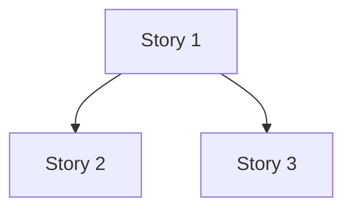

# Planning Format Contract

Authoritative reference for allowed embedded content, image sourcing, diagram conventions,
sidecar generation, and terminal-degradation expectations across all Hive planning document
types.

**Living document.** Do not restructure when adding content — append to the appropriate
section. Update the doc-type table §1 to remove stub markers as each slice ships.

**Cross-referenced by:** `hive/agents/orchestrator.md`

---

## 1. Doc-Type Table

The canonical format and permitted embedded content for each planning document type.

| Doc type | Canonical format | Embedded content | Sidecar | Notes |
|---|---|---|---|---|
| `design-discussion` | Markdown | `<figure>` image slots | `.html` generated on write | Wireframe slots filled from discovery protocol (§5); carries the epic concept illustration (§8) when visual mode is on |
| `structured-outline` | Markdown | `<figure>` optional; Mermaid dep map | `.html` generated on write | Figures optional; Mermaid dep map in §6 of structured-outline |
| `horizontal-plan` | Markdown | Mermaid layer diagrams | `.html` generated on write | Layer Map Diagram (§4 of horizontal-plan) uses `graph TD` per §3 |
| `vertical-plan` | Markdown | Mermaid slice diagrams | `.html` generated on write | Overlay Diagram (§3 of vertical-plan) uses `graph TD` per §3 |
| `PRD` | **HTML-primary** | Full HTML with sections, `<figure>`, Mermaid | `.md` sidecar (inverse direction) | Exception to markdown-canonical default; see §4 |

**Default:** Markdown is canonical for all doc types except PRD. When a doc type is not
listed above, assume markdown-canonical with no embedded HTML.

---

## 2. Image Source Policy

### Permitted sources

| Source | Usage | Path pattern |
|---|---|---|
| Approved wireframes | UI story `<figure>` slots in design-discussion | `state/wireframes/{epic-id}/{story-id}/approved.png` |
| Placeholder | When no approved wireframe exists | `<figure data-placeholder="...">` (see §5) |
| Brand assets | Brand-related planning docs only | `state/brand/` |
| Generated concept illustration | One per epic, on the design-discussion (see §8) | `.pHive/epics/{epic-id}/docs/concept-illustration.png` |

### Prohibited sources

- **External URLs** — no `` in planning docs. Planning documents
  are offline-readable artifacts; external image dependencies break reproducibility.
- **Embedded base64** — bloats token count. Use file references only.
- **Raw binary in git** — images must be generated artifacts, not committed source.
  Exceptions: (a) approved wireframes committed under `state/wireframes/` after design
  approval; (b) generated concept illustrations (§8), which are **gitignored** — referenced
  on-demand via `<figure data-src>`, never committed.

---

## 3. Mermaid Delimiter Convention

Use standard fenced code blocks. No custom wrapper, no HTML embedding, no alternative
delimiters.

~~~markdown

~~~

**Do not** wrap Mermaid in `<div>`, `<pre>`, or any HTML container. The fenced block is
the canonical form — it degrades gracefully in terminal environments (see §6) and renders
in GitHub markdown and HTML sidecar viewers.

Skills that emit Mermaid must reference this document in their prose instruction:
> "Use standard fenced ` ```mermaid ``` ` blocks per `hive/references/planning-format-contract.md §3`."

---

## 4. Sidecar-HTML Generation Rule

**Markdown is canonical.** The `.md` file is the source of truth. The `.html` sibling is
a generated artifact — never the other way around, except for PRD (see below).

### Standard direction: markdown → HTML

1. Skill writes the `.md` file.
2. Skill invokes `lib/html-sidecar-gen` to produce the `.html` sibling at the same path.
3. The `.html` sidecar is **not committed to git by default**. It is generated on-demand.
   Add `*.html` (or the specific sidecar path pattern) to `.gitignore` for planning doc
   directories. The sidecar is a rendering convenience, not a versioned artifact.
4. If `lib/html-sidecar-gen` is unavailable, the skill must log a warning and continue —
   the `.md` file is the deliverable; sidecar generation is best-effort.

### PRD exception: HTML-primary <!-- Added in S5.1 -->

PRD is the **only** document type where HTML is canonical. The `.md` sidecar is the
inverse direction — a stripped, grep-compatible fallback, not the source.

1. Skill writes the `.html` file first. The HTML document is a full `<!DOCTYPE html>`
   page with: a `<nav>` table of contents, named `<section id="...">` blocks per PRD
   section, inline `<div class="mermaid">` blocks (auto-initialized via Mermaid CDN on
   load), and `<figure>` elements following the wireframe discovery protocol (§5).
2. Skill invokes `generateMarkdownSidecar(htmlPath)` from `lib/html-sidecar-gen` to
   produce the `.md` sibling at the same path.
3. The `.md` sidecar strips HTML scaffolding (head, nav, script, wrapper divs) and
   converts block elements to markdown equivalents. `<figure>` blocks are preserved
   as-is so `data-placeholder` attributes remain visible in terminal / grep output.
4. Neither file is hand-edited after generation. The HTML is the deliverable; the `.md`
   is a rendering convenience for terminal environments.
5. Both files are committed to git for PRDs (unlike `.html` sidecars for other doc types,
   which are generated on-demand and gitignored).

**Canonical paths:**
- HTML: `.pHive/epics/{epic-id}/docs/prd.html`
- Sidecar: `.pHive/epics/{epic-id}/docs/prd.md`

---

## 5. Wireframe Discovery Protocol

Before writing `<figure>` slots in any planning document, the authoring agent must check
for approved wireframes. This protocol prevents stale placeholder slots from shipping
when wireframe artifacts already exist.

### Step 1 — Check for approved wireframes

Look for approved wireframe files in:

~~~
state/wireframes/{epic-id}/
~~~

Search for files matching `{story-id}/approved.png` or `{story-id}/v*.png`. The
`approved.png` filename indicates a wireframe that has passed the design approval
touchpoint (see `hive/references/wireframe-protocol.md`).

### Step 2a — Wireframe found: use image reference

~~~html
<figure>
  
  <figcaption>{caption describing the wireframe context}</figcaption>
</figure>
~~~

Use a path relative to the planning document's location. The `../../../../` prefix above
walks up from the doc dir (`.pHive/epics/{epic-id}/docs/`) to the repo root, where
`state/wireframes/` lives. Confirm the file exists before writing the reference — a broken
`` is worse than a placeholder.

### Step 2b — Wireframe absent: use data-placeholder

Do **not** block document writing on wireframe availability. Use a placeholder slot:

~~~html
<figure data-placeholder="{description of expected wireframe content}">
</figure>
~~~

The `data-placeholder` attribute is the canonical signal that this image slot is unfilled.
Sidecar generators, reviewers, and future agents use it to identify slots pending wireframe
approval. Do not use empty `<figure>` or comments — the attribute is required.

### Step 3 — One check per document write

Run the check once per document write, not per `<figure>` slot. If the epic directory
does not exist at all, all slots in the document use placeholders. Do not make per-slot
filesystem calls.

---

## 6. Terminal-Degradation Expectations

Planning documents must remain useful in terminal environments where HTML and Mermaid do
not render visually.

| Element | Terminal rendering | Usability | Grep-compatible |
|---|---|---|---|
| `<figure>` with `` | Visible HTML tag block, image not displayed | Readable — tag identifies where image would appear | Yes |
| `<figure data-placeholder="...">` | Visible HTML tag with attribute text | Readable — placeholder text describes expected content | Yes |
| ` ```mermaid ``` ` fences | Plain-text code block (Mermaid source) | Readable — graph structure visible as text | Yes |
| `.html` sidecar | Not rendered; separate file | No degradation — markdown canonical is the terminal artifact | N/A |
| PRD `.html` | Not rendered | Use `.md` sidecar for terminal reading | `.md` sidecar greppable |

**Invariant:** A planning document must always be readable in a plain-text terminal viewer.
If an element fails this test, it must either degrade gracefully (as above) or be
prohibited.

**Known limitation:** Mermaid diagrams are not visually rendered in terminal-only
environments. The fenced code block form is readable as a dependency graph (nodes and
arrows are plain text), but not visually equivalent to a rendered diagram. This is an
accepted limitation documented here; out of scope for S1 remediation.

---

## 7. Visual Planning Mode <!-- Added in hive-composability-design follow-up -->

Visual planning — HTML sidecar generation (§4), Mermaid diagrams (§3), `<figure>` image
slots (§5), and the concept illustration (§8) — is **on by default**. It is a rendering
layer over markdown-canonical docs; turning it off never changes which file is the source
of truth.

**Resolution (flag overrides config, config overrides default):**

1. `--no-visual` flag on the `/plan` invocation → visual planning OFF for that run.
2. Else `planning.visual: false` in root-resolved `hive.config.yaml` → OFF.
3. Else → ON (absent config key means on).

Store the resolved boolean as `${visual_planning}` on the planning context.

**What OFF suppresses:**

- HTML sidecar generation for markdown-canonical doc types (§4 standard direction). The
  `.md` file is still written — it is the deliverable.
- The concept illustration step (§8).

**What OFF does NOT change:**

- Mermaid fenced blocks (§3) stay in the markdown — they degrade to readable text (§6) and
  cost nothing extra to emit.
- `<figure>` slots and the wireframe discovery protocol (§5) — these are markdown content,
  not a rendering pass.
- **PRD stays HTML-primary (§4 exception).** PRD's canonical form is HTML; `--no-visual`
  does not strip it. The PRD `.md` sidecar is still generated (it is the grep fallback).
  `--no-visual` only suppresses the concept illustration for a PRD-bearing run.

## 8. Concept Illustration <!-- Added in hive-composability-design follow-up -->

At the end of planning, when `${visual_planning}` is ON, `/plan` generates **one**
AI illustration per epic depicting what the planned change "looks like" — part signal
(how the agent sized up the work), part delight. This is the only generated raster in the
planning flow.

**Generation rule:**

1. Gate: run only when `${visual_planning}` is ON **and** `--lite` is not active (`--lite`
   is token-economy; the illustration is the most expensive step, so lite skips it).
2. Build a prompt from the finalized planning context (epic title + design-discussion goal +
   scale assessment + the principal slices/changes). Describe a conceptual scene or
   diagram, not a literal UI.
3. Invoke the `openai-image` MCP tool `generate_image` with that prompt, `output_dir` set
   to the epic docs dir, and `output_prefix: concept`. Save to
   `.pHive/epics/{epic-id}/docs/concept-illustration.png`.
4. Embed it on the **design-discussion** (the always-present primary artifact) as a
   trailing section, then regenerate that doc's `.html` sidecar:

   ~~~html
   <figure data-src="concept-illustration.png" data-alt="Concept illustration of the planned change">
   </figure>
   ~~~

5. **Non-blocking, best-effort.** If the MCP tool is unavailable, `OPENAI_API_KEY` is
   missing, or the call errors (e.g. `403` verified-org requirement), propagate the exact
   error message verbatim as a warning, embed a `data-placeholder` figure instead, and
   continue. A failed illustration is never a failed plan.
6. The PNG is **gitignored** (`.pHive/epics/**/docs/*.png`) — generated on-demand, not
   committed, consistent with §2.

## Extension Notes

When adding sections in future D-expansion slices:

- Append to the relevant section (e.g., add PRD details to §4 when S5 ships).
- Do not restructure the document. Section numbers are stable references.
- Update the doc-type table §1 to remove `(S5+)` stubs as each slice ships.
- Each added section should note its originating slice (e.g., `<!-- Added in S5.x -->`).

<!-- S4.3 shipped: H/V and structured-outline Mermaid/figure support and sidecar generation added. (S4+) stubs removed from doc-type table. -->
