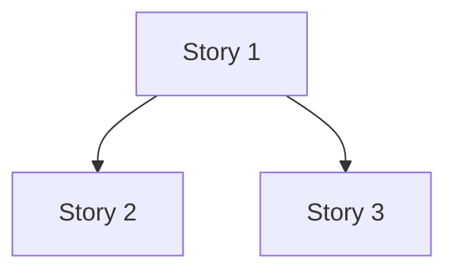

# Planning Format Contract

Authoritative reference for allowed embedded content, image sourcing, diagram conventions,
sidecar generation, and terminal-degradation expectations across all Hive planning document
types.

**Living document.** Sections marked `(S4+)` or `(S5+)` are stubs added for structural
completeness; they will be filled in by the corresponding D-expansion slices. Do not
restructure the document when adding content — append to the appropriate section.

**Cross-referenced by:** `hive/agents/orchestrator.md`

---

## 1. Doc-Type Table

The canonical format and permitted embedded content for each planning document type.

| Doc type | Canonical format | Embedded content (S1) | Sidecar | Notes |
|---|---|---|---|---|
| `design-discussion` | Markdown | `<figure>` image slots | `.html` generated on write | Wireframe slots filled from discovery protocol (§5) |
| `structured-outline` | Markdown | `<figure>` optional; Mermaid dep map (S4+) | `.html` generated on write (S4+) | Figures optional in S1; Mermaid dep map added in S4 |
| `horizontal-plan` | Markdown | Mermaid layer diagrams (S4+) | `.html` generated on write (S4+) | ASCII diagrams remain until S4 |
| `vertical-plan` | Markdown | Mermaid slice diagrams (S4+) | `.html` generated on write (S4+) | ASCII diagrams remain until S4 |
| `PRD` | **HTML-primary** | Full HTML with sections, `<figure>`, Mermaid | `.md` sidecar (inverse direction, S5+) | Exception to markdown-canonical default; see §4 |

**Default:** Markdown is canonical for all doc types except PRD. When a doc type is not
listed above, assume markdown-canonical with no embedded HTML.

---

## 2. Image Source Policy

### Permitted sources

| Source | Usage | Path pattern |
|---|---|---|
| Approved wireframes | UI story `<figure>` slots in design-discussion | `state/wireframes/{epic-id}/{story-id}/approved.png` |
| Placeholder | When no approved wireframe exists | `<figure data-placeholder="...">` (see §5) |
| Brand assets | Brand-related planning docs only | `state/brand/` |

### Prohibited sources

- **External URLs** — no `` in planning docs. Planning documents
  are offline-readable artifacts; external image dependencies break reproducibility.
- **Embedded base64** — bloats token count. Use file references only.
- **Raw binary in git** — images must be generated artifacts, not committed source.
  Exception: approved wireframes committed under `state/wireframes/` after design approval.

---

## 3. Mermaid Delimiter Convention

Use standard fenced code blocks. No custom wrapper, no HTML embedding, no alternative
delimiters.

~~~markdown

~~~

**Do not** wrap Mermaid in `<div>`, `<pre>`, or any HTML container. The fenced block is
the canonical form — it degrades gracefully in terminal environments (see §6) and renders
in GitHub markdown and HTML sidecar viewers.

Skills that emit Mermaid must reference this document in their prose instruction:
> "Use standard fenced ` ```mermaid ``` ` blocks per `hive/references/planning-format-contract.md §3`."

---

## 4. Sidecar-HTML Generation Rule

**Markdown is canonical.** The `.md` file is the source of truth. The `.html` sibling is
a generated artifact — never the other way around, except for PRD (see below).

### Standard direction: markdown → HTML

1. Skill writes the `.md` file.
2. Skill invokes `lib/html-sidecar-gen` to produce the `.html` sibling at the same path.
3. The `.html` sidecar is **not committed to git by default**. It is generated on-demand.
   Add `*.html` (or the specific sidecar path pattern) to `.gitignore` for planning doc
   directories. The sidecar is a rendering convenience, not a versioned artifact.
4. If `lib/html-sidecar-gen` is unavailable, the skill must log a warning and continue —
   the `.md` file is the deliverable; sidecar generation is best-effort.

### PRD exception: HTML-primary (S5+)

PRD is the only document type where HTML is canonical:

1. Skill writes the `.html` file (full document with sections, inline Mermaid, `<figure>`).
2. Skill invokes the inverse variant of `lib/html-sidecar-gen` to produce a `.md` sidecar.
3. The `.md` sidecar strips HTML scaffolding to produce readable, greppable markdown.
4. Both files are generated artifacts from the same source data — neither is hand-edited
   after generation.

This section is a stub for S5. Full PRD generation spec lives in the S5 story.

---

## 5. Wireframe Discovery Protocol

Before writing `<figure>` slots in any planning document, the authoring agent must check
for approved wireframes. This protocol prevents stale placeholder slots from shipping
when wireframe artifacts already exist.

### Step 1 — Check for approved wireframes

Look for approved wireframe files in:

```
state/wireframes/{epic-id}/
```

Search for files matching `{story-id}/approved.png` or `{story-id}/v*.png`. The
`approved.png` filename indicates a wireframe that has passed the design approval
touchpoint (see `hive/references/wireframe-protocol.md`).

### Step 2a — Wireframe found: use image reference

```html
<figure>
  
  <figcaption>{caption describing the wireframe context}</figcaption>
</figure>
```

Use a relative path from the planning document's location. Confirm the file exists before
writing the reference — a broken `` is worse than a placeholder.

### Step 2b — Wireframe absent: use data-placeholder

Do **not** block document writing on wireframe availability. Use a placeholder slot:

```html
<figure data-placeholder="{description of expected wireframe content}">
</figure>
```

The `data-placeholder` attribute is the canonical signal that this image slot is unfilled.
Sidecar generators, reviewers, and future agents use it to identify slots pending wireframe
approval. Do not use empty `<figure>` or comments — the attribute is required.

### Step 3 — One check per document write

Run the check once per document write, not per `<figure>` slot. If the epic directory
does not exist at all, all slots in the document use placeholders. Do not make per-slot
filesystem calls.

---

## 6. Terminal-Degradation Expectations

Planning documents must remain useful in terminal environments where HTML and Mermaid do
not render visually.

| Element | Terminal rendering | Usability | Grep-compatible |
|---|---|---|---|
| `<figure>` with `` | Visible HTML tag block, image not displayed | Readable — tag identifies where image would appear | Yes |
| `<figure data-placeholder="...">` | Visible HTML tag with attribute text | Readable — placeholder text describes expected content | Yes |
| ` ```mermaid ``` ` fences | Plain-text code block (Mermaid source) | Readable — graph structure visible as text | Yes |
| `.html` sidecar | Not rendered; separate file | No degradation — markdown canonical is the terminal artifact | N/A |
| PRD `.html` (S5+) | Not rendered | Use `.md` sidecar for terminal reading | `.md` sidecar greppable |

**Invariant:** A planning document must always be readable in a plain-text terminal viewer.
If an element fails this test, it must either degrade gracefully (as above) or be
prohibited.

**Known limitation:** Mermaid diagrams are not visually rendered in terminal-only
environments. The fenced code block form is readable as a dependency graph (nodes and
arrows are plain text), but not visually equivalent to a rendered diagram. This is an
accepted limitation documented here; out of scope for S1 remediation.

---

## Extension Notes

When adding sections in future D-expansion slices:

- Append to the relevant section (e.g., add H/V Mermaid details to §3; add structured-
  outline figure rules to the doc-type table row).
- Do not restructure the document. Section numbers are stable references.
- Update the doc-type table §1 to remove `(S4+)` / `(S5+)` stubs as each slice ships.
- Each added section should note its originating slice (e.g., `<!-- Added in S4.3 -->`).
